# MAGNeT: Music Generation using Transformers

## Quick Summary
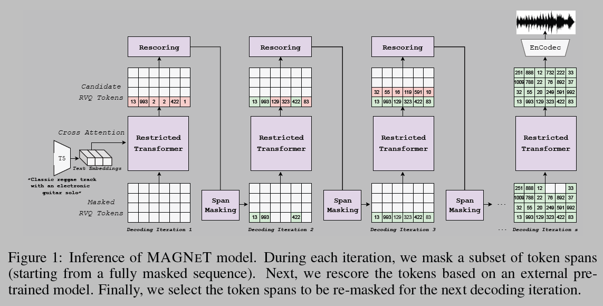
### Introduction
* The family of generative models explores in prior work can be roughly divided into two:
    * Autoregressive (AR) in the form of language models (LMs), usually operating on discrete audio representations
        * Due to its autoregressive nature, following the LM approach yields relatively high
        inference time which turns into high latency values, hence making it less appalling for interactive
        applications such as music generation and editing under Digital AudioWorkstations (DAW)
    * Diffusion-based models usually operating on continuous latent representations of the audio signal
        * Diffusion models perform parallel decoding, however, to reach high-quality music samples recent studies report using a few hundred diffusion decoding steps. Moreover, diffusion models struggle with generating long-form sequences. Recent studies present results for either 10-second generations

* The proposed approach comprised of a single transformer
model, working in a non-autoregressive fashion
    * During **training**, we first sample a masking rate
from the masking scheduler, then, we mask and predict spans of input tokens conditioned on unmasked ones
    * During **inference**, we gradually build the output audio sequence using several decoding steps. We start from a fully masked sequence and at each iteration step, we fix the most probable token spans, i.e., the spans that got the top confidence score
        * To further enhance the quality of the generated audio, we introduce a novel rescoring method. In which, we leverage an external pre-trained model to rescore and rank predictions from MAGNeT. Lastly, we explore a Hybrid version of MAGNeT, in which we fuse autoregressive and non-autoregressive models. The hybrid-MAGNeT generates the beginning of the tokens sequence in an autoregressive manner while the rest of the sequence is being decoded in parallel, similarly to the original MAGNeT

### Background
* Audio representation:
    * Modern audio generative models mostly operate on a latent representation of the audio, commonly obtained from a compression model
    * Compression models employ Residual Vector Quantization (**RVQ**) which results in several parallel streams
    * **EnCodec**: a convolutional auto-encoder with a latent
    space quantized using Residual Vector Quantization (RVQ), and an adversarial reconstruction loss
    * Given a reference audio signal $x ∈ dim(d·fs)$ with $d$ the audio duration and $fs$ the sample rate, EnCodec first encodes it into a continuous tensor with a frame rate $fr ≪ fs$
    * Then, this representation is quantized into $z ∈ \{1, \ldots , N\}$ of $dim(K×d·fr)$ , with $K$ being the number of codebooks used in RVQ and $N$ being the codebook size
    * After quantization we are left with $K$ discrete token sequences, each of length $T = d·fr$, representing the audio signal
* Audio generative modeling:
    * Given a discrete representation of the audio signal, $z$, our goal is to model the conditional joint probability distribution $p_θ(z|y)$, where $y$ is a semantic representation of the condition
    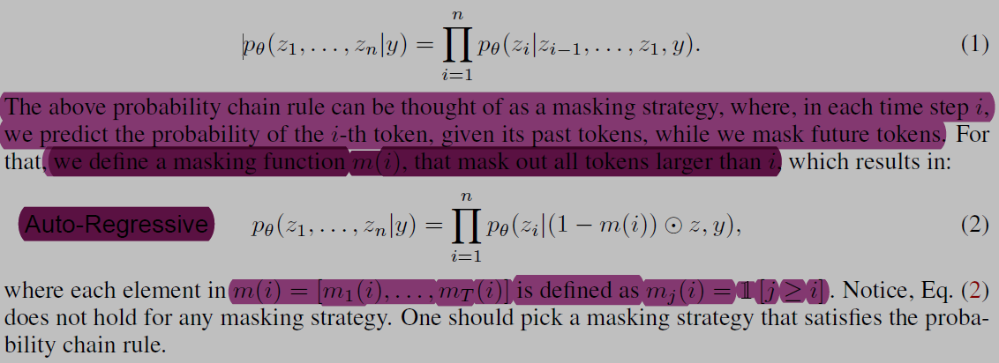
    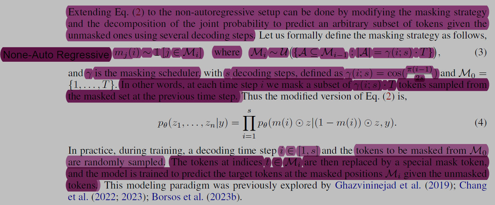
    * *Recall, the audio representation is composed of multi-stream sequences created by RVQ. In which, the first codebook encodes the coarse information of the signal while later codebooks encode the
    quantization error to refine the generation quality*
    * ***To handle that, Borsos et al. (2023b) proposed to predict tokens from codebook k given its preceding codebooks. During training, a codebook level $k$, is being uniformly sampled from $\{1, \ldots ,K\}$. Then, we mask and predict the tokens of thek-th codebook given previous levels via teacher forcing***
    * **At inference, we sequentially generate the token
    streams, where each codebook is being generated conditioned on previously generated codebooks**

### Method
* Following the approach presented in the previous section solely does not lead to high-quality audio generation
* MAGNET consists of a non-autoregressive audiobased
generative masked language model, conditioned on a semantic representation of the condition, operating on several streams of discrete audio tokens obtained from EnCodec

#### Masking Strategy
* 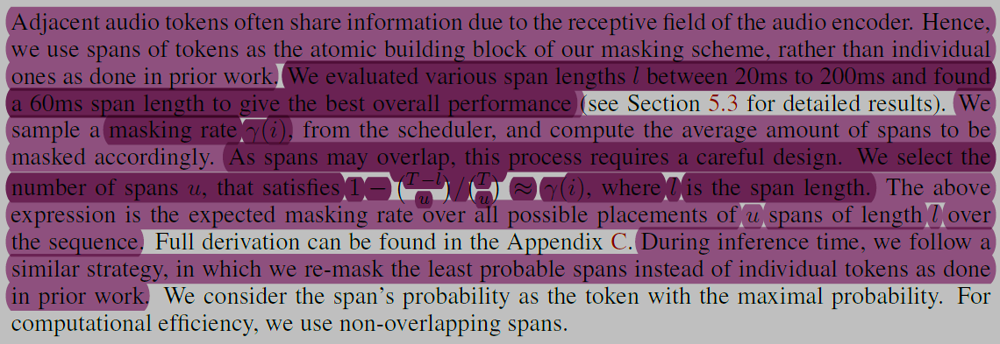 where $i$ is the current decoding step, $i \in \{1 \ldots s\}$
* 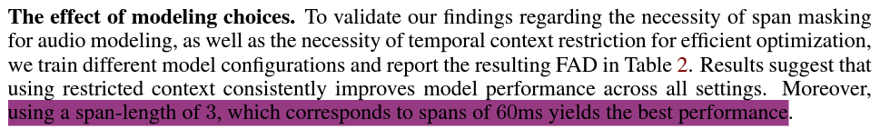
* 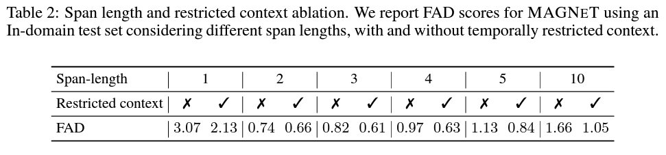
* 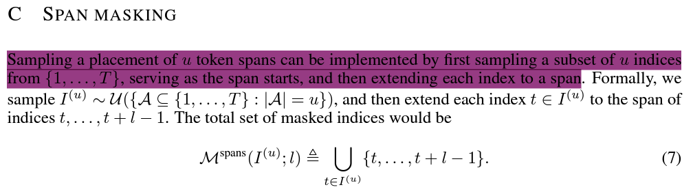
  $A$ is a subset of ${(1, ..., T)}$ whose size should be $u$. It indicates the span starts.\
  Then get $I^{(u)}$ from $\mathcal{U}(A)$ 

#### Restricted Context
* Recall, the used *audio tokenizer* is based on RVQ, *where each quantizer encodes the quantization error left by the previous quantizer. Thus quantized codebooks later than the first one heavily depend on previous codebooks rather than surrounding tokens*. To leverage that we analyze the used EnCodec and restrict the context of the codebooks accordingly
* Specifically, the *audio encoder consists of a multi-layer convolutional network and a final LSTM block*. Analyzing the receptive field for the used EnCodec shows that the receptive field of the convolutional network is `∼ 160ms`, while the effective receptive field when including the LSTM block is `∼ 180ms`
* We utilize this observation to improve model optimization, by restricting the self-attention of codebooks greater than 1, to attend only on tokens at a temporal distance smaller than `∼ 200ms`. See below figure
* 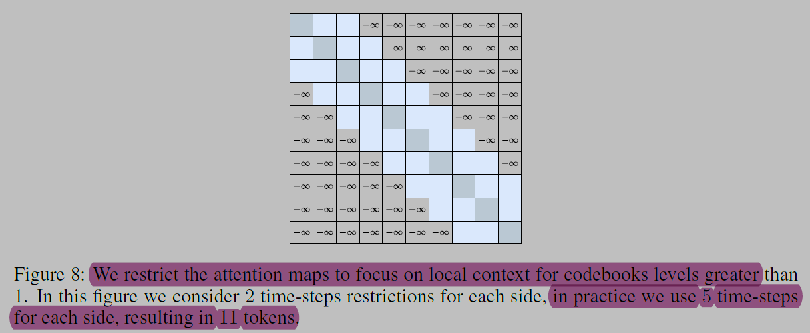

#### Model Inference
1. Sampling:
    * Fig. 4 presents the inference process of MAGNET. For clarity, we omit CFG and nucleus sampling,
    and assume $T$ is a multiple of the span length $l$. To further ease the reading, we present the inference
    algorithm for a single codebook, while in practice, we run Fig. 4 for every codebook $k \in \{1, \ldots, K\}$
    * 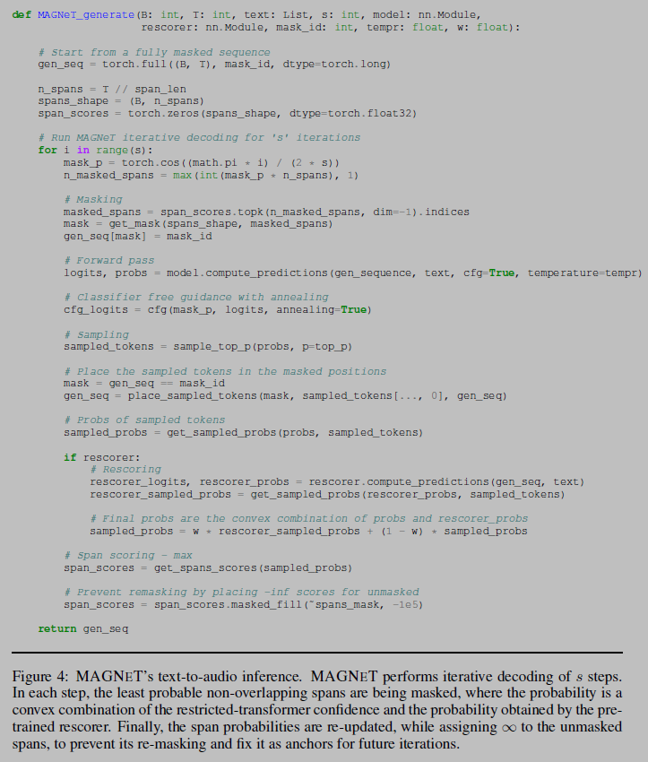
    * Sampling as described in Eq. (3) uses a uniform sampling to choose spans from the previously set of masked spans. 
    * *In practice, we use the model confidence at the i-th iteration as a scoring function to rank all possible spans and choose the least probable spans to be masked accordingly. However, the scoring function does not have to be part of the generative model*
    * 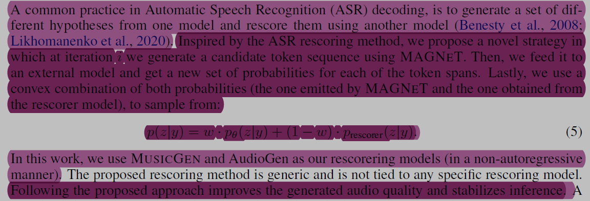
2. Classifier-free guidance annealing:
    * 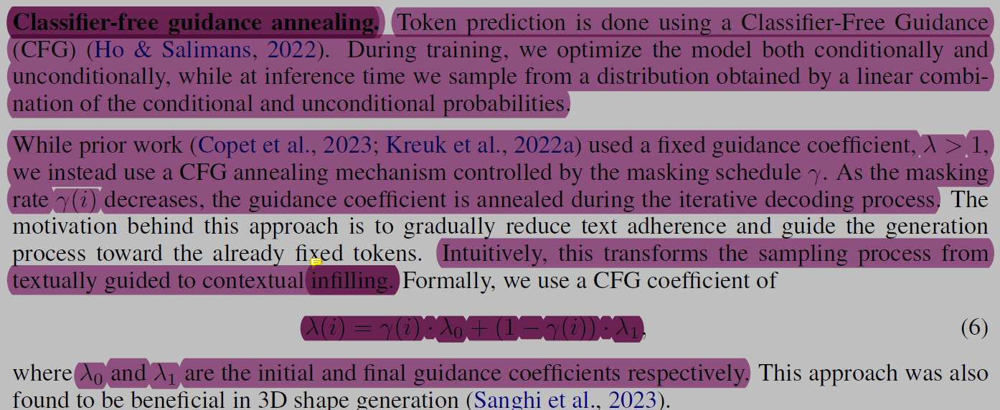
    *(The guidance coefficient ${\lambda}(i)$ is used in the linear combination of the conditional and unconditional probabilities to obtain the final distribution for sampling during the text generation process)*
    * ${\lambda}_0=10$ and ${\lambda}_1=1$ (initial and final guidance coefficients respectively)

* **Finally, for inference, we employ nucleus sampling with top-p $0.9$, and a temperature of $3.0$ that is linearly annealed to zero during decoding iterations. We use CFG with condition dropout rate of $0.3$ during training, and a guidance coefficient $10.0$ that is annealed to $1.0$ during iterative decoding**

### Implementation details
* We evaluate MAGNET on the task of text-to-music generation and text-to-audio generation
* **Encodec model: gets as input an audio segment and outputs a 50 Hz discrete representation.
We use four codebooks, where each has a codebook size of 2048**
* We perform the same text preprocessing as proposed by Copet et al. (2023); Kreuk et al. (2022a). We use a pre-trained T5 model to extract semantic representation from the text description and use it
as model conditioning
* Training Details:
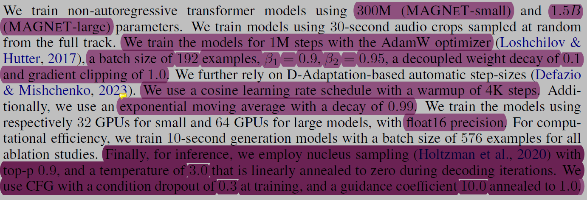

### Encodec
* 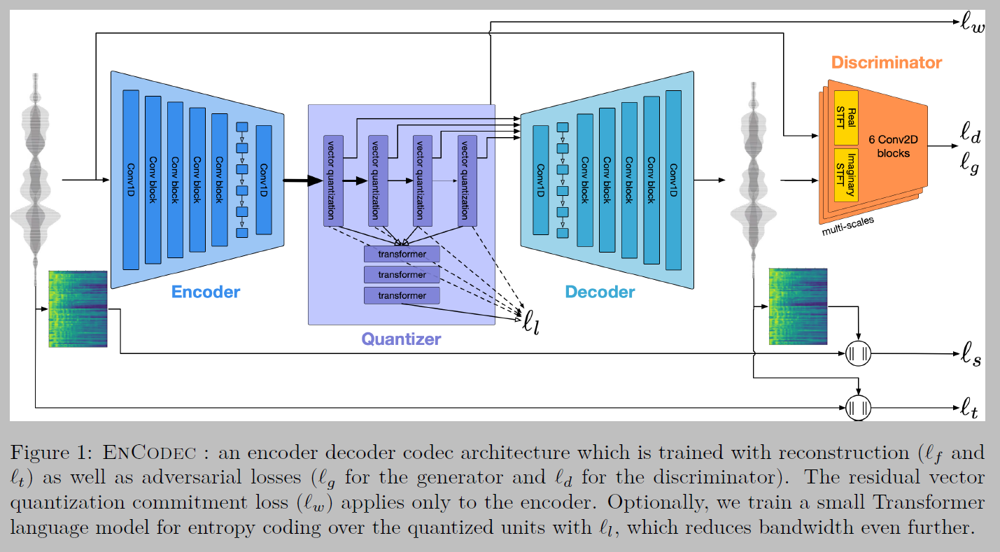
  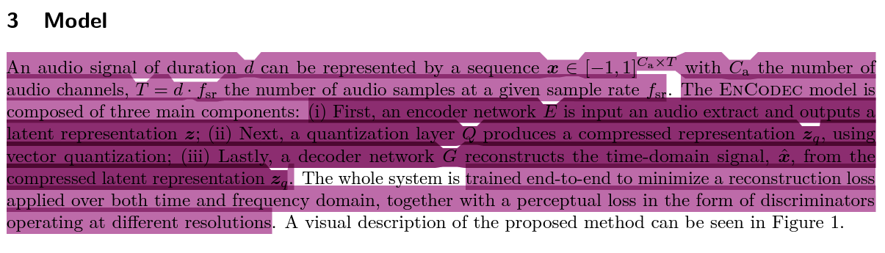
  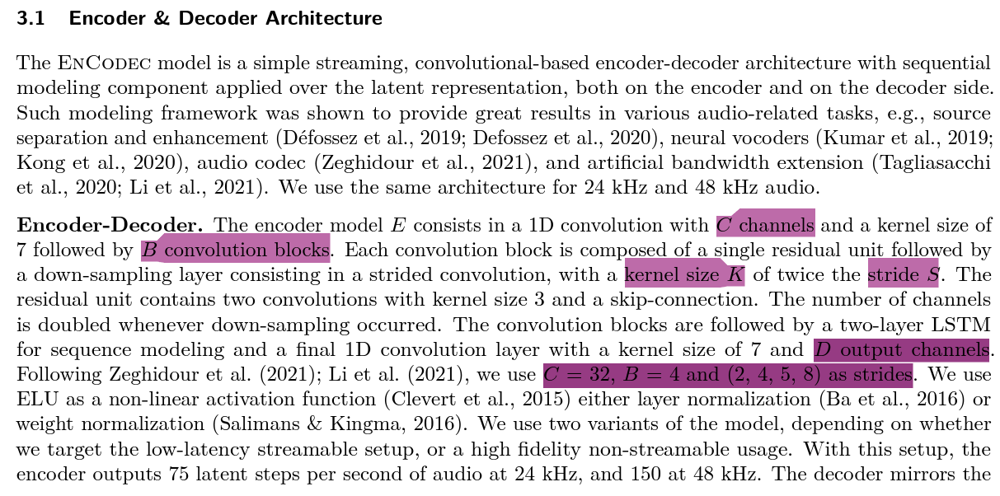
  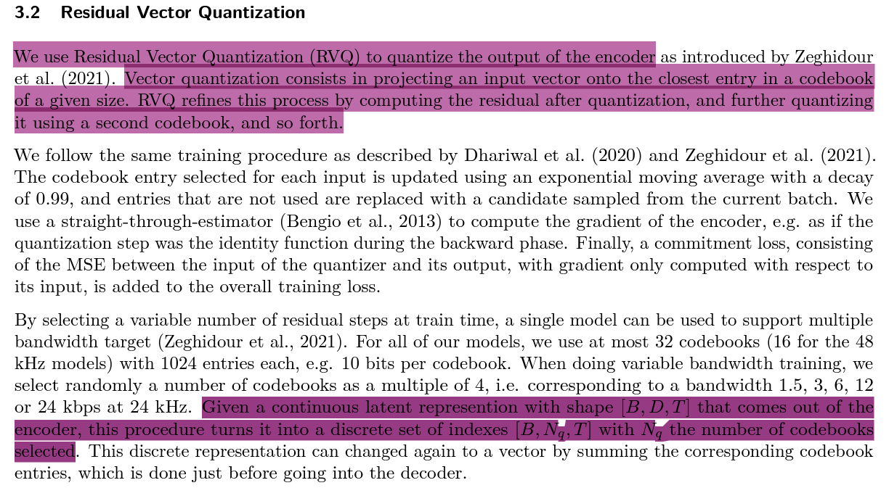

* VQ-VAE
    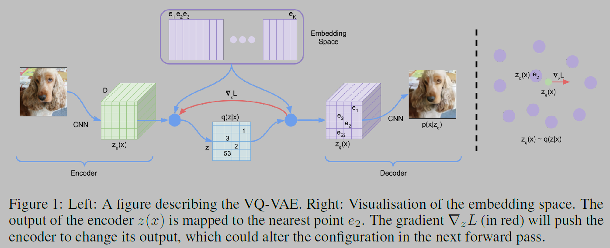
* VQ-VAE-2

    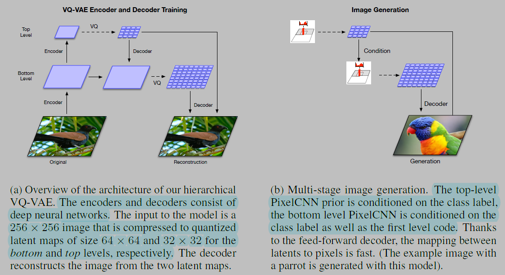

* RVQ algorithm

    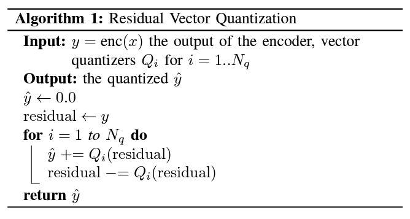

### Classifier free Guidance
* 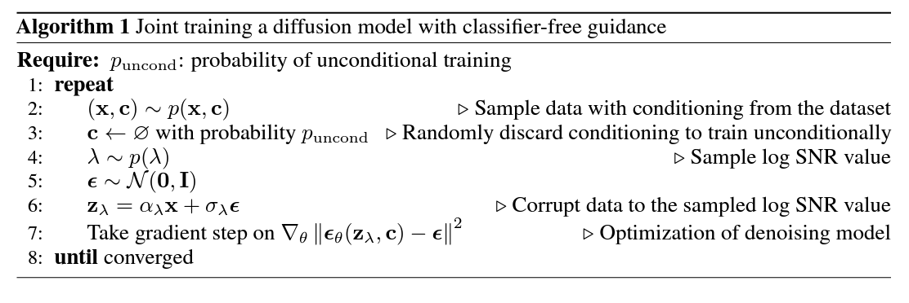
  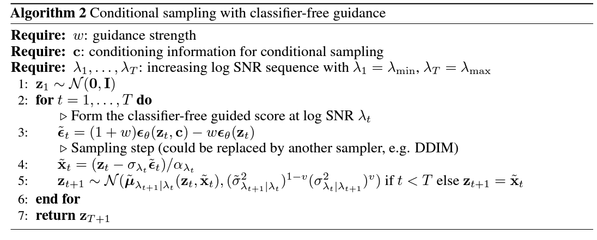