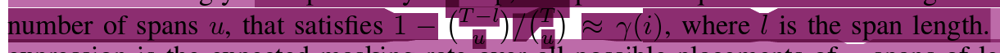

# Magnet Code Docs

## Magnet Model Docs
### Why is the Input and Output Embedding cardinality different?
```python
...
self.embeddings = nn.ModuleList([
    nn.Embedding(
        # something like vocab_size
        num_embeddings=config.cardinality + 1, # +1 for mask_id
        embedding_dim=config.d_model
    ) for _ in range(self.nq)
]) # 
self.linears = nn.ModuleList([
    nn.Linear(
        config.d_model, config.cardinality
    ) for _ in range(self.nq)
])
...
```
```python
Input:  [100, 120, 20, 200, 1024, 1024, 1000, 1024]
# model will predict the masked values, so no need of the masked 
Output: [100, 120, 20, 200, <predValue>, <predValue>, 1000, <predValue>]
# <predValue> is the value predicted by the model 
```
* $predValue  \in [0, 1023]$


## Explanation for `Binary AND` for loss mask
```python
>>> loss_mask = torch.tensor(
    [[True, True, False, False, False, True, True],
    [False, True, True, False, False, False, True]]
) # True values to be taken for loss, False values to be ignored

>>> pad_mask = torch.tensor(
    [[True, True, True, False, False, False, False],
    [True, True, True, True, True, False, False]]
)
>>> loss_mask & pad_mask # take loss only on masked tokens (True value)
tensor([[ True,  True, False, False, False, False, False],
        [False,  True,  True, False, False, False, False]])
```

# Dataset
### Music Bench (Dataset details):
* 52,768 training and 400 test samples
* Including music features of chords, beats, tempo, and key that are extracted from the audio.
* Describing these music features using text templates and thus enhancing the original text prompts.

Each row of a .json file has:
* `location` (of the files after decompressing the .tar.gz file)
* `main_caption` – text prompts that are a result of augmentation (TestB contains control sentences, train set contains ChatGPT rephrased captions here)
* `alt_caption` – in the case of TestB these are captions without any control sentences added.
* `prompt_aug` – A control sentence related to volume change augmentation.
* `prompt_ch` – A control sentence describing the chord sequence.
* `prompt_bt` – A control sentence describing the beat count (meter)
* `prompt_bpm` – A control sentence describing tempo, either in beats per minute (bpm), or in musical words, e.g., Adagio, Moderato, Presto.
* `prompt_key` – A control sentence related to the extracted musical key.
* `beats` – The beat and downbeat timestamps. This is used as an input for training Mustango.
* `bpm` – The tempo feature saved as a number.
* `chords` – The chord sequence contained in the track. This is used as an input for training Mustango.
* `chords_time` – Timestamps of the detected chords. This is used as an input for training Mustango.
* `key` – The root and the type of the detected key.
* `keyprob` – The confidence score for this detected key provided by the detection algorithm.

# Encodec Model

```python
Input to encodec (x): shape(C_a*T)
    T: d*f_s
    d: audio duration
    f_s: sampling frequency
Encoder Output:
    
Quantized repr: z ∈ {1,...,Nq}^(K*T)
    T: (d*f_r)
    d: audio duration
    f_r: frame_rate, f_r << f_s
    K: number of codebooks used in RVQ
    Nq: codebook size
```

* Recall, the audio representation is composed of multi-stream sequences created by RVQ. In which, the first codebook encodes the coarse information of the signal while later codebooks encode the quantization error to refine the generation quality
* To handle that, Borsos et al. (2023b) proposed to predict tokens from codebook k given its preceding codebooks. During training, a codebook level k, is being uniformly sampled from {1, . . . ,K}. Then, we mask and predict the tokens of the k-th codebook given previous levels via teacher forcing
* At inference, we sequentially generate the token streams, where each codebook is being generated conditioned on previously generated codebooks

## Masking Strategy
* Use spans of tokens as the atomic buildings blocks
* Using a ***span-length of 3*** *(after using encodec model not on raw wav tensor)*, which corresponds to spans of 60ms yields the best performance
* Masking rate `gamma(i)` from the scheduler and compute the average amount of spans to be masked
* `gamma(i;s) = cos(pi*(i-1)/2s)`
* Spans overlap so it's important to design `u (number of spans to mask)` carefully
* Choose 
* `j` is index to be masked, `i` is current index