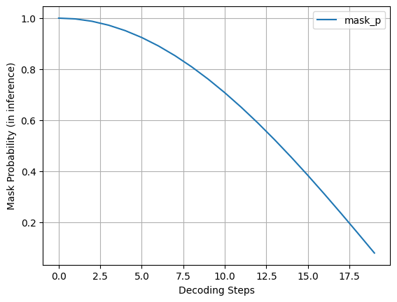
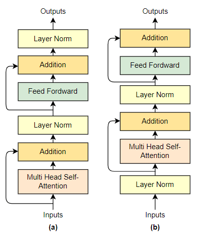

# Magnet Code Docs

## Magnet Model Docs
### Why is the Input and Output Embedding cardinality different?
```python
...
self.embeddings = nn.ModuleList([
    nn.Embedding(
        # something like vocab_size
        num_embeddings=config.cardinality + 1, # +1 for mask_id
        embedding_dim=config.d_model
    ) for _ in range(self.nq)
]) # 
self.linears = nn.ModuleList([
    nn.Linear(
        config.d_model, config.cardinality
    ) for _ in range(self.nq)
])
...
```
```python
Input:  [100, 120, 20, 200, 1024, 1024, 1000, 1024]
# model will predict the masked values, so no need of the masked 
Output: [100, 120, 20, 200, <predValue>, <predValue>, 1000, <predValue>]
# <predValue> is the value predicted by the model 
```
* $predValue  \in [0, 1023]$


## Explanation for `Binary AND` for loss mask
```python
>>> loss_mask = torch.tensor(
    [[True, True, False, False, False, True, True],
    [False, True, True, False, False, False, True]]
) # True values to be taken for loss, False values to be ignored

>>> pad_mask = torch.tensor(
    [[True, True, True, False, False, False, False],
    [True, True, True, True, True, False, False]]
)
>>> loss_mask & pad_mask # take loss only on masked tokens (True value)
tensor([[ True,  True, False, False, False, False, False],
        [False,  True,  True, False, False, False, False]])
```

# Dataset
### Music Bench (Dataset details):
* 52,768 training and 400 test samples
* Including music features of chords, beats, tempo, and key that are extracted from the audio.
* Describing these music features using text templates and thus enhancing the original text prompts.

Each row of a .json file has:
* `location` (of the files after decompressing the .tar.gz file)
* `main_caption` – text prompts that are a result of augmentation (TestB contains control sentences, train set contains ChatGPT rephrased captions here)
* `alt_caption` – in the case of TestB these are captions without any control sentences added.
* `prompt_aug` – A control sentence related to volume change augmentation.
* `prompt_ch` – A control sentence describing the chord sequence.
* `prompt_bt` – A control sentence describing the beat count (meter)
* `prompt_bpm` – A control sentence describing tempo, either in beats per minute (bpm), or in musical words, e.g., Adagio, Moderato, Presto.
* `prompt_key` – A control sentence related to the extracted musical key.
* `beats` – The beat and downbeat timestamps. This is used as an input for training Mustango.
* `bpm` – The tempo feature saved as a number.
* `chords` – The chord sequence contained in the track. This is used as an input for training Mustango.
* `chords_time` – Timestamps of the detected chords. This is used as an input for training Mustango.
* `key` – The root and the type of the detected key.
* `keyprob` – The confidence score for this detected key provided by the detection algorithm.

# Encodec Model

```python
Input to encodec (x): shape(C_a*T)
    T: d*f_s
    d: audio duration
    f_s: sampling frequency
Encoder Output:
    
Quantized repr: z ∈ {1,...,Nq}^(K*T)
    T: (d*f_r)
    d: audio duration
    f_r: frame_rate, f_r << f_s
    K: number of codebooks used in RVQ
    Nq: codebook size
```

* Recall, the audio representation is composed of multi-stream sequences created by RVQ. In which, the first codebook encodes the coarse information of the signal while later codebooks encode the quantization error to refine the generation quality
* To handle that, Borsos et al. (2023b) proposed to predict tokens from codebook k given its preceding codebooks. During training, a codebook level k, is being uniformly sampled from {1, . . . ,K}. Then, we mask and predict the tokens of the k-th codebook given previous levels via teacher forcing
* At inference, we sequentially generate the token streams, where each codebook is being generated conditioned on previously generated codebooks

## Masking Strategy
* Use spans of tokens as the atomic buildings blocks
* Using a ***span-length of 3*** *(after using encodec model not on raw wav tensor)*, which corresponds to spans of 60ms yields the best performance
* Masking rate `gamma(i)` from the scheduler and compute the average amount of spans to be masked
* `gamma(i;s) = cos(pi*(i-1)/2s)`
* Spans overlap so it's important to design `u (number of spans to mask)` carefully
* Choose 
* `j` is index to be masked, `i` is current index

## cfg while inference
* 
* $cfg_{coeff} = mask_p*cfg_{coeff_init} + (1 - mask_p)*cfg_{coeff_final}$
* $cfg_{coeff} = mask_p*10 + (1 - mask_p)*1 = 9*mask_p + 1$
* `cfg_coeff` decreases as `timestep` increases
* $logits = cond_{logits} * cfg_{coeff} + uncond_{logits} * (1 - cfg_{coeff})$
* So more dependence on unconditioned logits as `timestep` increases
* Gradually shifting towards a more context-aware generation that fits well with the already generated content

# Initialization
* 
  
  Feed Forward weights and Multi-Head-Attention last linear are scaled by `1/sqrt(num_layers)`


  | Step: 970 || Loss: 5.7361 || Masked Accuracy: 0.0491 | Accuracy: 0.0303 || LR: 3.492000e-04 || dt: 4803.17ms || Norm: 1.1519 |
| Step: 971 || Loss: 5.6760 || Masked Accuracy: 0.0454 | Accuracy: 0.0192 || LR: 3.495600e-04 || dt: 4644.00ms || Norm: 1.8108 |
| Step: 972 || Loss: 5.6345 || Masked Accuracy: 0.0445 | Accuracy: 0.0485 || LR: 3.499200e-04 || dt: 4747.24ms || Norm: 1.0543 |
| Step: 973 || Loss: 5.8615 || Masked Accuracy: 0.0303 | Accuracy: 0.0124 || LR: 3.502800e-04 || dt: 5117.81ms || Norm: 1.7292 |
| Step: 974 || Loss: 6.0925 || Masked Accuracy: 0.0193 | Accuracy: 0.0115 || LR: 3.506400e-04 || dt: 4728.62ms || Norm: 1.2212 |
| Step: 975 || Loss: 6.3770 || Masked Accuracy: 0.0084 | Accuracy: 0.0097 || LR: 3.510000e-04 || dt: 4677.26ms || Norm: 1.2865 |
| Step: 976 || Loss: 6.1549 || Masked Accuracy: 0.0228 | Accuracy: 0.0155 || LR: 3.513600e-04 || dt: 4898.67ms || Norm: 2.2367 |
| Step: 977 || Loss: 5.9210 || Masked Accuracy: 0.0689 | Accuracy: 0.0556 || LR: 3.517200e-04 || dt: 4642.41ms || Norm: 1.1049 |
| Step: 978 || Loss: 5.9184 || Masked Accuracy: 0.0670 | Accuracy: 0.0457 || LR: 3.520800e-04 || dt: 4766.20ms || Norm: 1.7867 |
| Step: 979 || Loss: 6.1462 || Masked Accuracy: 0.0122 | Accuracy: 0.0138 || LR: 3.524400e-04 || dt: 5017.49ms || Norm: 1.7251 |
| Step: 980 || Loss: 5.6736 || Masked Accuracy: 0.0783 | Accuracy: 0.0365 || LR: 3.528000e-04 || dt: 5018.58ms || Norm: 0.8576 |
| Step: 981 || Loss: 5.3049 || Masked Accuracy: 0.0669 | Accuracy: 0.0696 || LR: 3.531600e-04 || dt: 5127.37ms || Norm: 0.9800 |
| Step: 982 || Loss: 5.6473 || Masked Accuracy: 0.0419 | Accuracy: 0.0177 || LR: 3.535200e-04 || dt: 4934.11ms || Norm: 0.7496 |
| Step: 983 || Loss: 6.2040 || Masked Accuracy: 0.0249 | Accuracy: 0.0163 || LR: 3.538800e-04 || dt: 4886.86ms || Norm: 0.5887 |
| Step: 984 || Loss: 6.0498 || Masked Accuracy: 0.0240 | Accuracy: 0.0233 || LR: 3.542400e-04 || dt: 4726.97ms || Norm: 0.4462 |
| Step: 985 || Loss: 5.9541 || Masked Accuracy: 0.0379 | Accuracy: 0.0169 || LR: 3.546000e-04 || dt: 5067.88ms || Norm: 1.7090 |
| Step: 986 || Loss: 5.9772 || Masked Accuracy: 0.0275 | Accuracy: 0.0188 || LR: 3.549600e-04 || dt: 4943.37ms || Norm: 1.6985 |
| Step: 987 || Loss: 6.3932 || Masked Accuracy: 0.0241 | Accuracy: 0.0164 || LR: 3.553200e-04 || dt: 4790.09ms || Norm: 1.4146 |
| Step: 988 || Loss: 5.9876 || Masked Accuracy: 0.0249 | Accuracy: 0.0281 || LR: 3.556800e-04 || dt: 4715.07ms || Norm: 1.7031 |
| Step: 989 || Loss: 6.1184 || Masked Accuracy: 0.0437 | Accuracy: 0.0398 || LR: 3.560400e-04 || dt: 4794.91ms || Norm: 0.8703 |
| Step: 990 || Loss: 6.3326 || Masked Accuracy: 0.0070 | Accuracy: 0.0098 || LR: 3.564000e-04 || dt: 5294.76ms || Norm: 0.6439 |
| Step: 991 || Loss: 6.5522 || Masked Accuracy: 0.0084 | Accuracy: 0.0118 || LR: 3.567600e-04 || dt: 5010.11ms || Norm: 1.0435 |
| Step: 992 || Loss: 6.2107 || Masked Accuracy: 0.0249 | Accuracy: 0.0201 || LR: 3.571200e-04 || dt: 4856.55ms || Norm: 1.4369 |
| Step: 993 || Loss: 6.4146 || Masked Accuracy: 0.0213 | Accuracy: 0.0135 || LR: 3.574800e-04 || dt: 4875.11ms || Norm: 0.3972 |
| Step: 994 || Loss: 5.3643 || Masked Accuracy: 0.0464 | Accuracy: 0.0272 || LR: 3.578400e-04 || dt: 4918.19ms || Norm: 1.6378 |
| Step: 995 || Loss: 5.9477 || Masked Accuracy: 0.0331 | Accuracy: 0.0248 || LR: 3.582000e-04 || dt: 4986.09ms || Norm: 0.7456 |
| Step: 996 || Loss: 6.1978 || Masked Accuracy: 0.0118 | Accuracy: 0.0092 || LR: 3.585600e-04 || dt: 4887.25ms || Norm: 0.9814 |
| Step: 997 || Loss: 5.6821 || Masked Accuracy: 0.0311 | Accuracy: 0.0312 || LR: 3.589200e-04 || dt: 4795.06ms || Norm: 1.2444 |
| Step: 998 || Loss: 6.2508 || Masked Accuracy: 0.0161 | Accuracy: 0.0138 || LR: 3.592800e-04 || dt: 4616.83ms || Norm: 0.6124 |
| Step: 999 || Loss: 5.9403 || Masked Accuracy: 0.0448 | Accuracy: 0.0258 || LR: 3.596400e-04 || dt: 4776.06ms || Norm: 1.1184 |
| Step: 1000 || Loss: 6.0034 || Masked Accuracy: 0.0132 | Accuracy: 0.0199 || LR: 3.600000e-04 || dt: 4929.23ms || Norm: 0.9822 |
| Step: 1001 || Loss: 5.6469 || Masked Accuracy: 0.0294 | Accuracy: 0.0163 || LR: 3.603600e-04 || dt: 5014.86ms || Norm: 0.9187 |
| Step: 1002 || Loss: 5.8007 || Masked Accuracy: 0.0425 | Accuracy: 0.0333 || LR: 3.607200e-04 || dt: 4752.50ms || Norm: 1.6846 |
| Step: 1003 || Loss: 6.3710 || Masked Accuracy: 0.0116 | Accuracy: 0.0212 || LR: 3.610800e-04 || dt: 5087.38ms || Norm: 1.3191 |
| Step: 1004 || Loss: 5.4805 || Masked Accuracy: 0.0624 | Accuracy: 0.0732 || LR: 3.614400e-04 || dt: 5122.05ms || Norm: 0.7828 |
| Step: 1005 || Loss: 5.2136 || Masked Accuracy: 0.1004 | Accuracy: 0.0573 || LR: 3.618000e-04 || dt: 4829.68ms || Norm: 1.1856 |
| Step: 1006 || Loss: 6.5206 || Masked Accuracy: 0.0126 | Accuracy: 0.0169 || LR: 3.621600e-04 || dt: 5115.60ms || Norm: 1.1513 |
| Step: 1007 || Loss: 6.4011 || Masked Accuracy: 0.0213 | Accuracy: 0.0067 || LR: 3.625200e-04 || dt: 4770.04ms || Norm: 1.2500 |
| Step: 1008 || Loss: 6.0943 || Masked Accuracy: 0.0304 | Accuracy: 0.0198 || LR: 3.628800e-04 || dt: 4677.59ms || Norm: 1.9827 |
| Step: 1009 || Loss: 6.2635 || Masked Accuracy: 0.0307 | Accuracy: 0.0247 || LR: 3.632400e-04 || dt: 4878.27ms || Norm: 1.1281 |
| Step: 1010 || Loss: 6.0814 || Masked Accuracy: 0.0437 | Accuracy: 0.0367 || LR: 3.636000e-04 || dt: 4617.62ms || Norm: 1.6865 |
| Step: 1011 || Loss: 6.3120 || Masked Accuracy: 0.0121 | Accuracy: 0.0114 || LR: 3.639600e-04 || dt: 4724.00ms || Norm: 1.4382 |
| Step: 1012 || Loss: 5.2583 || Masked Accuracy: 0.0671 | Accuracy: 0.0788 || LR: 3.643200e-04 || dt: 4831.97ms || Norm: 0.8392 |
| Step: 1013 || Loss: 5.8246 || Masked Accuracy: 0.0467 | Accuracy: 0.0401 || LR: 3.646800e-04 || dt: 4947.59ms || Norm: 1.5084 |
| Step: 1014 || Loss: 6.1475 || Masked Accuracy: 0.0113 | Accuracy: 0.0165 || LR: 3.650400e-04 || dt: 4650.00ms || Norm: 0.4329 |
| Step: 1015 || Loss: 5.6537 || Masked Accuracy: 0.0124 | Accuracy: 0.0083 || LR: 3.654000e-04 || dt: 5044.42ms || Norm: 1.2872 |
| Step: 1016 || Loss: 5.5584 || Masked Accuracy: 0.0352 | Accuracy: 0.0211 || LR: 3.657600e-04 || dt: 4786.74ms || Norm: 0.9219 |
| Step: 1017 || Loss: 6.1671 || Masked Accuracy: 0.0158 | Accuracy: 0.0221 || LR: 3.661200e-04 || dt: 4987.54ms || Norm: 1.8070 |
| Step: 1018 || Loss: 5.8352 || Masked Accuracy: 0.0111 | Accuracy: 0.0067 || LR: 3.664800e-04 || dt: 4880.58ms || Norm: 2.7359 |
| Step: 1019 || Loss: 6.2710 || Masked Accuracy: 0.0123 | Accuracy: 0.0120 || LR: 3.668400e-04 || dt: 5008.57ms || Norm: 1.7310 |
| Step: 1020 || Loss: 5.3439 || Masked Accuracy: 0.0355 | Accuracy: 0.0305 || LR: 3.672000e-04 || dt: 4855.19ms || Norm: 2.0243 |
| Step: 1021 || Loss: 6.2261 || Masked Accuracy: 0.0848 | Accuracy: 0.0569 || LR: 3.675600e-04 || dt: 4928.23ms || Norm: 1.9169 |
| Step: 1022 || Loss: 6.2688 || Masked Accuracy: 0.0315 | Accuracy: 0.0173 || LR: 3.679200e-04 || dt: 4986.95ms || Norm: 0.9587 |
| Step: 1023 || Loss: 6.2033 || Masked Accuracy: 0.0339 | Accuracy: 0.0233 || LR: 3.682800e-04 || dt: 4705.19ms || Norm: 0.8812 |
| Step: 1024 || Loss: 5.8713 || Masked Accuracy: 0.0932 | Accuracy: 0.0896 || LR: 3.686400e-04 || dt: 5041.07ms || Norm: 2.3667 |
| Step: 1025 || Loss: 6.0381 || Masked Accuracy: 0.0158 | Accuracy: 0.0148 || LR: 3.690000e-04 || dt: 4736.57ms || Norm: 1.7651 |
| Step: 1026 || Loss: 6.4672 || Masked Accuracy: 0.0113 | Accuracy: 0.0191 || LR: 3.693600e-04 || dt: 4939.55ms || Norm: 0.5073 |
| Step: 1027 || Loss: 5.9893 || Masked Accuracy: 0.0303 | Accuracy: 0.0338 || LR: 3.697200e-04 || dt: 4857.11ms || Norm: 1.3494 |
| Step: 1028 || Loss: 6.1472 || Masked Accuracy: 0.0479 | Accuracy: 0.0380 || LR: 3.700800e-04 || dt: 4754.42ms || Norm: 0.5989 |
| Step: 1029 || Loss: 6.4044 || Masked Accuracy: 0.0075 | Accuracy: 0.0080 || LR: 3.704400e-04 || dt: 4763.90ms || Norm: 1.2008 |
| Step: 1030 || Loss: 6.2220 || Masked Accuracy: 0.0081 | Accuracy: 0.0153 || LR: 3.708000e-04 || dt: 4860.77ms || Norm: 1.3887 |
| Step: 1031 || Loss: 5.7535 || Masked Accuracy: 0.0603 | Accuracy: 0.0481 || LR: 3.711600e-04 || dt: 5024.63ms || Norm: 0.8167 |
| Step: 1032 || Loss: 6.3269 || Masked Accuracy: 0.0065 | Accuracy: 0.0160 || LR: 3.715200e-04 || dt: 4827.69ms || Norm: 1.3546 |
| Step: 1033 || Loss: 6.3604 || Masked Accuracy: 0.0066 | Accuracy: 0.0084 || LR: 3.718800e-04 || dt: 4694.21ms || Norm: 1.4260 |
| Step: 1034 || Loss: 6.2117 || Masked Accuracy: 0.0343 | Accuracy: 0.0137 || LR: 3.722400e-04 || dt: 4821.32ms || Norm: 0.5592 |
| Step: 1035 || Loss: 6.0475 || Masked Accuracy: 0.0229 | Accuracy: 0.0155 || LR: 3.726000e-04 || dt: 4717.00ms || Norm: 1.6991 |
| Step: 1036 || Loss: 6.1111 || Masked Accuracy: 0.0234 | Accuracy: 0.0223 || LR: 3.729600e-04 || dt: 4868.99ms || Norm: 1.3451 |
| Step: 1037 || Loss: 6.3124 || Masked Accuracy: 0.0246 | Accuracy: 0.0143 || LR: 3.733200e-04 || dt: 4996.48ms || Norm: 0.3962 |
| Step: 1038 || Loss: 6.2582 || Masked Accuracy: 0.0118 | Accuracy: 0.0104 || LR: 3.736800e-04 || dt: 4791.99ms || Norm: 1.3362 |
| Step: 1039 || Loss: 6.2685 || Masked Accuracy: 0.0206 | Accuracy: 0.0240 || LR: 3.740400e-04 || dt: 4797.64ms || Norm: 0.9389 |
| Step: 1040 || Loss: 6.3463 || Masked Accuracy: 0.0076 | Accuracy: 0.0104 || LR: 3.744000e-04 || dt: 4810.49ms || Norm: 0.7117 |
| Step: 1041 || Loss: 6.1649 || Masked Accuracy: 0.0281 | Accuracy: 0.0186 || LR: 3.747600e-04 || dt: 4818.77ms || Norm: 1.2524 |
| Step: 1042 || Loss: 6.2003 || Masked Accuracy: 0.0126 | Accuracy: 0.0172 || LR: 3.751200e-04 || dt: 4874.65ms || Norm: 0.8801 |
| Step: 1043 || Loss: 5.9715 || Masked Accuracy: 0.0376 | Accuracy: 0.0258 || LR: 3.754800e-04 || dt: 4973.62ms || Norm: 0.5164 |
| Step: 1044 || Loss: 6.2979 || Masked Accuracy: 0.0330 | Accuracy: 0.0272 || LR: 3.758400e-04 || dt: 4741.61ms || Norm: 1.0415 |
| Step: 1045 || Loss: 5.7649 || Masked Accuracy: 0.0261 | Accuracy: 0.0278 || LR: 3.762000e-04 || dt: 4607.67ms || Norm: 1.1058 |
| Step: 1046 || Loss: 5.8537 || Masked Accuracy: 0.0097 | Accuracy: 0.0164 || LR: 3.765600e-04 || dt: 4772.95ms || Norm: 0.7565 |
| Step: 1047 || Loss: 6.1528 || Masked Accuracy: 0.0138 | Accuracy: 0.0113 || LR: 3.769200e-04 || dt: 4795.19ms || Norm: 1.1868 |
| Step: 1048 || Loss: 5.9525 || Masked Accuracy: 0.0868 | Accuracy: 0.0675 || LR: 3.772800e-04 || dt: 4806.14ms || Norm: 0.4404 |
| Step: 1049 || Loss: 6.2561 || Masked Accuracy: 0.0162 | Accuracy: 0.0144 || LR: 3.776400e-04 || dt: 4952.29ms || Norm: 0.8991 |
| Step: 1050 || Loss: 6.1682 || Masked Accuracy: 0.0282 | Accuracy: 0.0353 || LR: 3.780000e-04 || dt: 4829.63ms || Norm: 0.6318 |
| Step: 1051 || Loss: 5.8772 || Masked Accuracy: 0.0408 | Accuracy: 0.0178 || LR: 3.783600e-04 || dt: 4677.30ms || Norm: 1.0284 |
| Step: 1052 || Loss: 6.5025 || Masked Accuracy: 0.0073 | Accuracy: 0.0102 || LR: 3.787200e-04 || dt: 4802.75ms || Norm: 0.5115 |
| Step: 1053 || Loss: 5.3679 || Masked Accuracy: 0.1549 | Accuracy: 0.1136 || LR: 3.790800e-04 || dt: 4978.19ms || Norm: 1.1809 |
| Step: 1054 || Loss: 6.4650 || Masked Accuracy: 0.0131 | Accuracy: 0.0098 || LR: 3.794400e-04 || dt: 4844.00ms || Norm: 1.2054 |
| Step: 1055 || Loss: 6.4440 || Masked Accuracy: 0.0126 | Accuracy: 0.0099 || LR: 3.798000e-04 || dt: 4937.97ms || Norm: 1.8152 |
| Step: 1056 || Loss: 6.2608 || Masked Accuracy: 0.0158 | Accuracy: 0.0149 || LR: 3.801600e-04 || dt: 4949.78ms || Norm: 1.8364 |
| Step: 1057 || Loss: 6.2228 || Masked Accuracy: 0.1053 | Accuracy: 0.0608 || LR: 3.805200e-04 || dt: 5052.37ms || Norm: 0.7995 |
| Step: 1058 || Loss: 5.9415 || Masked Accuracy: 0.0509 | Accuracy: 0.0480 || LR: 3.808800e-04 || dt: 4766.32ms || Norm: 0.9861 |
| Step: 1059 || Loss: 6.0882 || Masked Accuracy: 0.0181 | Accuracy: 0.0171 || LR: 3.812400e-04 || dt: 4874.61ms || Norm: 1.5200 |
| Step: 1060 || Loss: 6.5021 || Masked Accuracy: 0.0195 | Accuracy: 0.0167 || LR: 3.816000e-04 || dt: 5096.11ms || Norm: 1.3885 |
| Step: 1061 || Loss: 6.0205 || Masked Accuracy: 0.0331 | Accuracy: 0.0172 || LR: 3.819600e-04 || dt: 4982.14ms || Norm: 0.9046 |
| Step: 1062 || Loss: 6.2699 || Masked Accuracy: 0.0180 | Accuracy: 0.0124 || LR: 3.823200e-04 || dt: 4910.45ms || Norm: 1.9976 |
| Step: 1063 || Loss: 6.0016 || Masked Accuracy: 0.0374 | Accuracy: 0.0232 || LR: 3.826800e-04 || dt: 4872.59ms || Norm: 1.2057 |
| Step: 1064 || Loss: 6.3328 || Masked Accuracy: 0.0144 | Accuracy: 0.0132 || LR: 3.830400e-04 || dt: 4834.46ms || Norm: 1.1226 |
| Step: 1065 || Loss: 6.5342 || Masked Accuracy: 0.0148 | Accuracy: 0.0145 || LR: 3.834000e-04 || dt: 4972.62ms || Norm: 1.2935 |
| Step: 1066 || Loss: 5.5239 || Masked Accuracy: 0.0270 | Accuracy: 0.0161 || LR: 3.837600e-04 || dt: 5003.22ms || Norm: 0.9750 |
| Step: 1067 || Loss: 6.3988 || Masked Accuracy: 0.0129 | Accuracy: 0.0089 || LR: 3.841200e-04 || dt: 4781.21ms || Norm: 1.3753 |
| Step: 1068 || Loss: 5.8745 || Masked Accuracy: 0.0140 | Accuracy: 0.0122 || LR: 3.844800e-04 || dt: 4850.39ms || Norm: 1.2945 |
| Step: 1069 || Loss: 6.0467 || Masked Accuracy: 0.0267 | Accuracy: 0.0204 || LR: 3.848400e-04 || dt: 4779.45ms || Norm: 0.7332 |
| Step: 1070 || Loss: 5.9623 || Masked Accuracy: 0.0148 | Accuracy: 0.0110 || LR: 3.852000e-04 || dt: 4929.52ms || Norm: 0.7174 |
| Step: 1071 || Loss: 6.2117 || Masked Accuracy: 0.0228 | Accuracy: 0.0205 || LR: 3.855600e-04 || dt: 4800.66ms || Norm: 0.8870 |
| Step: 1072 || Loss: 6.3226 || Masked Accuracy: 0.0187 | Accuracy: 0.0148 || LR: 3.859200e-04 || dt: 4624.23ms || Norm: 0.7818 |
| Step: 1073 || Loss: 5.9871 || Masked Accuracy: 0.0668 | Accuracy: 0.0632 || LR: 3.862800e-04 || dt: 4791.47ms || Norm: 1.0841 |
| Step: 1074 || Loss: 6.0619 || Masked Accuracy: 0.0286 | Accuracy: 0.0142 || LR: 3.866400e-04 || dt: 4955.35ms || Norm: 1.6245 |
| Step: 1075 || Loss: 6.2903 || Masked Accuracy: 0.0150 | Accuracy: 0.0129 || LR: 3.870000e-04 || dt: 4810.47ms || Norm: 0.8505 |
| Step: 1076 || Loss: 6.3737 || Masked Accuracy: 0.0185 | Accuracy: 0.0188 || LR: 3.873600e-04 || dt: 4669.98ms || Norm: 1.5665 |
| Step: 1077 || Loss: 6.0982 || Masked Accuracy: 0.0179 | Accuracy: 0.0140 || LR: 3.877200e-04 || dt: 4980.46ms || Norm: 1.0618 |
| Step: 1078 || Loss: 5.9793 || Masked Accuracy: 0.0295 | Accuracy: 0.0202 || LR: 3.880800e-04 || dt: 4784.00ms || Norm: 0.8909 |
| Step: 1079 || Loss: 6.2759 || Masked Accuracy: 0.0150 | Accuracy: 0.0127 || LR: 3.884400e-04 || dt: 4930.67ms || Norm: 1.4846 |
| Step: 1080 || Loss: 6.0472 || Masked Accuracy: 0.0232 | Accuracy: 0.0207 || LR: 3.888000e-04 || dt: 4937.95ms || Norm: 0.3741 |
| Step: 1081 || Loss: 5.8878 || Masked Accuracy: 0.0761 | Accuracy: 0.0241 || LR: 3.891600e-04 || dt: 4614.55ms || Norm: 0.4273 |
| Step: 1082 || Loss: 5.6115 || Masked Accuracy: 0.0307 | Accuracy: 0.0130 || LR: 3.895200e-04 || dt: 4913.20ms || Norm: 0.7903 |
| Step: 1083 || Loss: 5.4860 || Masked Accuracy: 0.1103 | Accuracy: 0.0858 || LR: 3.898800e-04 || dt: 4917.28ms || Norm: 0.4214 |
| Step: 1084 || Loss: 5.9278 || Masked Accuracy: 0.0413 | Accuracy: 0.0343 || LR: 3.902400e-04 || dt: 4495.00ms || Norm: 0.4332 |
| Step: 1085 || Loss: 5.7933 || Masked Accuracy: 0.0291 | Accuracy: 0.0170 || LR: 3.906000e-04 || dt: 4926.33ms || Norm: 0.9166 |
| Step: 1086 || Loss: 6.2509 || Masked Accuracy: 0.0210 | Accuracy: 0.0145 || LR: 3.909600e-04 || dt: 4619.10ms || Norm: 0.7866 |
| Step: 1087 || Loss: 6.4505 || Masked Accuracy: 0.0233 | Accuracy: 0.0153 || LR: 3.913200e-04 || dt: 4691.53ms || Norm: 0.9205 |
| Step: 1088 || Loss: 5.9868 || Masked Accuracy: 0.0099 | Accuracy: 0.0118 || LR: 3.916800e-04 || dt: 4867.15ms || Norm: 1.3465 |
| Step: 1089 || Loss: 5.5009 || Masked Accuracy: 0.0175 | Accuracy: 0.0119 || LR: 3.920400e-04 || dt: 4951.89ms || Norm: 1.6475 |
| Step: 1090 || Loss: 6.0311 || Masked Accuracy: 0.0265 | Accuracy: 0.0251 || LR: 3.924000e-04 || dt: 4790.43ms || Norm: 2.0453 |
| Step: 1091 || Loss: 6.0700 || Masked Accuracy: 0.0418 | Accuracy: 0.0339 || LR: 3.927600e-04 || dt: 4815.59ms || Norm: 3.5952 |
| Step: 1092 || Loss: 5.8802 || Masked Accuracy: 0.0323 | Accuracy: 0.0213 || LR: 3.931200e-04 || dt: 4888.00ms || Norm: 0.6581 |
| Step: 1093 || Loss: 5.8721 || Masked Accuracy: 0.0466 | Accuracy: 0.0390 || LR: 3.934800e-04 || dt: 4691.52ms || Norm: 1.2314 |
| Step: 1094 || Loss: 6.0708 || Masked Accuracy: 0.0269 | Accuracy: 0.0167 || LR: 3.938400e-04 || dt: 4773.71ms || Norm: 1.5061 |
| Step: 1095 || Loss: 6.3155 || Masked Accuracy: 0.0116 | Accuracy: 0.0096 || LR: 3.942000e-04 || dt: 4790.12ms || Norm: 0.5896 |
| Step: 1096 || Loss: 5.8367 || Masked Accuracy: 0.0221 | Accuracy: 0.0149 || LR: 3.945600e-04 || dt: 4655.07ms || Norm: 1.0144 |
| Step: 1097 || Loss: 6.3314 || Masked Accuracy: 0.0166 | Accuracy: 0.0217 || LR: 3.949200e-04 || dt: 4946.01ms || Norm: 0.6816 |
| Step: 1098 || Loss: 6.2416 || Masked Accuracy: 0.0298 | Accuracy: 0.0203 || LR: 3.952800e-04 || dt: 4998.70ms || Norm: 0.4539 |
| Step: 1099 || Loss: 5.7095 || Masked Accuracy: 0.0440 | Accuracy: 0.0221 || LR: 3.956400e-04 || dt: 5142.18ms || Norm: 0.5126 |
| Step: 1100 || Loss: 6.4337 || Masked Accuracy: 0.0166 | Accuracy: 0.0157 || LR: 3.960000e-04 || dt: 4934.13ms || Norm: 0.7909 |
| Step: 1101 || Loss: 5.6420 || Masked Accuracy: 0.0386 | Accuracy: 0.0318 || LR: 3.963600e-04 || dt: 4965.58ms || Norm: 0.5736 |
| Step: 1102 || Loss: 5.9988 || Masked Accuracy: 0.0341 | Accuracy: 0.0240 || LR: 3.967200e-04 || dt: 4942.42ms || Norm: 0.4447 |
| Step: 1103 || Loss: 6.1289 || Masked Accuracy: 0.0192 | Accuracy: 0.0113 || LR: 3.970800e-04 || dt: 4849.57ms || Norm: 1.2162 |
| Step: 1104 || Loss: 6.3328 || Masked Accuracy: 0.0297 | Accuracy: 0.0229 || LR: 3.974400e-04 || dt: 4769.28ms || Norm: 1.4025 |
| Step: 1105 || Loss: 6.1235 || Masked Accuracy: 0.0288 | Accuracy: 0.0213 || LR: 3.978000e-04 || dt: 4930.15ms || Norm: 0.7601 |
| Step: 1106 || Loss: 5.6562 || Masked Accuracy: 0.0219 | Accuracy: 0.0179 || LR: 3.981600e-04 || dt: 4874.04ms || Norm: 0.8235 |
| Step: 1107 || Loss: 5.6767 || Masked Accuracy: 0.0319 | Accuracy: 0.0163 || LR: 3.985200e-04 || dt: 4736.66ms || Norm: 5.0025 |
| Step: 1108 || Loss: 5.7339 || Masked Accuracy: 0.1036 | Accuracy: 0.0836 || LR: 3.988800e-04 || dt: 4858.74ms || Norm: 2.4384 |
| Step: 1109 || Loss: 6.0487 || Masked Accuracy: 0.0343 | Accuracy: 0.0326 || LR: 3.992400e-04 || dt: 4791.75ms || Norm: 0.5616 |
| Step: 1110 || Loss: 6.3720 || Masked Accuracy: 0.0144 | Accuracy: 0.0158 || LR: 3.996000e-04 || dt: 4730.94ms || Norm: 1.3053 |
| Step: 1111 || Loss: 6.4295 || Masked Accuracy: 0.0108 | Accuracy: 0.0133 || LR: 3.999600e-04 || dt: 4818.23ms || Norm: 0.8104 |
| Step: 1112 || Loss: 5.7406 || Masked Accuracy: 0.0271 | Accuracy: 0.0297 || LR: 4.003200e-04 || dt: 4921.40ms || Norm: 0.4831 |
| Step: 1113 || Loss: 6.1807 || Masked Accuracy: 0.0224 | Accuracy: 0.0138 || LR: 4.006800e-04 || dt: 4857.63ms || Norm: 1.0365 |
| Step: 1114 || Loss: 6.0999 || Masked Accuracy: 0.0167 | Accuracy: 0.0103 || LR: 4.010400e-04 || dt: 4650.36ms || Norm: 1.0114 |
| Step: 1115 || Loss: 6.0416 || Masked Accuracy: 0.0149 | Accuracy: 0.0094 || LR: 4.014000e-04 || dt: 4970.22ms || Norm: 0.9545 |
| Step: 1116 || Loss: 5.9907 || Masked Accuracy: 0.0321 | Accuracy: 0.0227 || LR: 4.017600e-04 || dt: 4852.76ms || Norm: 1.0486 |
| Step: 1117 || Loss: 5.9672 || Masked Accuracy: 0.0252 | Accuracy: 0.0120 || LR: 4.021200e-04 || dt: 4880.87ms || Norm: 0.9646 |
| Step: 1118 || Loss: 5.6819 || Masked Accuracy: 0.0407 | Accuracy: 0.0363 || LR: 4.024800e-04 || dt: 4911.54ms || Norm: 0.6671 |
| Step: 1119 || Loss: 5.9020 || Masked Accuracy: 0.0365 | Accuracy: 0.0306 || LR: 4.028400e-04 || dt: 4717.28ms || Norm: 0.7777 |
| Step: 1120 || Loss: 5.6624 || Masked Accuracy: 0.0156 | Accuracy: 0.0120 || LR: 4.032000e-04 || dt: 4891.22ms || Norm: 0.6811 |
| Step: 1121 || Loss: 6.2607 || Masked Accuracy: 0.0233 | Accuracy: 0.0119 || LR: 4.035600e-04 || dt: 4717.66ms || Norm: 1.6470 |
| Step: 1122 || Loss: 6.2018 || Masked Accuracy: 0.0292 | Accuracy: 0.0192 || LR: 4.039200e-04 || dt: 4843.07ms || Norm: 1.2961 |
| Step: 1123 || Loss: 5.9947 || Masked Accuracy: 0.0250 | Accuracy: 0.0193 || LR: 4.042800e-04 || dt: 4942.60ms || Norm: 1.1542 |
| Step: 1124 || Loss: 5.7555 || Masked Accuracy: 0.0749 | Accuracy: 0.0727 || LR: 4.046400e-04 || dt: 4947.27ms || Norm: 1.0042 |
| Step: 1125 || Loss: 6.3972 || Masked Accuracy: 0.0329 | Accuracy: 0.0328 || LR: 4.050000e-04 || dt: 4806.83ms || Norm: 1.6054 |
| Step: 1126 || Loss: 6.3468 || Masked Accuracy: 0.0122 | Accuracy: 0.0097 || LR: 4.053600e-04 || dt: 4780.62ms || Norm: 1.3046 |
| Step: 1127 || Loss: 5.8387 || Masked Accuracy: 0.0552 | Accuracy: 0.0306 || LR: 4.057200e-04 || dt: 4805.26ms || Norm: 1.0400 |
| Step: 1128 || Loss: 5.7242 || Masked Accuracy: 0.0255 | Accuracy: 0.0200 || LR: 4.060800e-04 || dt: 5094.52ms || Norm: 0.7327 |
| Step: 1129 || Loss: 6.2528 || Masked Accuracy: 0.0278 | Accuracy: 0.0160 || LR: 4.064400e-04 || dt: 4653.63ms || Norm: 1.0094 |
| Step: 1130 || Loss: 6.3335 || Masked Accuracy: 0.0238 | Accuracy: 0.0100 || LR: 4.068000e-04 || dt: 5221.40ms || Norm: 0.8248 |
| Step: 1131 || Loss: 6.2172 || Masked Accuracy: 0.0363 | Accuracy: 0.0154 || LR: 4.071600e-04 || dt: 5045.31ms || Norm: 1.2179 |
| Step: 1132 || Loss: 6.2027 || Masked Accuracy: 0.0319 | Accuracy: 0.0160 || LR: 4.075200e-04 || dt: 5242.10ms || Norm: 1.4825 |
| Step: 1133 || Loss: 5.9687 || Masked Accuracy: 0.0274 | Accuracy: 0.0176 || LR: 4.078800e-04 || dt: 5022.43ms || Norm: 0.8485 |
| Step: 1134 || Loss: 5.8027 || Masked Accuracy: 0.0345 | Accuracy: 0.0216 || LR: 4.082400e-04 || dt: 4957.81ms || Norm: 1.2183 |
| Step: 1135 || Loss: 5.9787 || Masked Accuracy: 0.0330 | Accuracy: 0.0158 || LR: 4.086000e-04 || dt: 4866.69ms || Norm: 0.6365 |
| Step: 1136 || Loss: 5.6685 || Masked Accuracy: 0.0213 | Accuracy: 0.0186 || LR: 4.089600e-04 || dt: 4940.89ms || Norm: 1.3224 |
| Step: 1137 || Loss: 6.1459 || Masked Accuracy: 0.0257 | Accuracy: 0.0101 || LR: 4.093200e-04 || dt: 4764.96ms || Norm: 1.6792 |
| Step: 1138 || Loss: 5.9741 || Masked Accuracy: 0.0257 | Accuracy: 0.0236 || LR: 4.096800e-04 || dt: 5044.21ms || Norm: 0.7453 |
| Step: 1139 || Loss: 6.3882 || Masked Accuracy: 0.0098 | Accuracy: 0.0069 || LR: 4.100400e-04 || dt: 4984.84ms || Norm: 0.6829 |
| Step: 1140 || Loss: 6.1243 || Masked Accuracy: 0.0247 | Accuracy: 0.0134 || LR: 4.104000e-04 || dt: 4755.82ms || Norm: 0.6914 |
| Step: 1141 || Loss: 5.7858 || Masked Accuracy: 0.0657 | Accuracy: 0.0615 || LR: 4.107600e-04 || dt: 4780.70ms || Norm: 0.6088 |
| Step: 1142 || Loss: 6.4273 || Masked Accuracy: 0.0138 | Accuracy: 0.0114 || LR: 4.111200e-04 || dt: 4816.57ms || Norm: 0.5356 |
| Step: 1143 || Loss: 5.1906 || Masked Accuracy: 0.1301 | Accuracy: 0.1140 || LR: 4.114800e-04 || dt: 4793.52ms || Norm: 1.1139 |
| Step: 1144 || Loss: 6.1468 || Masked Accuracy: 0.0099 | Accuracy: 0.0155 || LR: 4.118400e-04 || dt: 4913.45ms || Norm: 0.7144 |
| Step: 1145 || Loss: 6.1807 || Masked Accuracy: 0.0176 | Accuracy: 0.0149 || LR: 4.122000e-04 || dt: 4810.26ms || Norm: 0.6553 |
| Step: 1146 || Loss: 6.1010 || Masked Accuracy: 0.0423 | Accuracy: 0.0178 || LR: 4.125600e-04 || dt: 4774.20ms || Norm: 0.8555 |
| Step: 1147 || Loss: 5.4091 || Masked Accuracy: 0.0345 | Accuracy: 0.0220 || LR: 4.129200e-04 || dt: 5385.89ms || Norm: 1.4535 |
| Step: 1148 || Loss: 5.4886 || Masked Accuracy: 0.1030 | Accuracy: 0.0907 || LR: 4.132800e-04 || dt: 4964.25ms || Norm: 0.6212 |
| Step: 1149 || Loss: 6.2688 || Masked Accuracy: 0.0143 | Accuracy: 0.0121 || LR: 4.136400e-04 || dt: 4871.13ms || Norm: 0.7901 |
| Step: 1150 || Loss: 5.7821 || Masked Accuracy: 0.0334 | Accuracy: 0.0247 || LR: 4.140000e-04 || dt: 5058.84ms || Norm: 0.8216 |
| Step: 1151 || Loss: 6.4073 || Masked Accuracy: 0.0232 | Accuracy: 0.0119 || LR: 4.143600e-04 || dt: 4905.24ms || Norm: 1.2334 |
| Step: 1152 || Loss: 6.2876 || Masked Accuracy: 0.0294 | Accuracy: 0.0265 || LR: 4.147200e-04 || dt: 4871.18ms || Norm: 1.4253 |
| Step: 1153 || Loss: 6.1372 || Masked Accuracy: 0.0133 | Accuracy: 0.0144 || LR: 4.150800e-04 || dt: 5042.76ms || Norm: 1.5967 |
| Step: 1154 || Loss: 6.1328 || Masked Accuracy: 0.0186 | Accuracy: 0.0138 || LR: 4.154400e-04 || dt: 4979.87ms || Norm: 0.8111 |
| Step: 1155 || Loss: 6.0169 || Masked Accuracy: 0.0267 | Accuracy: 0.0077 || LR: 4.158000e-04 || dt: 4853.79ms || Norm: 1.3956 |
| Step: 1156 || Loss: 6.0250 || Masked Accuracy: 0.0601 | Accuracy: 0.0479 || LR: 4.161600e-04 || dt: 4936.01ms || Norm: 0.8152 |
| Step: 1157 || Loss: 6.1831 || Masked Accuracy: 0.0403 | Accuracy: 0.0224 || LR: 4.165200e-04 || dt: 4845.13ms || Norm: 0.7211 |
| Step: 1158 || Loss: 6.4330 || Masked Accuracy: 0.0156 | Accuracy: 0.0097 || LR: 4.168800e-04 || dt: 4869.85ms || Norm: 0.7250 |
| Step: 1159 || Loss: 6.0758 || Masked Accuracy: 0.0256 | Accuracy: 0.0163 || LR: 4.172400e-04 || dt: 4934.10ms || Norm: 0.4436 |
| Step: 1160 || Loss: 6.3003 || Masked Accuracy: 0.0099 | Accuracy: 0.0073 || LR: 4.176000e-04 || dt: 4964.12ms || Norm: 1.0788 |
| Step: 1161 || Loss: 6.4574 || Masked Accuracy: 0.0088 | Accuracy: 0.0082 || LR: 4.179600e-04 || dt: 4673.38ms || Norm: 1.3598 |
| Step: 1162 || Loss: 5.5970 || Masked Accuracy: 0.0369 | Accuracy: 0.0143 || LR: 4.183200e-04 || dt: 4727.97ms || Norm: 1.0685 |
| Step: 1163 || Loss: 6.2283 || Masked Accuracy: 0.0243 | Accuracy: 0.0156 || LR: 4.186800e-04 || dt: 4721.42ms || Norm: 0.9970 |
| Step: 1164 || Loss: 6.1606 || Masked Accuracy: 0.0158 | Accuracy: 0.0108 || LR: 4.190400e-04 || dt: 5191.04ms || Norm: 1.0298 |
| Step: 1165 || Loss: 6.2846 || Masked Accuracy: 0.0233 | Accuracy: 0.0130 || LR: 4.194000e-04 || dt: 4859.44ms || Norm: 0.5781 |
| Step: 1166 || Loss: 5.7963 || Masked Accuracy: 0.0256 | Accuracy: 0.0151 || LR: 4.197600e-04 || dt: 5103.40ms || Norm: 0.6562 |
| Step: 1167 || Loss: 6.1540 || Masked Accuracy: 0.0295 | Accuracy: 0.0211 || LR: 4.201200e-04 || dt: 4925.41ms || Norm: 1.7758 |
| Step: 1168 || Loss: 6.4999 || Masked Accuracy: 0.0125 | Accuracy: 0.0085 || LR: 4.204800e-04 || dt: 4934.46ms || Norm: 1.2305 |
| Step: 1169 || Loss: 6.0110 || Masked Accuracy: 0.0217 | Accuracy: 0.0170 || LR: 4.208400e-04 || dt: 4783.27ms || Norm: 1.6890 |
| Step: 1170 || Loss: 6.0370 || Masked Accuracy: 0.0297 | Accuracy: 0.0137 || LR: 4.212000e-04 || dt: 4930.68ms || Norm: 0.7712 |
| Step: 1171 || Loss: 6.1596 || Masked Accuracy: 0.0371 | Accuracy: 0.0308 || LR: 4.215600e-04 || dt: 4780.82ms || Norm: 1.3750 |
| Step: 1172 || Loss: 5.8484 || Masked Accuracy: 0.0248 | Accuracy: 0.0153 || LR: 4.219200e-04 || dt: 4821.56ms || Norm: 0.7920 |
| Step: 1173 || Loss: 6.1476 || Masked Accuracy: 0.0209 | Accuracy: 0.0114 || LR: 4.222800e-04 || dt: 4829.88ms || Norm: 1.5971 |
| Step: 1174 || Loss: 6.1639 || Masked Accuracy: 0.0377 | Accuracy: 0.0237 || LR: 4.226400e-04 || dt: 5264.27ms || Norm: 0.8431 |
| Step: 1175 || Loss: 5.8668 || Masked Accuracy: 0.0328 | Accuracy: 0.0335 || LR: 4.230000e-04 || dt: 4976.79ms || Norm: 1.3110 |
| Step: 1176 || Loss: 6.3880 || Masked Accuracy: 0.0122 | Accuracy: 0.0148 || LR: 4.233600e-04 || dt: 5179.84ms || Norm: 1.2087 |
| Step: 1177 || Loss: 5.7384 || Masked Accuracy: 0.0467 | Accuracy: 0.0612 || LR: 4.237200e-04 || dt: 4953.87ms || Norm: 0.6073 |
| Step: 1178 || Loss: 5.9908 || Masked Accuracy: 0.0329 | Accuracy: 0.0267 || LR: 4.240800e-04 || dt: 4872.60ms || Norm: 0.8443 |
| Step: 1179 || Loss: 5.8854 || Masked Accuracy: 0.0410 | Accuracy: 0.0209 || LR: 4.244400e-04 || dt: 4891.34ms || Norm: 0.5612 |
| Step: 1180 || Loss: 6.0874 || Masked Accuracy: 0.0114 | Accuracy: 0.0081 || LR: 4.248000e-04 || dt: 4952.71ms || Norm: 0.6743 |
| Step: 1181 || Loss: 5.5988 || Masked Accuracy: 0.1310 | Accuracy: 0.1108 || LR: 4.251600e-04 || dt: 4711.08ms || Norm: 0.3728 |
| Step: 1182 || Loss: 5.5904 || Masked Accuracy: 0.0406 | Accuracy: 0.0529 || LR: 4.255200e-04 || dt: 4917.20ms || Norm: 0.3618 |
| Step: 1183 || Loss: 5.7882 || Masked Accuracy: 0.0495 | Accuracy: 0.0532 || LR: 4.258800e-04 || dt: 4778.50ms || Norm: 0.5072 |
| Step: 1184 || Loss: 6.2014 || Masked Accuracy: 0.0170 | Accuracy: 0.0151 || LR: 4.262400e-04 || dt: 4827.91ms || Norm: 1.0973 |
| Step: 1185 || Loss: 6.2254 || Masked Accuracy: 0.0305 | Accuracy: 0.0262 || LR: 4.266000e-04 || dt: 4995.19ms || Norm: 1.2878 |
| Step: 1186 || Loss: 5.7297 || Masked Accuracy: 0.0124 | Accuracy: 0.0149 || LR: 4.269600e-04 || dt: 4908.17ms || Norm: 1.3506 |
| Step: 1187 || Loss: 6.2427 || Masked Accuracy: 0.0278 | Accuracy: 0.0316 || LR: 4.273200e-04 || dt: 4978.52ms || Norm: 0.8528 |
| Step: 1188 || Loss: 5.4882 || Masked Accuracy: 0.0448 | Accuracy: 0.0182 || LR: 4.276800e-04 || dt: 4803.84ms || Norm: 1.8506 |
| Step: 1189 || Loss: 5.9547 || Masked Accuracy: 0.0195 | Accuracy: 0.0180 || LR: 4.280400e-04 || dt: 4796.04ms || Norm: 1.3800 |
| Step: 1190 || Loss: 6.2579 || Masked Accuracy: 0.0202 | Accuracy: 0.0267 || LR: 4.284000e-04 || dt: 4640.35ms || Norm: 0.3383 |
| Step: 1191 || Loss: 6.2205 || Masked Accuracy: 0.0452 | Accuracy: 0.0414 || LR: 4.287600e-04 || dt: 4919.46ms || Norm: 1.8835 |
| Step: 1192 || Loss: 6.0061 || Masked Accuracy: 0.0235 | Accuracy: 0.0194 || LR: 4.291200e-04 || dt: 4799.87ms || Norm: 0.8361 |
| Step: 1193 || Loss: 6.1914 || Masked Accuracy: 0.0270 | Accuracy: 0.0182 || LR: 4.294800e-04 || dt: 4920.20ms || Norm: 1.5261 |
| Step: 1194 || Loss: 6.4060 || Masked Accuracy: 0.0179 | Accuracy: 0.0195 || LR: 4.298400e-04 || dt: 4736.46ms || Norm: 1.9992 |
| Step: 1195 || Loss: 6.0513 || Masked Accuracy: 0.0383 | Accuracy: 0.0263 || LR: 4.302000e-04 || dt: 4692.76ms || Norm: 0.4692 |
| Step: 1196 || Loss: 6.2188 || Masked Accuracy: 0.0233 | Accuracy: 0.0195 || LR: 4.305600e-04 || dt: 4716.97ms || Norm: 1.1553 |
| Step: 1197 || Loss: 5.9951 || Masked Accuracy: 0.0410 | Accuracy: 0.0194 || LR: 4.309200e-04 || dt: 4724.91ms || Norm: 0.6728 |
| Step: 1198 || Loss: 5.4440 || Masked Accuracy: 0.0647 | Accuracy: 0.0505 || LR: 4.312800e-04 || dt: 4936.54ms || Norm: 0.5837 |
| Step: 1199 || Loss: 6.4364 || Masked Accuracy: 0.0134 | Accuracy: 0.0127 || LR: 4.316400e-04 || dt: 4895.93ms || Norm: 0.8297 |
| Step: 1200 || Loss: 6.2154 || Masked Accuracy: 0.0168 | Accuracy: 0.0165 || LR: 4.320000e-04 || dt: 4795.79ms || Norm: 0.5410 |
| Step: 1201 || Loss: 5.7088 || Masked Accuracy: 0.0466 | Accuracy: 0.0455 || LR: 4.323600e-04 || dt: 4919.68ms || Norm: 0.3639 |
| Step: 1202 || Loss: 5.9865 || Masked Accuracy: 0.0329 | Accuracy: 0.0219 || LR: 4.327200e-04 || dt: 4953.74ms || Norm: 0.8019 |
| Step: 1203 || Loss: 5.8541 || Masked Accuracy: 0.0256 | Accuracy: 0.0255 || LR: 4.330800e-04 || dt: 5077.52ms || Norm: 0.4077 |
| Step: 1204 || Loss: 5.8918 || Masked Accuracy: 0.0437 | Accuracy: 0.0324 || LR: 4.334400e-04 || dt: 4842.24ms || Norm: 0.8167 |
| Step: 1205 || Loss: 6.3282 || Masked Accuracy: 0.0193 | Accuracy: 0.0083 || LR: 4.338000e-04 || dt: 4837.63ms || Norm: 0.6220 |
| Step: 1206 || Loss: 5.6141 || Masked Accuracy: 0.0420 | Accuracy: 0.0307 || LR: 4.341600e-04 || dt: 4878.92ms || Norm: 1.2995 |
| Step: 1207 || Loss: 5.6418 || Masked Accuracy: 0.0626 | Accuracy: 0.0569 || LR: 4.345200e-04 || dt: 4818.06ms || Norm: 0.5050 |
| Step: 1208 || Loss: 5.4364 || Masked Accuracy: 0.0583 | Accuracy: 0.0532 || LR: 4.348800e-04 || dt: 5078.36ms || Norm: 0.7607 |
| Step: 1209 || Loss: 6.1515 || Masked Accuracy: 0.0237 | Accuracy: 0.0142 || LR: 4.352400e-04 || dt: 5348.80ms || Norm: 0.3992 |
| Step: 1210 || Loss: 6.3201 || Masked Accuracy: 0.0235 | Accuracy: 0.0123 || LR: 4.356000e-04 || dt: 5017.33ms || Norm: 0.8085 |
| Step: 1211 || Loss: 5.7789 || Masked Accuracy: 0.0429 | Accuracy: 0.0256 || LR: 4.359600e-04 || dt: 5144.04ms || Norm: 1.0710 |
| Step: 1212 || Loss: 6.3076 || Masked Accuracy: 0.0307 | Accuracy: 0.0165 || LR: 4.363200e-04 || dt: 4814.39ms || Norm: 0.7273 |
| Step: 1213 || Loss: 6.1546 || Masked Accuracy: 0.0207 | Accuracy: 0.0195 || LR: 4.366800e-04 || dt: 5026.00ms || Norm: 0.5992 |
| Step: 1214 || Loss: 5.5578 || Masked Accuracy: 0.0381 | Accuracy: 0.0267 || LR: 4.370400e-04 || dt: 4869.26ms || Norm: 0.6073 |
| Step: 1215 || Loss: 5.2061 || Masked Accuracy: 0.0655 | Accuracy: 0.1117 || LR: 4.374000e-04 || dt: 4848.74ms || Norm: 0.4927 |
| Step: 1216 || Loss: 5.1965 || Masked Accuracy: 0.0455 | Accuracy: 0.0179 || LR: 4.377600e-04 || dt: 4946.12ms || Norm: 0.8731 |
| Step: 1217 || Loss: 6.2989 || Masked Accuracy: 0.0153 | Accuracy: 0.0171 || LR: 4.381200e-04 || dt: 4924.87ms || Norm: 0.6230 |
| Step: 1218 || Loss: 6.3094 || Masked Accuracy: 0.0263 | Accuracy: 0.0165 || LR: 4.384800e-04 || dt: 5117.62ms || Norm: 1.0781 |
| Step: 1219 || Loss: 6.1331 || Masked Accuracy: 0.0446 | Accuracy: 0.0250 || LR: 4.388400e-04 || dt: 4805.36ms || Norm: 0.9154 |
| Step: 1220 || Loss: 5.0700 || Masked Accuracy: 0.0854 | Accuracy: 0.0582 || LR: 4.392000e-04 || dt: 4931.15ms || Norm: 0.4234 |
| Step: 1221 || Loss: 6.3340 || Masked Accuracy: 0.0174 | Accuracy: 0.0159 || LR: 4.395600e-04 || dt: 5076.06ms || Norm: 1.3911 |
| Step: 1222 || Loss: 6.3893 || Masked Accuracy: 0.0736 | Accuracy: 0.0510 || LR: 4.399200e-04 || dt: 4954.75ms || Norm: 0.4206 |
| Step: 1223 || Loss: 5.9785 || Masked Accuracy: 0.0175 | Accuracy: 0.0159 || LR: 4.402800e-04 || dt: 4942.01ms || Norm: 0.5160 |
| Step: 1224 || Loss: 6.1334 || Masked Accuracy: 0.0303 | Accuracy: 0.0266 || LR: 4.406400e-04 || dt: 4882.75ms || Norm: 0.3020 |
| Step: 1225 || Loss: 5.4445 || Masked Accuracy: 0.0705 | Accuracy: 0.0519 || LR: 4.410000e-04 || dt: 5055.82ms || Norm: 0.7572 |
| Step: 1226 || Loss: 5.8674 || Masked Accuracy: 0.0290 | Accuracy: 0.0228 || LR: 4.413600e-04 || dt: 4836.26ms || Norm: 0.9088 |
| Step: 1227 || Loss: 6.4298 || Masked Accuracy: 0.0091 | Accuracy: 0.0129 || LR: 4.417200e-04 || dt: 4868.18ms || Norm: 1.0384 |
| Step: 1228 || Loss: 5.8281 || Masked Accuracy: 0.0506 | Accuracy: 0.0302 || LR: 4.420800e-04 || dt: 4998.73ms || Norm: 0.6921 |
| Step: 1229 || Loss: 6.4021 || Masked Accuracy: 0.0135 | Accuracy: 0.0098 || LR: 4.424400e-04 || dt: 4944.56ms || Norm: 0.9694 |
| Step: 1230 || Loss: 5.9568 || Masked Accuracy: 0.0264 | Accuracy: 0.0240 || LR: 4.428000e-04 || dt: 5057.78ms || Norm: 1.5741 |
| Step: 1231 || Loss: 6.4588 || Masked Accuracy: 0.0187 | Accuracy: 0.0093 || LR: 4.431600e-04 || dt: 4937.92ms || Norm: 2.5667 |
| Step: 1232 || Loss: 6.0495 || Masked Accuracy: 0.0198 | Accuracy: 0.0118 || LR: 4.435200e-04 || dt: 4923.72ms || Norm: 0.5935 |
| Step: 1233 || Loss: 5.6489 || Masked Accuracy: 0.0168 | Accuracy: 0.0144 || LR: 4.438800e-04 || dt: 4900.44ms || Norm: 1.4956 |
| Step: 1234 || Loss: 6.3667 || Masked Accuracy: 0.0233 | Accuracy: 0.0142 || LR: 4.442400e-04 || dt: 4784.46ms || Norm: 0.9596 |
| Step: 1235 || Loss: 5.8169 || Masked Accuracy: 0.0442 | Accuracy: 0.0227 || LR: 4.446000e-04 || dt: 5071.03ms || Norm: 0.9211 |
| Step: 1236 || Loss: 6.3818 || Masked Accuracy: 0.0231 | Accuracy: 0.0125 || LR: 4.449600e-04 || dt: 4879.53ms || Norm: 0.7620 |
| Step: 1237 || Loss: 6.4694 || Masked Accuracy: 0.0119 | Accuracy: 0.0127 || LR: 4.453200e-04 || dt: 4973.51ms || Norm: 0.6292 |
| Step: 1238 || Loss: 6.1658 || Masked Accuracy: 0.0332 | Accuracy: 0.0225 || LR: 4.456800e-04 || dt: 4908.52ms || Norm: 1.7421 |
| Step: 1239 || Loss: 5.7024 || Masked Accuracy: 0.0450 | Accuracy: 0.0142 || LR: 4.460400e-04 || dt: 4903.43ms || Norm: 0.6015 |
| Step: 1240 || Loss: 6.3680 || Masked Accuracy: 0.0128 | Accuracy: 0.0197 || LR: 4.464000e-04 || dt: 5108.31ms || Norm: 0.6457 |
| Step: 1241 || Loss: 6.2399 || Masked Accuracy: 0.0100 | Accuracy: 0.0096 || LR: 4.467600e-04 || dt: 4941.68ms || Norm: 0.5100 |
| Step: 1242 || Loss: 6.1431 || Masked Accuracy: 0.0344 | Accuracy: 0.0166 || LR: 4.471200e-04 || dt: 4938.06ms || Norm: 0.4817 |
| Step: 1243 || Loss: 5.9183 || Masked Accuracy: 0.0738 | Accuracy: 0.0691 || LR: 4.474800e-04 || dt: 4980.21ms || Norm: 0.5339 |
| Step: 1244 || Loss: 5.6065 || Masked Accuracy: 0.0456 | Accuracy: 0.0220 || LR: 4.478400e-04 || dt: 4901.89ms || Norm: 0.7417 |
| Step: 1245 || Loss: 5.3223 || Masked Accuracy: 0.0246 | Accuracy: 0.0125 || LR: 4.482000e-04 || dt: 5123.10ms || Norm: 0.6943 |
| Step: 1246 || Loss: 5.9921 || Masked Accuracy: 0.0307 | Accuracy: 0.0260 || LR: 4.485600e-04 || dt: 4901.81ms || Norm: 1.1174 |
| Step: 1247 || Loss: 5.7453 || Masked Accuracy: 0.0564 | Accuracy: 0.0476 || LR: 4.489200e-04 || dt: 5047.17ms || Norm: 0.5891 |
| Step: 1248 || Loss: 5.5485 || Masked Accuracy: 0.0696 | Accuracy: 0.0688 || LR: 4.492800e-04 || dt: 5032.84ms || Norm: 0.7830 |
| Step: 1249 || Loss: 5.6907 || Masked Accuracy: 0.0366 | Accuracy: 0.0247 || LR: 4.496400e-04 || dt: 4827.04ms || Norm: 0.5588 |
| Step: 1250 || Loss: 6.3372 || Masked Accuracy: 0.0107 | Accuracy: 0.0129 || LR: 4.500000e-04 || dt: 4943.64ms || Norm: 0.5281 |
| Step: 1251 || Loss: 5.9443 || Masked Accuracy: 0.0271 | Accuracy: 0.0195 || LR: 4.500000e-04 || dt: 5445.31ms || Norm: 1.0929 |
| Step: 1252 || Loss: 5.7737 || Masked Accuracy: 0.0285 | Accuracy: 0.0142 || LR: 4.500000e-04 || dt: 4946.92ms || Norm: 0.4435 |
| Step: 1253 || Loss: 4.9288 || Masked Accuracy: 0.1200 | Accuracy: 0.0920 || LR: 4.500000e-04 || dt: 4943.20ms || Norm: 0.9403 |
| Step: 1254 || Loss: 5.9433 || Masked Accuracy: 0.0643 | Accuracy: 0.0493 || LR: 4.500000e-04 || dt: 4634.72ms || Norm: 1.2007 |
| Step: 1255 || Loss: 5.5117 || Masked Accuracy: 0.0557 | Accuracy: 0.0400 || LR: 4.500000e-04 || dt: 4917.70ms || Norm: 0.5519 |
| Step: 1256 || Loss: 6.2755 || Masked Accuracy: 0.0309 | Accuracy: 0.0267 || LR: 4.500000e-04 || dt: 5036.52ms || Norm: 0.6472 |
| Step: 1257 || Loss: 6.1744 || Masked Accuracy: 0.0384 | Accuracy: 0.0302 || LR: 4.500000e-04 || dt: 4877.57ms || Norm: 0.4811 |
| Step: 1258 || Loss: 6.0101 || Masked Accuracy: 0.0638 | Accuracy: 0.0416 || LR: 4.500000e-04 || dt: 4958.89ms || Norm: 0.5072 |
| Step: 1259 || Loss: 6.3322 || Masked Accuracy: 0.0186 | Accuracy: 0.0137 || LR: 4.500000e-04 || dt: 4742.74ms || Norm: 0.9400 |
| Step: 1260 || Loss: 6.2008 || Masked Accuracy: 0.0198 | Accuracy: 0.0212 || LR: 4.500000e-04 || dt: 5191.69ms || Norm: 0.8043 |
| Step: 1261 || Loss: 6.0185 || Masked Accuracy: 0.0486 | Accuracy: 0.0363 || LR: 4.500000e-04 || dt: 5061.13ms || Norm: 0.5150 |
| Step: 1262 || Loss: 6.0024 || Masked Accuracy: 0.0207 | Accuracy: 0.0200 || LR: 4.500000e-04 || dt: 5008.07ms || Norm: 0.6482 |
| Step: 1263 || Loss: 5.8819 || Masked Accuracy: 0.0428 | Accuracy: 0.0159 || LR: 4.500000e-04 || dt: 5016.14ms || Norm: 1.0596 |
| Step: 1264 || Loss: 6.0064 || Masked Accuracy: 0.0209 | Accuracy: 0.0203 || LR: 4.500000e-04 || dt: 5013.73ms || Norm: 0.5056 |
| Step: 1265 || Loss: 5.6798 || Masked Accuracy: 0.0239 | Accuracy: 0.0191 || LR: 4.500000e-04 || dt: 5246.27ms || Norm: 0.6123 |
| Step: 1266 || Loss: 6.0028 || Masked Accuracy: 0.0270 | Accuracy: 0.0237 || LR: 4.500000e-04 || dt: 4850.34ms || Norm: 0.3730 |
| Step: 1267 || Loss: 5.6486 || Masked Accuracy: 0.0434 | Accuracy: 0.0226 || LR: 4.500000e-04 || dt: 4866.75ms || Norm: 0.3515 |
| Step: 1268 || Loss: 6.0419 || Masked Accuracy: 0.0226 | Accuracy: 0.0217 || LR: 4.500000e-04 || dt: 4933.96ms || Norm: 0.4909 |
| Step: 1269 || Loss: 5.5539 || Masked Accuracy: 0.0288 | Accuracy: 0.0149 || LR: 4.500000e-04 || dt: 5001.16ms || Norm: 0.9388 |
| Step: 1270 || Loss: 6.3420 || Masked Accuracy: 0.0237 | Accuracy: 0.0205 || LR: 4.500000e-04 || dt: 5238.00ms || Norm: 0.8708 |
| Step: 1271 || Loss: 6.0316 || Masked Accuracy: 0.0283 | Accuracy: 0.0243 || LR: 4.499999e-04 || dt: 4946.92ms || Norm: 0.7174 |
| Step: 1272 || Loss: 5.9756 || Masked Accuracy: 0.0209 | Accuracy: 0.0116 || LR: 4.499999e-04 || dt: 4787.83ms || Norm: 1.0488 |
| Step: 1273 || Loss: 6.0272 || Masked Accuracy: 0.0265 | Accuracy: 0.0205 || LR: 4.499999e-04 || dt: 5030.66ms || Norm: 0.5551 |
| Step: 1274 || Loss: 6.1578 || Masked Accuracy: 0.0274 | Accuracy: 0.0133 || LR: 4.499999e-04 || dt: 5095.21ms || Norm: 1.0267 |
| Step: 1275 || Loss: 5.4095 || Masked Accuracy: 0.0482 | Accuracy: 0.0431 || LR: 4.499999e-04 || dt: 5121.60ms || Norm: 1.2419 |
| Step: 1276 || Loss: 5.7846 || Masked Accuracy: 0.0659 | Accuracy: 0.0334 || LR: 4.499999e-04 || dt: 5078.34ms || Norm: 0.4502 |
| Step: 1277 || Loss: 5.9908 || Masked Accuracy: 0.0218 | Accuracy: 0.0112 || LR: 4.499999e-04 || dt: 4720.44ms || Norm: 0.9257 |
| Step: 1278 || Loss: 5.9386 || Masked Accuracy: 0.0290 | Accuracy: 0.0183 || LR: 4.499999e-04 || dt: 5086.54ms || Norm: 1.1092 |
| Step: 1279 || Loss: 5.8105 || Masked Accuracy: 0.0218 | Accuracy: 0.0252 || LR: 4.499999e-04 || dt: 5204.95ms || Norm: 1.1858 |
| Step: 1280 || Loss: 5.7248 || Masked Accuracy: 0.0467 | Accuracy: 0.0307 || LR: 4.499999e-04 || dt: 5095.36ms || Norm: 0.9622 |
| Step: 1281 || Loss: 5.9642 || Masked Accuracy: 0.0325 | Accuracy: 0.0355 || LR: 4.499999e-04 || dt: 5194.14ms || Norm: 1.3030 |
| Step: 1282 || Loss: 6.0887 || Masked Accuracy: 0.0436 | Accuracy: 0.0279 || LR: 4.499999e-04 || dt: 4917.42ms || Norm: 1.5776 |
| Step: 1283 || Loss: 5.6607 || Masked Accuracy: 0.0396 | Accuracy: 0.0185 || LR: 4.499999e-04 || dt: 5163.33ms || Norm: 0.5598 |
| Step: 1284 || Loss: 5.4808 || Masked Accuracy: 0.0386 | Accuracy: 0.0235 || LR: 4.499999e-04 || dt: 5027.40ms || Norm: 0.9626 |
| Step: 1285 || Loss: 6.0313 || Masked Accuracy: 0.0197 | Accuracy: 0.0180 || LR: 4.499999e-04 || dt: 5148.41ms || Norm: 0.3696 |
| Step: 1286 || Loss: 6.1975 || Masked Accuracy: 0.0205 | Accuracy: 0.0233 || LR: 4.499999e-04 || dt: 4881.38ms || Norm: 0.9738 |
| Step: 1287 || Loss: 6.1169 || Masked Accuracy: 0.0326 | Accuracy: 0.0256 || LR: 4.499998e-04 || dt: 4937.24ms || Norm: 1.2552 |
| Step: 1288 || Loss: 6.0899 || Masked Accuracy: 0.0312 | Accuracy: 0.0260 || LR: 4.499998e-04 || dt: 5082.50ms || Norm: 0.8412 |
| Step: 1289 || Loss: 6.0132 || Masked Accuracy: 0.0175 | Accuracy: 0.0133 || LR: 4.499998e-04 || dt: 4863.17ms || Norm: 1.0714 |
| Step: 1290 || Loss: 5.7286 || Masked Accuracy: 0.1089 | Accuracy: 0.0831 || LR: 4.499998e-04 || dt: 4980.84ms || Norm: 0.6107 |
| Step: 1291 || Loss: 6.2784 || Masked Accuracy: 0.0170 | Accuracy: 0.0127 || LR: 4.499998e-04 || dt: 4995.40ms || Norm: 0.5982 |
| Step: 1292 || Loss: 6.1563 || Masked Accuracy: 0.0252 | Accuracy: 0.0280 || LR: 4.499998e-04 || dt: 4930.43ms || Norm: 0.5133 |
| Step: 1293 || Loss: 6.2556 || Masked Accuracy: 0.0143 | Accuracy: 0.0124 || LR: 4.499998e-04 || dt: 4738.19ms || Norm: 0.5341 |
| Step: 1294 || Loss: 5.8839 || Masked Accuracy: 0.0457 | Accuracy: 0.0320 || LR: 4.499998e-04 || dt: 4956.11ms || Norm: 0.8097 |
| Step: 1295 || Loss: 6.4975 || Masked Accuracy: 0.0162 | Accuracy: 0.0048 || LR: 4.499998e-04 || dt: 4890.70ms || Norm: 1.2225 |
| Step: 1296 || Loss: 6.1729 || Masked Accuracy: 0.0337 | Accuracy: 0.0204 || LR: 4.499998e-04 || dt: 4709.55ms || Norm: 1.0400 |
| Step: 1297 || Loss: 6.0191 || Masked Accuracy: 0.0270 | Accuracy: 0.0216 || LR: 4.499997e-04 || dt: 4888.84ms || Norm: 0.7770 |
| Step: 1298 || Loss: 6.3826 || Masked Accuracy: 0.0249 | Accuracy: 0.0217 || LR: 4.499997e-04 || dt: 4892.57ms || Norm: 0.6453 |
| Step: 1299 || Loss: 5.4517 || Masked Accuracy: 0.0465 | Accuracy: 0.0411 || LR: 4.499997e-04 || dt: 4877.38ms || Norm: 0.9204 |
| Step: 1300 || Loss: 5.5780 || Masked Accuracy: 0.0653 | Accuracy: 0.0356 || LR: 4.499997e-04 || dt: 4826.43ms || Norm: 0.4962 |
| Step: 1301 || Loss: 5.9349 || Masked Accuracy: 0.0223 | Accuracy: 0.0075 || LR: 4.499997e-04 || dt: 5007.18ms || Norm: 1.0960 |
| Step: 1302 || Loss: 6.1893 || Masked Accuracy: 0.0123 | Accuracy: 0.0175 || LR: 4.499997e-04 || dt: 4705.62ms || Norm: 0.4790 |
| Step: 1303 || Loss: 6.1569 || Masked Accuracy: 0.0328 | Accuracy: 0.0220 || LR: 4.499997e-04 || dt: 4678.82ms || Norm: 0.4172 |
| Step: 1304 || Loss: 6.2156 || Masked Accuracy: 0.0251 | Accuracy: 0.0141 || LR: 4.499997e-04 || dt: 4889.23ms || Norm: 1.2690 |
| Step: 1305 || Loss: 5.5785 || Masked Accuracy: 0.0240 | Accuracy: 0.0186 || LR: 4.499997e-04 || dt: 4803.77ms || Norm: 0.9759 |
| Step: 1306 || Loss: 6.4716 || Masked Accuracy: 0.0237 | Accuracy: 0.0160 || LR: 4.499996e-04 || dt: 4970.19ms || Norm: 0.6888 |
| Step: 1307 || Loss: 5.3201 || Masked Accuracy: 0.0585 | Accuracy: 0.0160 || LR: 4.499996e-04 || dt: 5056.34ms || Norm: 2.8129 |
| Step: 1308 || Loss: 6.3596 || Masked Accuracy: 0.0254 | Accuracy: 0.0150 || LR: 4.499996e-04 || dt: 5074.00ms || Norm: 2.1603 |
| Step: 1309 || Loss: 5.1238 || Masked Accuracy: 0.1412 | Accuracy: 0.0890 || LR: 4.499996e-04 || dt: 4922.31ms || Norm: 0.9879 |
| Step: 1310 || Loss: 6.1641 || Masked Accuracy: 0.0278 | Accuracy: 0.0157 || LR: 4.499996e-04 || dt: 4884.99ms || Norm: 1.1141 |
| Step: 1311 || Loss: 5.9610 || Masked Accuracy: 0.0418 | Accuracy: 0.0252 || LR: 4.499996e-04 || dt: 4863.83ms || Norm: 0.5901 |
| Step: 1312 || Loss: 6.0409 || Masked Accuracy: 0.0758 | Accuracy: 0.0543 || LR: 4.499996e-04 || dt: 4937.22ms || Norm: 0.5513 |
| Step: 1313 || Loss: 6.2164 || Masked Accuracy: 0.0279 | Accuracy: 0.0220 || LR: 4.499995e-04 || dt: 4983.60ms || Norm: 0.6485 |
| Step: 1314 || Loss: 5.9954 || Masked Accuracy: 0.0198 | Accuracy: 0.0133 || LR: 4.499995e-04 || dt: 4992.65ms || Norm: 0.5692 |
| Step: 1315 || Loss: 5.4880 || Masked Accuracy: 0.0424 | Accuracy: 0.0243 || LR: 4.499995e-04 || dt: 5104.01ms || Norm: 0.5308 |
| Step: 1316 || Loss: 6.1823 || Masked Accuracy: 0.0169 | Accuracy: 0.0140 || LR: 4.499995e-04 || dt: 4592.53ms || Norm: 0.7488 |
| Step: 1317 || Loss: 6.0679 || Masked Accuracy: 0.0336 | Accuracy: 0.0210 || LR: 4.499995e-04 || dt: 4930.06ms || Norm: 0.3915 |
| Step: 1318 || Loss: 5.9977 || Masked Accuracy: 0.0407 | Accuracy: 0.0260 || LR: 4.499995e-04 || dt: 5166.13ms || Norm: 0.6467 |
| Step: 1319 || Loss: 6.0982 || Masked Accuracy: 0.0265 | Accuracy: 0.0247 || LR: 4.499995e-04 || dt: 4827.26ms || Norm: 0.7491 |
| Step: 1320 || Loss: 6.0544 || Masked Accuracy: 0.0258 | Accuracy: 0.0153 || LR: 4.499994e-04 || dt: 4869.79ms || Norm: 0.5583 |
| Step: 1321 || Loss: 6.2580 || Masked Accuracy: 0.0270 | Accuracy: 0.0186 || LR: 4.499994e-04 || dt: 4601.08ms || Norm: 0.4617 |
| Step: 1322 || Loss: 6.0272 || Masked Accuracy: 0.0505 | Accuracy: 0.0542 || LR: 4.499994e-04 || dt: 5038.78ms || Norm: 0.4037 |
| Step: 1323 || Loss: 6.2079 || Masked Accuracy: 0.0224 | Accuracy: 0.0146 || LR: 4.499994e-04 || dt: 4713.82ms || Norm: 0.6235 |
| Step: 1324 || Loss: 5.4271 || Masked Accuracy: 0.0895 | Accuracy: 0.0681 || LR: 4.499994e-04 || dt: 5103.06ms || Norm: 0.4758 |
| Step: 1325 || Loss: 5.8366 || Masked Accuracy: 0.0507 | Accuracy: 0.0292 || LR: 4.499994e-04 || dt: 4957.30ms || Norm: 0.8768 |
| Step: 1326 || Loss: 5.4867 || Masked Accuracy: 0.0305 | Accuracy: 0.0257 || LR: 4.499993e-04 || dt: 5025.45ms || Norm: 0.7526 |
| Step: 1327 || Loss: 5.7265 || Masked Accuracy: 0.0515 | Accuracy: 0.0365 || LR: 4.499993e-04 || dt: 4716.10ms || Norm: 1.4343 |
| Step: 1328 || Loss: 5.3154 || Masked Accuracy: 0.0744 | Accuracy: 0.0561 || LR: 4.499993e-04 || dt: 4854.70ms || Norm: 0.5716 |
| Step: 1329 || Loss: 6.0622 || Masked Accuracy: 0.0486 | Accuracy: 0.0259 || LR: 4.499993e-04 || dt: 4985.62ms || Norm: 1.0467 |
| Step: 1330 || Loss: 6.2812 || Masked Accuracy: 0.0179 | Accuracy: 0.0120 || LR: 4.499993e-04 || dt: 4992.01ms || Norm: 0.6264 |
| Step: 1331 || Loss: 6.0515 || Masked Accuracy: 0.0262 | Accuracy: 0.0296 || LR: 4.499993e-04 || dt: 4837.34ms || Norm: 0.5897 |
| Step: 1332 || Loss: 6.2808 || Masked Accuracy: 0.0151 | Accuracy: 0.0199 || LR: 4.499992e-04 || dt: 4866.74ms || Norm: 0.4350 |
| Step: 1333 || Loss: 5.0338 || Masked Accuracy: 0.1375 | Accuracy: 0.1229 || LR: 4.499992e-04 || dt: 4741.01ms || Norm: 0.3319 |
| Step: 1334 || Loss: 6.0216 || Masked Accuracy: 0.0279 | Accuracy: 0.0282 || LR: 4.499992e-04 || dt: 5172.19ms || Norm: 0.8167 |
| Step: 1335 || Loss: 6.3923 || Masked Accuracy: 0.0123 | Accuracy: 0.0081 || LR: 4.499992e-04 || dt: 4853.94ms || Norm: 0.5227 |
| Step: 1336 || Loss: 6.2947 || Masked Accuracy: 0.0251 | Accuracy: 0.0139 || LR: 4.499992e-04 || dt: 5146.17ms || Norm: 0.5171 |
| Step: 1337 || Loss: 5.7723 || Masked Accuracy: 0.0343 | Accuracy: 0.0241 || LR: 4.499991e-04 || dt: 4933.11ms || Norm: 0.7249 |
| Step: 1338 || Loss: 6.4113 || Masked Accuracy: 0.0151 | Accuracy: 0.0120 || LR: 4.499991e-04 || dt: 4934.47ms || Norm: 0.8945 |
| Step: 1339 || Loss: 6.3410 || Masked Accuracy: 0.0167 | Accuracy: 0.0156 || LR: 4.499991e-04 || dt: 4955.44ms || Norm: 0.7220 |
| Step: 1340 || Loss: 5.3205 || Masked Accuracy: 0.0528 | Accuracy: 0.0148 || LR: 4.499991e-04 || dt: 5102.31ms || Norm: 0.7932 |
| Step: 1341 || Loss: 5.8728 || Masked Accuracy: 0.0313 | Accuracy: 0.0275 || LR: 4.499991e-04 || dt: 4939.39ms || Norm: 0.6709 |
| Step: 1342 || Loss: 6.3261 || Masked Accuracy: 0.0139 | Accuracy: 0.0081 || LR: 4.499990e-04 || dt: 4922.41ms || Norm: 0.6372 |
| Step: 1343 || Loss: 6.2768 || Masked Accuracy: 0.0220 | Accuracy: 0.0130 || LR: 4.499990e-04 || dt: 4985.87ms || Norm: 1.5328 |
| Step: 1344 || Loss: 6.3167 || Masked Accuracy: 0.0206 | Accuracy: 0.0155 || LR: 4.499990e-04 || dt: 4714.50ms || Norm: 1.2663 |
| Step: 1345 || Loss: 6.0330 || Masked Accuracy: 0.0453 | Accuracy: 0.0285 || LR: 4.499990e-04 || dt: 4927.83ms || Norm: 0.8822 |
| Step: 1346 || Loss: 6.1029 || Masked Accuracy: 0.0322 | Accuracy: 0.0193 || LR: 4.499990e-04 || dt: 4686.63ms || Norm: 0.8122 |
| Step: 1347 || Loss: 6.2227 || Masked Accuracy: 0.0310 | Accuracy: 0.0322 || LR: 4.499989e-04 || dt: 4744.77ms || Norm: 0.6070 |
| Step: 1348 || Loss: 6.3088 || Masked Accuracy: 0.0148 | Accuracy: 0.0102 || LR: 4.499989e-04 || dt: 4825.88ms || Norm: 0.4490 |
| Step: 1349 || Loss: 6.1971 || Masked Accuracy: 0.0742 | Accuracy: 0.0582 || LR: 4.499989e-04 || dt: 4905.19ms || Norm: 0.6088 |
| Step: 1350 || Loss: 5.0220 || Masked Accuracy: 0.0538 | Accuracy: 0.0190 || LR: 4.499989e-04 || dt: 5243.99ms || Norm: 0.6246 |
| Step: 1351 || Loss: 5.9654 || Masked Accuracy: 0.0756 | Accuracy: 0.0532 || LR: 4.499988e-04 || dt: 4812.19ms || Norm: 1.0071 |
| Step: 1352 || Loss: 5.4323 || Masked Accuracy: 0.0288 | Accuracy: 0.0133 || LR: 4.499988e-04 || dt: 4930.11ms || Norm: 0.6618 |
| Step: 1353 || Loss: 5.6757 || Masked Accuracy: 0.0310 | Accuracy: 0.0204 || LR: 4.499988e-04 || dt: 4857.81ms || Norm: 1.1388 |
| Step: 1354 || Loss: 5.4966 || Masked Accuracy: 0.1001 | Accuracy: 0.1032 || LR: 4.499988e-04 || dt: 4707.08ms || Norm: 1.0194 |
| Step: 1355 || Loss: 5.9406 || Masked Accuracy: 0.0265 | Accuracy: 0.0229 || LR: 4.499987e-04 || dt: 5152.01ms || Norm: 0.7707 |
| Step: 1356 || Loss: 6.1739 || Masked Accuracy: 0.0284 | Accuracy: 0.0220 || LR: 4.499987e-04 || dt: 4988.04ms || Norm: 1.0988 |
| Step: 1357 || Loss: 5.7508 || Masked Accuracy: 0.0299 | Accuracy: 0.0233 || LR: 4.499987e-04 || dt: 4965.84ms || Norm: 0.3792 |
| Step: 1358 || Loss: 5.8395 || Masked Accuracy: 0.0227 | Accuracy: 0.0168 || LR: 4.499987e-04 || dt: 4806.02ms || Norm: 0.9355 |
| Step: 1359 || Loss: 6.1954 || Masked Accuracy: 0.0399 | Accuracy: 0.0318 || LR: 4.499986e-04 || dt: 4793.43ms || Norm: 0.6273 |
| Step: 1360 || Loss: 6.0204 || Masked Accuracy: 0.0301 | Accuracy: 0.0207 || LR: 4.499986e-04 || dt: 4802.17ms || Norm: 0.8888 |
| Step: 1361 || Loss: 6.3662 || Masked Accuracy: 0.0169 | Accuracy: 0.0133 || LR: 4.499986e-04 || dt: 4856.85ms || Norm: 1.3223 |
| Step: 1362 || Loss: 5.5169 || Masked Accuracy: 0.0515 | Accuracy: 0.0215 || LR: 4.499986e-04 || dt: 5099.33ms || Norm: 1.4324 |
| Step: 1363 || Loss: 6.0078 || Masked Accuracy: 0.0308 | Accuracy: 0.0168 || LR: 4.499985e-04 || dt: 4961.14ms || Norm: 0.4972 |
| Step: 1364 || Loss: 5.7267 || Masked Accuracy: 0.0546 | Accuracy: 0.0493 || LR: 4.499985e-04 || dt: 4794.23ms || Norm: 1.0606 |
| Step: 1365 || Loss: 5.7945 || Masked Accuracy: 0.0525 | Accuracy: 0.0413 || LR: 4.499985e-04 || dt: 4815.33ms || Norm: 0.8962 |
| Step: 1366 || Loss: 5.8966 || Masked Accuracy: 0.0279 | Accuracy: 0.0201 || LR: 4.499985e-04 || dt: 4928.71ms || Norm: 0.8193 |
| Step: 1367 || Loss: 6.1276 || Masked Accuracy: 0.0217 | Accuracy: 0.0152 || LR: 4.499984e-04 || dt: 4955.56ms || Norm: 1.4199 |
| Step: 1368 || Loss: 5.4550 || Masked Accuracy: 0.0702 | Accuracy: 0.0185 || LR: 4.499984e-04 || dt: 5184.59ms || Norm: 1.0268 |
| Step: 1369 || Loss: 5.7847 || Masked Accuracy: 0.0304 | Accuracy: 0.0164 || LR: 4.499984e-04 || dt: 4942.13ms || Norm: 0.4590 |
| Step: 1370 || Loss: 6.0026 || Masked Accuracy: 0.0383 | Accuracy: 0.0395 || LR: 4.499984e-04 || dt: 4926.45ms || Norm: 1.0975 |
| Step: 1371 || Loss: 6.0520 || Masked Accuracy: 0.0281 | Accuracy: 0.0268 || LR: 4.499983e-04 || dt: 5393.06ms || Norm: 0.8443 |
| Step: 1372 || Loss: 5.9955 || Masked Accuracy: 0.0189 | Accuracy: 0.0099 || LR: 4.499983e-04 || dt: 4977.99ms || Norm: 0.9071 |
| Step: 1373 || Loss: 5.9021 || Masked Accuracy: 0.0382 | Accuracy: 0.0245 || LR: 4.499983e-04 || dt: 5320.05ms || Norm: 0.8563 |
| Step: 1374 || Loss: 5.9293 || Masked Accuracy: 0.0379 | Accuracy: 0.0307 || LR: 4.499982e-04 || dt: 4850.97ms || Norm: 1.3264 |
| Step: 1375 || Loss: 5.5949 || Masked Accuracy: 0.0254 | Accuracy: 0.0189 || LR: 4.499982e-04 || dt: 5188.21ms || Norm: 0.9782 |
| Step: 1376 || Loss: 5.6105 || Masked Accuracy: 0.0742 | Accuracy: 0.0394 || LR: 4.499982e-04 || dt: 5236.26ms || Norm: 1.2050 |
| Step: 1377 || Loss: 6.0386 || Masked Accuracy: 0.0159 | Accuracy: 0.0181 || LR: 4.499982e-04 || dt: 4854.34ms || Norm: 0.4988 |
| Step: 1378 || Loss: 5.8152 || Masked Accuracy: 0.0265 | Accuracy: 0.0202 || LR: 4.499981e-04 || dt: 5131.61ms || Norm: 0.7796 |
| Step: 1379 || Loss: 5.7705 || Masked Accuracy: 0.0602 | Accuracy: 0.0152 || LR: 4.499981e-04 || dt: 5035.09ms || Norm: 0.5616 |
| Step: 1380 || Loss: 5.7106 || Masked Accuracy: 0.0397 | Accuracy: 0.0103 || LR: 4.499981e-04 || dt: 4805.64ms || Norm: 0.4569 |
| Step: 1381 || Loss: 5.8509 || Masked Accuracy: 0.0437 | Accuracy: 0.0367 || LR: 4.499980e-04 || dt: 4875.88ms || Norm: 0.7149 |
| Step: 1382 || Loss: 5.8183 || Masked Accuracy: 0.0657 | Accuracy: 0.0515 || LR: 4.499980e-04 || dt: 5164.15ms || Norm: 0.5326 |
| Step: 1383 || Loss: 6.3362 || Masked Accuracy: 0.0140 | Accuracy: 0.0126 || LR: 4.499980e-04 || dt: 5168.89ms || Norm: 0.6144 |
| Step: 1384 || Loss: 6.3612 || Masked Accuracy: 0.0161 | Accuracy: 0.0112 || LR: 4.499980e-04 || dt: 4941.16ms || Norm: 0.4511 |
| Step: 1385 || Loss: 5.9028 || Masked Accuracy: 0.0214 | Accuracy: 0.0172 || LR: 4.499979e-04 || dt: 5238.46ms || Norm: 0.7953 |
| Step: 1386 || Loss: 6.0983 || Masked Accuracy: 0.0191 | Accuracy: 0.0155 || LR: 4.499979e-04 || dt: 4854.97ms || Norm: 0.9159 |
| Step: 1387 || Loss: 5.7239 || Masked Accuracy: 0.0486 | Accuracy: 0.0297 || LR: 4.499979e-04 || dt: 4870.55ms || Norm: 1.0773 |
| Step: 1388 || Loss: 6.2984 || Masked Accuracy: 0.0169 | Accuracy: 0.0113 || LR: 4.499978e-04 || dt: 5024.24ms || Norm: 0.9727 |
| Step: 1389 || Loss: 5.8148 || Masked Accuracy: 0.0157 | Accuracy: 0.0088 || LR: 4.499978e-04 || dt: 4840.16ms || Norm: 0.7032 |
| Step: 1390 || Loss: 5.6977 || Masked Accuracy: 0.0467 | Accuracy: 0.0309 || LR: 4.499978e-04 || dt: 4921.80ms || Norm: 0.6065 |
| Step: 1391 || Loss: 5.9211 || Masked Accuracy: 0.0493 | Accuracy: 0.0404 || LR: 4.499977e-04 || dt: 4861.59ms || Norm: 0.6821 |
| Step: 1392 || Loss: 5.4377 || Masked Accuracy: 0.0340 | Accuracy: 0.0149 || LR: 4.499977e-04 || dt: 5245.32ms || Norm: 0.7161 |
| Step: 1393 || Loss: 6.2895 || Masked Accuracy: 0.0252 | Accuracy: 0.0210 || LR: 4.499977e-04 || dt: 4760.49ms || Norm: 0.7532 |
| Step: 1394 || Loss: 6.1532 || Masked Accuracy: 0.0260 | Accuracy: 0.0205 || LR: 4.499976e-04 || dt: 5013.53ms || Norm: 0.6727 |
| Step: 1395 || Loss: 5.6847 || Masked Accuracy: 0.0460 | Accuracy: 0.0244 || LR: 4.499976e-04 || dt: 5211.73ms || Norm: 1.3687 |
| Step: 1396 || Loss: 6.2893 || Masked Accuracy: 0.0116 | Accuracy: 0.0138 || LR: 4.499976e-04 || dt: 5003.91ms || Norm: 0.6855 |
| Step: 1397 || Loss: 5.8021 || Masked Accuracy: 0.0802 | Accuracy: 0.0618 || LR: 4.499975e-04 || dt: 4923.49ms || Norm: 0.9330 |
| Step: 1398 || Loss: 6.1730 || Masked Accuracy: 0.0193 | Accuracy: 0.0163 || LR: 4.499975e-04 || dt: 5012.14ms || Norm: 1.0414 |
| Step: 1399 || Loss: 6.0188 || Masked Accuracy: 0.0390 | Accuracy: 0.0355 || LR: 4.499975e-04 || dt: 4913.09ms || Norm: 0.7760 |
| Step: 1400 || Loss: 5.6376 || Masked Accuracy: 0.0313 | Accuracy: 0.0167 || LR: 4.499974e-04 || dt: 4826.11ms || Norm: 0.7218 |
| Step: 1401 || Loss: 5.9919 || Masked Accuracy: 0.0341 | Accuracy: 0.0263 || LR: 4.499974e-04 || dt: 5166.90ms || Norm: 0.4839 |
| Step: 1402 || Loss: 5.7708 || Masked Accuracy: 0.0384 | Accuracy: 0.0280 || LR: 4.499974e-04 || dt: 4582.79ms || Norm: 0.5104 |
| Step: 1403 || Loss: 5.6653 || Masked Accuracy: 0.0456 | Accuracy: 0.0270 || LR: 4.499973e-04 || dt: 4788.26ms || Norm: 0.6037 |
| Step: 1404 || Loss: 5.9076 || Masked Accuracy: 0.0291 | Accuracy: 0.0289 || LR: 4.499973e-04 || dt: 4973.99ms || Norm: 0.4550 |
| Step: 1405 || Loss: 5.6510 || Masked Accuracy: 0.0356 | Accuracy: 0.0254 || LR: 4.499973e-04 || dt: 4790.38ms || Norm: 1.1572 |
| Step: 1406 || Loss: 5.7064 || Masked Accuracy: 0.0382 | Accuracy: 0.0184 || LR: 4.499972e-04 || dt: 4936.68ms || Norm: 0.5118 |
| Step: 1407 || Loss: 5.6548 || Masked Accuracy: 0.0763 | Accuracy: 0.0640 || LR: 4.499972e-04 || dt: 5155.21ms || Norm: 1.2325 |
| Step: 1408 || Loss: 6.2474 || Masked Accuracy: 0.0263 | Accuracy: 0.0221 || LR: 4.499972e-04 || dt: 4984.79ms || Norm: 0.8835 |
| Step: 1409 || Loss: 6.0119 || Masked Accuracy: 0.0290 | Accuracy: 0.0155 || LR: 4.499971e-04 || dt: 4981.00ms || Norm: 0.8362 |
| Step: 1410 || Loss: 6.1001 || Masked Accuracy: 0.0269 | Accuracy: 0.0212 || LR: 4.499971e-04 || dt: 4688.96ms || Norm: 0.8795 |
| Step: 1411 || Loss: 5.5818 || Masked Accuracy: 0.0219 | Accuracy: 0.0176 || LR: 4.499970e-04 || dt: 4925.58ms || Norm: 1.5721 |
| Step: 1412 || Loss: 5.4121 || Masked Accuracy: 0.0335 | Accuracy: 0.0236 || LR: 4.499970e-04 || dt: 4879.81ms || Norm: 0.6847 |
| Step: 1413 || Loss: 6.0594 || Masked Accuracy: 0.0425 | Accuracy: 0.0235 || LR: 4.499970e-04 || dt: 4893.88ms || Norm: 0.7401 |
| Step: 1414 || Loss: 6.2207 || Masked Accuracy: 0.0144 | Accuracy: 0.0117 || LR: 4.499969e-04 || dt: 4953.30ms || Norm: 0.5387 |
| Step: 1415 || Loss: 5.6784 || Masked Accuracy: 0.0365 | Accuracy: 0.0447 || LR: 4.499969e-04 || dt: 5081.99ms || Norm: 0.4523 |
| Step: 1416 || Loss: 6.1785 || Masked Accuracy: 0.0234 | Accuracy: 0.0233 || LR: 4.499969e-04 || dt: 4848.76ms || Norm: 0.8007 |
| Step: 1417 || Loss: 6.0990 || Masked Accuracy: 0.0365 | Accuracy: 0.0395 || LR: 4.499968e-04 || dt: 4718.41ms || Norm: 0.7648 |
| Step: 1418 || Loss: 6.0620 || Masked Accuracy: 0.0314 | Accuracy: 0.0252 || LR: 4.499968e-04 || dt: 4798.89ms || Norm: 0.5060 |
| Step: 1419 || Loss: 6.0506 || Masked Accuracy: 0.0435 | Accuracy: 0.0227 || LR: 4.499967e-04 || dt: 4799.80ms || Norm: 0.9302 |
| Step: 1420 || Loss: 6.2358 || Masked Accuracy: 0.0115 | Accuracy: 0.0078 || LR: 4.499967e-04 || dt: 4942.74ms || Norm: 1.0640 |
| Step: 1421 || Loss: 5.8018 || Masked Accuracy: 0.0497 | Accuracy: 0.0355 || LR: 4.499967e-04 || dt: 4888.03ms || Norm: 0.9395 |
| Step: 1422 || Loss: 5.8657 || Masked Accuracy: 0.0203 | Accuracy: 0.0169 || LR: 4.499966e-04 || dt: 5091.07ms || Norm: 1.2243 |
| Step: 1423 || Loss: 5.5526 || Masked Accuracy: 0.0986 | Accuracy: 0.0852 || LR: 4.499966e-04 || dt: 4843.06ms || Norm: 0.8412 |
| Step: 1424 || Loss: 5.6049 || Masked Accuracy: 0.0438 | Accuracy: 0.0428 || LR: 4.499966e-04 || dt: 4933.66ms || Norm: 0.4820 |
| Step: 1425 || Loss: 6.1836 || Masked Accuracy: 0.0199 | Accuracy: 0.0159 || LR: 4.499965e-04 || dt: 5022.99ms || Norm: 1.2570 |
| Step: 1426 || Loss: 6.0242 || Masked Accuracy: 0.0256 | Accuracy: 0.0218 || LR: 4.499965e-04 || dt: 4925.25ms || Norm: 0.8411 |
| Step: 1427 || Loss: 5.7577 || Masked Accuracy: 0.0419 | Accuracy: 0.0431 || LR: 4.499964e-04 || dt: 5017.08ms || Norm: 0.5345 |
| Step: 1428 || Loss: 6.0857 || Masked Accuracy: 0.0342 | Accuracy: 0.0226 || LR: 4.499964e-04 || dt: 4766.89ms || Norm: 0.6892 |
| Step: 1429 || Loss: 5.5821 || Masked Accuracy: 0.0338 | Accuracy: 0.0146 || LR: 4.499964e-04 || dt: 4858.09ms || Norm: 1.2226 |
| Step: 1430 || Loss: 5.6869 || Masked Accuracy: 0.0390 | Accuracy: 0.0144 || LR: 4.499963e-04 || dt: 5106.39ms || Norm: 0.9956 |
| Step: 1431 || Loss: 6.3674 || Masked Accuracy: 0.0183 | Accuracy: 0.0158 || LR: 4.499963e-04 || dt: 5016.85ms || Norm: 1.3778 |
| Step: 1432 || Loss: 6.1350 || Masked Accuracy: 0.0215 | Accuracy: 0.0187 || LR: 4.499962e-04 || dt: 5013.62ms || Norm: 0.6978 |
| Step: 1433 || Loss: 6.1864 || Masked Accuracy: 0.0235 | Accuracy: 0.0129 || LR: 4.499962e-04 || dt: 5019.41ms || Norm: 0.7244 |
| Step: 1434 || Loss: 5.9562 || Masked Accuracy: 0.0501 | Accuracy: 0.0333 || LR: 4.499961e-04 || dt: 5017.57ms || Norm: 1.0498 |
| Step: 1435 || Loss: 6.0616 || Masked Accuracy: 0.0497 | Accuracy: 0.0333 || LR: 4.499961e-04 || dt: 4957.86ms || Norm: 0.7219 |
| Step: 1436 || Loss: 5.2854 || Masked Accuracy: 0.1481 | Accuracy: 0.1032 || LR: 4.499961e-04 || dt: 4691.28ms || Norm: 1.5565 |
| Step: 1437 || Loss: 5.9382 || Masked Accuracy: 0.0263 | Accuracy: 0.0123 || LR: 4.499960e-04 || dt: 4796.34ms || Norm: 1.3310 |
| Step: 1438 || Loss: 5.3742 || Masked Accuracy: 0.0364 | Accuracy: 0.0140 || LR: 4.499960e-04 || dt: 4741.59ms || Norm: 0.9709 |
| Step: 1439 || Loss: 6.2287 || Masked Accuracy: 0.0325 | Accuracy: 0.0226 || LR: 4.499959e-04 || dt: 4947.14ms || Norm: 0.9348 |
| Step: 1440 || Loss: 6.2283 || Masked Accuracy: 0.0199 | Accuracy: 0.0146 || LR: 4.499959e-04 || dt: 5001.71ms || Norm: 1.1746 |
| Step: 1441 || Loss: 5.5886 || Masked Accuracy: 0.0287 | Accuracy: 0.0154 || LR: 4.499958e-04 || dt: 4723.97ms || Norm: 1.2962 |
| Step: 1442 || Loss: 6.2839 || Masked Accuracy: 0.0221 | Accuracy: 0.0134 || LR: 4.499958e-04 || dt: 4806.29ms || Norm: 1.2703 |
| Step: 1443 || Loss: 6.1802 || Masked Accuracy: 0.0219 | Accuracy: 0.0194 || LR: 4.499958e-04 || dt: 4643.14ms || Norm: 0.6326 |
| Step: 1444 || Loss: 6.1283 || Masked Accuracy: 0.0144 | Accuracy: 0.0115 || LR: 4.499957e-04 || dt: 4916.36ms || Norm: 1.1605 |
| Step: 1445 || Loss: 6.1497 || Masked Accuracy: 0.0287 | Accuracy: 0.0227 || LR: 4.499957e-04 || dt: 5006.27ms || Norm: 1.1457 |
| Step: 1446 || Loss: 5.8847 || Masked Accuracy: 0.0308 | Accuracy: 0.0187 || LR: 4.499956e-04 || dt: 4996.09ms || Norm: 0.5414 |
| Step: 1447 || Loss: 6.2627 || Masked Accuracy: 0.0205 | Accuracy: 0.0089 || LR: 4.499956e-04 || dt: 4924.67ms || Norm: 1.1675 |
| Step: 1448 || Loss: 5.8250 || Masked Accuracy: 0.0321 | Accuracy: 0.0195 || LR: 4.499955e-04 || dt: 5098.52ms || Norm: 0.9367 |
| Step: 1449 || Loss: 6.0446 || Masked Accuracy: 0.1137 | Accuracy: 0.0738 || LR: 4.499955e-04 || dt: 5118.55ms || Norm: 1.7380 |
| Step: 1450 || Loss: 6.1157 || Masked Accuracy: 0.0127 | Accuracy: 0.0122 || LR: 4.499954e-04 || dt: 4960.49ms || Norm: 1.4589 |
| Step: 1451 || Loss: 5.8580 || Masked Accuracy: 0.0380 | Accuracy: 0.0183 || LR: 4.499954e-04 || dt: 5081.59ms || Norm: 0.5351 |
| Step: 1452 || Loss: 6.1388 || Masked Accuracy: 0.0258 | Accuracy: 0.0147 || LR: 4.499954e-04 || dt: 4884.47ms || Norm: 1.1378 |
| Step: 1453 || Loss: 5.3341 || Masked Accuracy: 0.1281 | Accuracy: 0.1192 || LR: 4.499953e-04 || dt: 5044.85ms || Norm: 1.2600 |
| Step: 1454 || Loss: 5.5551 || Masked Accuracy: 0.0254 | Accuracy: 0.0170 || LR: 4.499953e-04 || dt: 4917.72ms || Norm: 0.9133 |
| Step: 1455 || Loss: 5.7673 || Masked Accuracy: 0.0488 | Accuracy: 0.0355 || LR: 4.499952e-04 || dt: 4843.85ms || Norm: 1.4126 |
| Step: 1456 || Loss: 5.6708 || Masked Accuracy: 0.0539 | Accuracy: 0.0309 || LR: 4.499952e-04 || dt: 4903.25ms || Norm: 1.3757 |
| Step: 1457 || Loss: 6.2096 || Masked Accuracy: 0.0148 | Accuracy: 0.0142 || LR: 4.499951e-04 || dt: 4749.67ms || Norm: 0.6824 |
| Step: 1458 || Loss: 6.2962 || Masked Accuracy: 0.0272 | Accuracy: 0.0170 || LR: 4.499951e-04 || dt: 4951.97ms || Norm: 0.9645 |
| Step: 1459 || Loss: 6.1454 || Masked Accuracy: 0.0410 | Accuracy: 0.0274 || LR: 4.499950e-04 || dt: 4878.03ms || Norm: 0.6743 |
| Step: 1460 || Loss: 5.7487 || Masked Accuracy: 0.0236 | Accuracy: 0.0119 || LR: 4.499950e-04 || dt: 5053.78ms || Norm: 1.1300 |
| Step: 1461 || Loss: 5.1719 || Masked Accuracy: 0.0935 | Accuracy: 0.0845 || LR: 4.499949e-04 || dt: 4819.75ms || Norm: 1.3355 |
| Step: 1462 || Loss: 5.8632 || Masked Accuracy: 0.0602 | Accuracy: 0.0315 || LR: 4.499949e-04 || dt: 4974.65ms || Norm: 0.9813 |
| Step: 1463 || Loss: 6.0420 || Masked Accuracy: 0.0206 | Accuracy: 0.0151 || LR: 4.499948e-04 || dt: 5141.45ms || Norm: 0.8594 |
| Step: 1464 || Loss: 5.9544 || Masked Accuracy: 0.0511 | Accuracy: 0.0201 || LR: 4.499948e-04 || dt: 5263.30ms || Norm: 1.0760 |
| Step: 1465 || Loss: 5.9313 || Masked Accuracy: 0.0436 | Accuracy: 0.0306 || LR: 4.499947e-04 || dt: 4900.52ms || Norm: 1.0471 |
| Step: 1466 || Loss: 6.2790 || Masked Accuracy: 0.0303 | Accuracy: 0.0146 || LR: 4.499947e-04 || dt: 5031.38ms || Norm: 0.7174 |
| Step: 1467 || Loss: 6.3846 || Masked Accuracy: 0.0217 | Accuracy: 0.0143 || LR: 4.499946e-04 || dt: 4982.12ms || Norm: 1.1483 |
| Step: 1468 || Loss: 5.9400 || Masked Accuracy: 0.0369 | Accuracy: 0.0250 || LR: 4.499946e-04 || dt: 4837.07ms || Norm: 0.4396 |
| Step: 1469 || Loss: 6.2520 || Masked Accuracy: 0.0226 | Accuracy: 0.0151 || LR: 4.499945e-04 || dt: 5179.68ms || Norm: 1.0056 |
| Step: 1470 || Loss: 5.4336 || Masked Accuracy: 0.0682 | Accuracy: 0.0259 || LR: 4.499945e-04 || dt: 4924.54ms || Norm: 0.7524 |
| Step: 1471 || Loss: 6.2735 || Masked Accuracy: 0.0183 | Accuracy: 0.0116 || LR: 4.499944e-04 || dt: 4876.84ms || Norm: 1.6826 |
| Step: 1472 || Loss: 5.7940 || Masked Accuracy: 0.0461 | Accuracy: 0.0225 || LR: 4.499944e-04 || dt: 4986.12ms || Norm: 1.4100 |
| Step: 1473 || Loss: 5.9264 || Masked Accuracy: 0.0259 | Accuracy: 0.0118 || LR: 4.499943e-04 || dt: 4983.17ms || Norm: 0.9320 |
| Step: 1474 || Loss: 5.7861 || Masked Accuracy: 0.0374 | Accuracy: 0.0242 || LR: 4.499943e-04 || dt: 4979.01ms || Norm: 1.0159 |
| Step: 1475 || Loss: 5.9508 || Masked Accuracy: 0.0240 | Accuracy: 0.0172 || LR: 4.499942e-04 || dt: 4873.64ms || Norm: 0.7662 |
| Step: 1476 || Loss: 6.0125 || Masked Accuracy: 0.0105 | Accuracy: 0.0069 || LR: 4.499942e-04 || dt: 4971.01ms || Norm: 1.4554 |
| Step: 1477 || Loss: 6.3052 || Masked Accuracy: 0.0143 | Accuracy: 0.0094 || LR: 4.499941e-04 || dt: 5098.93ms || Norm: 0.7389 |
| Step: 1478 || Loss: 5.4819 || Masked Accuracy: 0.0338 | Accuracy: 0.0158 || LR: 4.499941e-04 || dt: 4895.15ms || Norm: 0.6800 |
| Step: 1479 || Loss: 5.7118 || Masked Accuracy: 0.0601 | Accuracy: 0.0565 || LR: 4.499940e-04 || dt: 5233.50ms || Norm: 0.7847 |
| Step: 1480 || Loss: 5.5449 || Masked Accuracy: 0.0579 | Accuracy: 0.0437 || LR: 4.499940e-04 || dt: 4839.17ms || Norm: 0.9022 |
| Step: 1481 || Loss: 6.0029 || Masked Accuracy: 0.0408 | Accuracy: 0.0280 || LR: 4.499939e-04 || dt: 4852.63ms || Norm: 0.7763 |
| Step: 1482 || Loss: 5.1013 || Masked Accuracy: 0.0789 | Accuracy: 0.0728 || LR: 4.499939e-04 || dt: 5079.57ms || Norm: 0.9963 |
| Step: 1483 || Loss: 5.7000 || Masked Accuracy: 0.0487 | Accuracy: 0.0285 || LR: 4.499938e-04 || dt: 5124.46ms || Norm: 0.5579 |
| Step: 1484 || Loss: 5.7538 || Masked Accuracy: 0.0447 | Accuracy: 0.0386 || LR: 4.499938e-04 || dt: 4922.76ms || Norm: 0.6767 |
| Step: 1485 || Loss: 6.2112 || Masked Accuracy: 0.0263 | Accuracy: 0.0158 || LR: 4.499937e-04 || dt: 4836.66ms || Norm: 0.8634 |
| Step: 1486 || Loss: 6.1192 || Masked Accuracy: 0.0329 | Accuracy: 0.0258 || LR: 4.499937e-04 || dt: 4965.28ms || Norm: 1.1695 |
| Step: 1487 || Loss: 6.2059 || Masked Accuracy: 0.0271 | Accuracy: 0.0176 || LR: 4.499936e-04 || dt: 4714.66ms || Norm: 0.8954 |
| Step: 1488 || Loss: 5.9419 || Masked Accuracy: 0.0288 | Accuracy: 0.0094 || LR: 4.499936e-04 || dt: 5102.93ms || Norm: 1.0166 |
| Step: 1489 || Loss: 6.0375 || Masked Accuracy: 0.0296 | Accuracy: 0.0162 || LR: 4.499935e-04 || dt: 4946.26ms || Norm: 1.1271 |
| Step: 1490 || Loss: 5.4825 || Masked Accuracy: 0.0505 | Accuracy: 0.0160 || LR: 4.499934e-04 || dt: 5532.23ms || Norm: 1.3981 |
| Step: 1491 || Loss: 5.7048 || Masked Accuracy: 0.0301 | Accuracy: 0.0300 || LR: 4.499934e-04 || dt: 4925.78ms || Norm: 0.9547 |
| Step: 1492 || Loss: 5.7870 || Masked Accuracy: 0.0682 | Accuracy: 0.0527 || LR: 4.499933e-04 || dt: 5022.24ms || Norm: 0.5176 |
| Step: 1493 || Loss: 5.6031 || Masked Accuracy: 0.0355 | Accuracy: 0.0295 || LR: 4.499933e-04 || dt: 5033.90ms || Norm: 1.4584 |
| Step: 1494 || Loss: 5.8378 || Masked Accuracy: 0.0327 | Accuracy: 0.0281 || LR: 4.499932e-04 || dt: 5062.93ms || Norm: 0.6393 |
| Step: 1495 || Loss: 5.7616 || Masked Accuracy: 0.0370 | Accuracy: 0.0120 || LR: 4.499932e-04 || dt: 4891.92ms || Norm: 0.8101 |
| Step: 1496 || Loss: 6.2034 || Masked Accuracy: 0.0228 | Accuracy: 0.0210 || LR: 4.499931e-04 || dt: 4703.60ms || Norm: 0.9138 |
| Step: 1497 || Loss: 5.7298 || Masked Accuracy: 0.0426 | Accuracy: 0.0130 || LR: 4.499931e-04 || dt: 5013.82ms || Norm: 0.6755 |
| Step: 1498 || Loss: 5.7793 || Masked Accuracy: 0.0469 | Accuracy: 0.0316 || LR: 4.499930e-04 || dt: 4970.81ms || Norm: 0.5486 |
| Step: 1499 || Loss: 5.3075 || Masked Accuracy: 0.0699 | Accuracy: 0.0172 || LR: 4.499929e-04 || dt: 5001.51ms || Norm: 0.5607 |
| Step: 1500 || Loss: 5.8513 || Masked Accuracy: 0.0415 | Accuracy: 0.0203 || LR: 4.499929e-04 || dt: 5126.30ms || Norm: 1.0009 |
| Step: 1501 || Loss: 5.8204 || Masked Accuracy: 0.0289 | Accuracy: 0.0215 || LR: 4.499928e-04 || dt: 4755.91ms || Norm: 0.9359 |
| Step: 1502 || Loss: 5.8066 || Masked Accuracy: 0.0249 | Accuracy: 0.0215 || LR: 4.499928e-04 || dt: 5063.12ms || Norm: 1.0181 |
| Step: 1503 || Loss: 5.9618 || Masked Accuracy: 0.0208 | Accuracy: 0.0155 || LR: 4.499927e-04 || dt: 4858.70ms || Norm: 1.1385 |
| Step: 1504 || Loss: 5.7326 || Masked Accuracy: 0.0397 | Accuracy: 0.0299 || LR: 4.499927e-04 || dt: 5041.93ms || Norm: 1.3961 |
| Step: 1505 || Loss: 5.5536 || Masked Accuracy: 0.0781 | Accuracy: 0.0503 || LR: 4.499926e-04 || dt: 4759.38ms || Norm: 0.7483 |
| Step: 1506 || Loss: 5.3335 || Masked Accuracy: 0.0411 | Accuracy: 0.0167 || LR: 4.499925e-04 || dt: 4874.62ms || Norm: 1.1211 |
| Step: 1507 || Loss: 5.7611 || Masked Accuracy: 0.0408 | Accuracy: 0.0204 || LR: 4.499925e-04 || dt: 4906.07ms || Norm: 0.6807 |
| Step: 1508 || Loss: 5.7070 || Masked Accuracy: 0.0325 | Accuracy: 0.0179 || LR: 4.499924e-04 || dt: 4763.89ms || Norm: 0.5231 |
| Step: 1509 || Loss: 6.0339 || Masked Accuracy: 0.0288 | Accuracy: 0.0201 || LR: 4.499924e-04 || dt: 5004.96ms || Norm: 0.5971 |
| Step: 1510 || Loss: 5.0671 || Masked Accuracy: 0.1353 | Accuracy: 0.1093 || LR: 4.499923e-04 || dt: 4788.10ms || Norm: 0.6079 |
| Step: 1511 || Loss: 6.2257 || Masked Accuracy: 0.0108 | Accuracy: 0.0101 || LR: 4.499922e-04 || dt: 5186.30ms || Norm: 0.8645 |
| Step: 1512 || Loss: 6.0582 || Masked Accuracy: 0.0335 | Accuracy: 0.0173 || LR: 4.499922e-04 || dt: 5022.27ms || Norm: 0.6925 |
| Step: 1513 || Loss: 5.9864 || Masked Accuracy: 0.0362 | Accuracy: 0.0253 || LR: 4.499921e-04 || dt: 5058.60ms || Norm: 0.4738 |
| Step: 1514 || Loss: 5.6057 || Masked Accuracy: 0.0451 | Accuracy: 0.0186 || LR: 4.499921e-04 || dt: 5055.94ms || Norm: 0.5990 |
| Step: 1515 || Loss: 5.8324 || Masked Accuracy: 0.0483 | Accuracy: 0.0260 || LR: 4.499920e-04 || dt: 5150.09ms || Norm: 0.8519 |
| Step: 1516 || Loss: 5.9171 || Masked Accuracy: 0.0247 | Accuracy: 0.0318 || LR: 4.499919e-04 || dt: 5020.65ms || Norm: 0.6547 |
| Step: 1517 || Loss: 6.1364 || Masked Accuracy: 0.0241 | Accuracy: 0.0127 || LR: 4.499919e-04 || dt: 4892.97ms || Norm: 0.8345 |
| Step: 1518 || Loss: 6.1664 || Masked Accuracy: 0.0557 | Accuracy: 0.0462 || LR: 4.499918e-04 || dt: 5039.37ms || Norm: 0.5198 |
| Step: 1519 || Loss: 5.6660 || Masked Accuracy: 0.0184 | Accuracy: 0.0173 || LR: 4.499918e-04 || dt: 4761.62ms || Norm: 1.0974 |
| Step: 1520 || Loss: 5.6822 || Masked Accuracy: 0.0526 | Accuracy: 0.0236 || LR: 4.499917e-04 || dt: 4733.16ms || Norm: 1.3312 |
| Step: 1521 || Loss: 5.7996 || Masked Accuracy: 0.0354 | Accuracy: 0.0278 || LR: 4.499916e-04 || dt: 4957.58ms || Norm: 0.9787 |
| Step: 1522 || Loss: 6.0115 || Masked Accuracy: 0.0877 | Accuracy: 0.0624 || LR: 4.499916e-04 || dt: 4818.38ms || Norm: 1.0045 |
| Step: 1523 || Loss: 6.1258 || Masked Accuracy: 0.0294 | Accuracy: 0.0221 || LR: 4.499915e-04 || dt: 4900.72ms || Norm: 0.7257 |
| Step: 1524 || Loss: 5.4035 || Masked Accuracy: 0.1038 | Accuracy: 0.0835 || LR: 4.499915e-04 || dt: 4817.58ms || Norm: 1.2085 |
| Step: 1525 || Loss: 5.7613 || Masked Accuracy: 0.0278 | Accuracy: 0.0105 || LR: 4.499914e-04 || dt: 4896.14ms || Norm: 0.8537 |
| Step: 1526 || Loss: 5.5117 || Masked Accuracy: 0.0323 | Accuracy: 0.0104 || LR: 4.499913e-04 || dt: 4871.01ms || Norm: 0.5857 |
| Step: 1527 || Loss: 6.1407 || Masked Accuracy: 0.0130 | Accuracy: 0.0070 || LR: 4.499913e-04 || dt: 4967.91ms || Norm: 1.9186 |
| Step: 1528 || Loss: 5.7500 || Masked Accuracy: 0.0444 | Accuracy: 0.0196 || LR: 4.499912e-04 || dt: 4725.85ms || Norm: 0.9911 |
| Step: 1529 || Loss: 6.0652 || Masked Accuracy: 0.0351 | Accuracy: 0.0272 || LR: 4.499911e-04 || dt: 4963.48ms || Norm: 1.2621 |
| Step: 1530 || Loss: 5.7949 || Masked Accuracy: 0.0285 | Accuracy: 0.0225 || LR: 4.499911e-04 || dt: 4896.58ms || Norm: 1.4344 |
| Step: 1531 || Loss: 6.3421 || Masked Accuracy: 0.0156 | Accuracy: 0.0144 || LR: 4.499910e-04 || dt: 4785.50ms || Norm: 0.6691 |
| Step: 1532 || Loss: 5.4762 || Masked Accuracy: 0.0635 | Accuracy: 0.0228 || LR: 4.499909e-04 || dt: 5069.78ms || Norm: 1.0793 |
| Step: 1533 || Loss: 6.0365 || Masked Accuracy: 0.0423 | Accuracy: 0.0192 || LR: 4.499909e-04 || dt: 4898.13ms || Norm: 1.0298 |
| Step: 1534 || Loss: 5.4586 || Masked Accuracy: 0.0645 | Accuracy: 0.0322 || LR: 4.499908e-04 || dt: 4773.98ms || Norm: 0.5825 |
| Step: 1535 || Loss: 5.3548 || Masked Accuracy: 0.0562 | Accuracy: 0.0270 || LR: 4.499908e-04 || dt: 5046.26ms || Norm: 0.7995 |
| Step: 1536 || Loss: 5.8441 || Masked Accuracy: 0.0229 | Accuracy: 0.0219 || LR: 4.499907e-04 || dt: 4778.15ms || Norm: 0.6280 |
| Step: 1537 || Loss: 5.5715 || Masked Accuracy: 0.0346 | Accuracy: 0.0165 || LR: 4.499906e-04 || dt: 5050.10ms || Norm: 0.7809 |
| Step: 1538 || Loss: 5.4762 || Masked Accuracy: 0.1061 | Accuracy: 0.0937 || LR: 4.499906e-04 || dt: 4857.46ms || Norm: 0.6351 |
| Step: 1539 || Loss: 5.4775 || Masked Accuracy: 0.0412 | Accuracy: 0.0157 || LR: 4.499905e-04 || dt: 5189.29ms || Norm: 0.6868 |
| Step: 1540 || Loss: 5.4632 || Masked Accuracy: 0.0724 | Accuracy: 0.0550 || LR: 4.499904e-04 || dt: 5263.18ms || Norm: 0.5170 |
| Step: 1541 || Loss: 5.2274 || Masked Accuracy: 0.0693 | Accuracy: 0.0206 || LR: 4.499904e-04 || dt: 4965.20ms || Norm: 0.8120 |
| Step: 1542 || Loss: 6.2375 || Masked Accuracy: 0.0358 | Accuracy: 0.0148 || LR: 4.499903e-04 || dt: 4855.11ms || Norm: 0.5717 |
| Step: 1543 || Loss: 5.9500 || Masked Accuracy: 0.0440 | Accuracy: 0.0323 || LR: 4.499902e-04 || dt: 4994.41ms || Norm: 0.9751 |
| Step: 1544 || Loss: 5.9958 || Masked Accuracy: 0.0404 | Accuracy: 0.0309 || LR: 4.499902e-04 || dt: 4813.68ms || Norm: 0.4547 |
| Step: 1545 || Loss: 5.7823 || Masked Accuracy: 0.0420 | Accuracy: 0.0172 || LR: 4.499901e-04 || dt: 4973.27ms || Norm: 0.7538 |
| Step: 1546 || Loss: 5.6676 || Masked Accuracy: 0.0639 | Accuracy: 0.0503 || LR: 4.499900e-04 || dt: 4865.37ms || Norm: 0.4959 |
| Step: 1547 || Loss: 5.9003 || Masked Accuracy: 0.0275 | Accuracy: 0.0225 || LR: 4.499900e-04 || dt: 5012.10ms || Norm: 0.7153 |
| Step: 1548 || Loss: 6.0389 || Masked Accuracy: 0.0320 | Accuracy: 0.0181 || LR: 4.499899e-04 || dt: 4900.34ms || Norm: 1.1241 |
| Step: 1549 || Loss: 5.4182 || Masked Accuracy: 0.0676 | Accuracy: 0.0573 || LR: 4.499898e-04 || dt: 4811.65ms || Norm: 0.6295 |
| Step: 1550 || Loss: 5.5268 || Masked Accuracy: 0.0727 | Accuracy: 0.0509 || LR: 4.499898e-04 || dt: 5030.76ms || Norm: 1.1712 |
| Step: 1551 || Loss: 5.3739 || Masked Accuracy: 0.0390 | Accuracy: 0.0274 || LR: 4.499897e-04 || dt: 4871.70ms || Norm: 0.8070 |
| Step: 1552 || Loss: 6.1142 || Masked Accuracy: 0.0592 | Accuracy: 0.0406 || LR: 4.499896e-04 || dt: 4598.50ms || Norm: 0.5783 |
| Step: 1553 || Loss: 6.3394 || Masked Accuracy: 0.0172 | Accuracy: 0.0138 || LR: 4.499895e-04 || dt: 4764.21ms || Norm: 0.7909 |
| Step: 1554 || Loss: 5.9732 || Masked Accuracy: 0.0201 | Accuracy: 0.0207 || LR: 4.499895e-04 || dt: 5039.61ms || Norm: 1.1253 |
| Step: 1555 || Loss: 4.7721 || Masked Accuracy: 0.0901 | Accuracy: 0.0944 || LR: 4.499894e-04 || dt: 4763.18ms || Norm: 0.9523 |
| Step: 1556 || Loss: 6.0965 || Masked Accuracy: 0.0441 | Accuracy: 0.0380 || LR: 4.499893e-04 || dt: 4842.49ms || Norm: 0.7309 |
| Step: 1557 || Loss: 5.3070 || Masked Accuracy: 0.0358 | Accuracy: 0.0122 || LR: 4.499893e-04 || dt: 4752.75ms || Norm: 1.3295 |
| Step: 1558 || Loss: 5.8673 || Masked Accuracy: 0.0487 | Accuracy: 0.0372 || LR: 4.499892e-04 || dt: 4887.34ms || Norm: 1.1553 |
| Step: 1559 || Loss: 6.0624 || Masked Accuracy: 0.0358 | Accuracy: 0.0242 || LR: 4.499891e-04 || dt: 4889.31ms || Norm: 1.0586 |
| Step: 1560 || Loss: 5.4491 || Masked Accuracy: 0.0558 | Accuracy: 0.0130 || LR: 4.499891e-04 || dt: 4801.75ms || Norm: 1.0007 |
| Step: 1561 || Loss: 5.7225 || Masked Accuracy: 0.0427 | Accuracy: 0.0275 || LR: 4.499890e-04 || dt: 4844.81ms || Norm: 0.6583 |
| Step: 1562 || Loss: 5.6319 || Masked Accuracy: 0.0822 | Accuracy: 0.0490 || LR: 4.499889e-04 || dt: 4842.29ms || Norm: 0.8749 |
| Step: 1563 || Loss: 5.8174 || Masked Accuracy: 0.0421 | Accuracy: 0.0227 || LR: 4.499888e-04 || dt: 5041.21ms || Norm: 0.9830 |
| Step: 1564 || Loss: 4.5915 || Masked Accuracy: 0.1858 | Accuracy: 0.1111 || LR: 4.499888e-04 || dt: 4849.20ms || Norm: 1.6368 |
| Step: 1565 || Loss: 5.4449 || Masked Accuracy: 0.0683 | Accuracy: 0.0645 || LR: 4.499887e-04 || dt: 4778.36ms || Norm: 1.0840 |
| Step: 1566 || Loss: 6.2955 || Masked Accuracy: 0.0510 | Accuracy: 0.0161 || LR: 4.499886e-04 || dt: 5123.37ms || Norm: 0.7801 |
| Step: 1567 || Loss: 5.7690 || Masked Accuracy: 0.1122 | Accuracy: 0.0526 || LR: 4.499886e-04 || dt: 4723.42ms || Norm: 1.3645 |
| Step: 1568 || Loss: 5.9225 || Masked Accuracy: 0.0311 | Accuracy: 0.0221 || LR: 4.499885e-04 || dt: 4829.21ms || Norm: 1.1631 |
| Step: 1569 || Loss: 5.7317 || Masked Accuracy: 0.0354 | Accuracy: 0.0201 || LR: 4.499884e-04 || dt: 5140.25ms || Norm: 0.9365 |
| Step: 1570 || Loss: 6.0012 || Masked Accuracy: 0.0249 | Accuracy: 0.0149 || LR: 4.499883e-04 || dt: 5171.36ms || Norm: 1.2260 |
| Step: 1571 || Loss: 6.0508 || Masked Accuracy: 0.0210 | Accuracy: 0.0097 || LR: 4.499883e-04 || dt: 4961.94ms || Norm: 0.8072 |
| Step: 1572 || Loss: 5.8724 || Masked Accuracy: 0.0347 | Accuracy: 0.0266 || LR: 4.499882e-04 || dt: 4963.08ms || Norm: 0.6907 |
| Step: 1573 || Loss: 5.6318 || Masked Accuracy: 0.0328 | Accuracy: 0.0297 || LR: 4.499881e-04 || dt: 4945.97ms || Norm: 1.0741 |
| Step: 1574 || Loss: 6.0792 || Masked Accuracy: 0.0287 | Accuracy: 0.0191 || LR: 4.499880e-04 || dt: 5135.56ms || Norm: 0.4737 |
| Step: 1575 || Loss: 5.4144 || Masked Accuracy: 0.0779 | Accuracy: 0.0171 || LR: 4.499880e-04 || dt: 5097.49ms || Norm: 0.6921 |
| Step: 1576 || Loss: 5.5152 || Masked Accuracy: 0.0628 | Accuracy: 0.0397 || LR: 4.499879e-04 || dt: 4783.91ms || Norm: 1.2856 |
| Step: 1577 || Loss: 5.2900 || Masked Accuracy: 0.0596 | Accuracy: 0.0468 || LR: 4.499878e-04 || dt: 4958.23ms || Norm: 0.7667 |
| Step: 1578 || Loss: 5.9636 || Masked Accuracy: 0.0309 | Accuracy: 0.0176 || LR: 4.499878e-04 || dt: 4889.20ms || Norm: 1.1357 |
| Step: 1579 || Loss: 6.2142 || Masked Accuracy: 0.0354 | Accuracy: 0.0118 || LR: 4.499877e-04 || dt: 4991.13ms || Norm: 1.4342 |
| Step: 1580 || Loss: 6.0433 || Masked Accuracy: 0.0414 | Accuracy: 0.0237 || LR: 4.499876e-04 || dt: 5165.04ms || Norm: 0.4601 |
| Step: 1581 || Loss: 5.9501 || Masked Accuracy: 0.0428 | Accuracy: 0.0282 || LR: 4.499875e-04 || dt: 5041.21ms || Norm: 0.9113 |
| Step: 1582 || Loss: 5.9447 || Masked Accuracy: 0.0264 | Accuracy: 0.0186 || LR: 4.499874e-04 || dt: 4904.83ms || Norm: 0.7138 |
| Step: 1583 || Loss: 5.6640 || Masked Accuracy: 0.0481 | Accuracy: 0.0177 || LR: 4.499874e-04 || dt: 5270.11ms || Norm: 0.7537 |
| Step: 1584 || Loss: 5.1651 || Masked Accuracy: 0.1053 | Accuracy: 0.0821 || LR: 4.499873e-04 || dt: 4710.08ms || Norm: 1.1357 |
| Step: 1585 || Loss: 6.1669 || Masked Accuracy: 0.0195 | Accuracy: 0.0142 || LR: 4.499872e-04 || dt: 5210.27ms || Norm: 0.7186 |
| Step: 1586 || Loss: 6.2141 || Masked Accuracy: 0.0148 | Accuracy: 0.0201 || LR: 4.499871e-04 || dt: 4654.66ms || Norm: 1.2145 |
| Step: 1587 || Loss: 5.8760 || Masked Accuracy: 0.0340 | Accuracy: 0.0205 || LR: 4.499871e-04 || dt: 5228.78ms || Norm: 1.1903 |
| Step: 1588 || Loss: 6.2097 || Masked Accuracy: 0.0340 | Accuracy: 0.0135 || LR: 4.499870e-04 || dt: 4956.26ms || Norm: 0.5856 |
| Step: 1589 || Loss: 6.1322 || Masked Accuracy: 0.0241 | Accuracy: 0.0294 || LR: 4.499869e-04 || dt: 4962.96ms || Norm: 0.8700 |
| Step: 1590 || Loss: 5.8897 || Masked Accuracy: 0.0436 | Accuracy: 0.0387 || LR: 4.499868e-04 || dt: 5125.23ms || Norm: 0.8933 |
| Step: 1591 || Loss: 5.7610 || Masked Accuracy: 0.0310 | Accuracy: 0.0225 || LR: 4.499868e-04 || dt: 4974.65ms || Norm: 0.9914 |
| Step: 1592 || Loss: 5.5406 || Masked Accuracy: 0.0333 | Accuracy: 0.0122 || LR: 4.499867e-04 || dt: 5086.82ms || Norm: 0.7901 |
| Step: 1593 || Loss: 6.1649 || Masked Accuracy: 0.0225 | Accuracy: 0.0165 || LR: 4.499866e-04 || dt: 5391.09ms || Norm: 0.7477 |
| Step: 1594 || Loss: 5.9867 || Masked Accuracy: 0.0302 | Accuracy: 0.0174 || LR: 4.499865e-04 || dt: 5124.61ms || Norm: 0.6731 |
| Step: 1595 || Loss: 6.3014 || Masked Accuracy: 0.0164 | Accuracy: 0.0122 || LR: 4.499864e-04 || dt: 5225.48ms || Norm: 0.3565 |
| Step: 1596 || Loss: 5.9450 || Masked Accuracy: 0.0489 | Accuracy: 0.0441 || LR: 4.499864e-04 || dt: 4890.71ms || Norm: 0.6896 |
| Step: 1597 || Loss: 5.8478 || Masked Accuracy: 0.0395 | Accuracy: 0.0208 || LR: 4.499863e-04 || dt: 4875.67ms || Norm: 0.4753 |
| Step: 1598 || Loss: 5.5540 || Masked Accuracy: 0.0476 | Accuracy: 0.0175 || LR: 4.499862e-04 || dt: 4828.05ms || Norm: 1.1116 |
| Step: 1599 || Loss: 5.8740 || Masked Accuracy: 0.0491 | Accuracy: 0.0328 || LR: 4.499861e-04 || dt: 4929.42ms || Norm: 0.5186 |
| Step: 1600 || Loss: 6.0845 || Masked Accuracy: 0.0468 | Accuracy: 0.0300 || LR: 4.499861e-04 || dt: 5136.44ms || Norm: 1.0354 |
| Step: 1601 || Loss: 5.5355 || Masked Accuracy: 0.0855 | Accuracy: 0.0616 || LR: 4.499860e-04 || dt: 4889.69ms || Norm: 0.6128 |
| Step: 1602 || Loss: 5.7102 || Masked Accuracy: 0.0503 | Accuracy: 0.0132 || LR: 4.499859e-04 || dt: 5048.55ms || Norm: 0.7962 |
| Step: 1603 || Loss: 5.5277 || Masked Accuracy: 0.0513 | Accuracy: 0.0151 || LR: 4.499858e-04 || dt: 5153.23ms || Norm: 0.6661 |
| Step: 1604 || Loss: 5.8911 || Masked Accuracy: 0.0373 | Accuracy: 0.0198 || LR: 4.499857e-04 || dt: 5203.87ms || Norm: 1.0083 |
| Step: 1605 || Loss: 6.0597 || Masked Accuracy: 0.0291 | Accuracy: 0.0170 || LR: 4.499857e-04 || dt: 4880.77ms || Norm: 1.3769 |
| Step: 1606 || Loss: 5.8495 || Masked Accuracy: 0.0230 | Accuracy: 0.0157 || LR: 4.499856e-04 || dt: 4902.26ms || Norm: 0.7865 |
| Step: 1607 || Loss: 5.9414 || Masked Accuracy: 0.0344 | Accuracy: 0.0228 || LR: 4.499855e-04 || dt: 4771.48ms || Norm: 0.9288 |
| Step: 1608 || Loss: 5.9683 || Masked Accuracy: 0.0222 | Accuracy: 0.0087 || LR: 4.499854e-04 || dt: 4719.19ms || Norm: 1.1282 |
| Step: 1609 || Loss: 5.9992 || Masked Accuracy: 0.0226 | Accuracy: 0.0094 || LR: 4.499853e-04 || dt: 5128.57ms || Norm: 0.6466 |
| Step: 1610 || Loss: 5.9705 || Masked Accuracy: 0.0184 | Accuracy: 0.0079 || LR: 4.499852e-04 || dt: 5113.31ms || Norm: 1.0457 |
| Step: 1611 || Loss: 5.7618 || Masked Accuracy: 0.0410 | Accuracy: 0.0240 || LR: 4.499852e-04 || dt: 4922.83ms || Norm: 1.0551 |
| Step: 1612 || Loss: 5.8082 || Masked Accuracy: 0.0537 | Accuracy: 0.0245 || LR: 4.499851e-04 || dt: 5022.11ms || Norm: 0.8922 |
| Step: 1613 || Loss: 5.4774 || Masked Accuracy: 0.0566 | Accuracy: 0.0461 || LR: 4.499850e-04 || dt: 4840.34ms || Norm: 0.6780 |
| Step: 1614 || Loss: 6.1598 || Masked Accuracy: 0.0187 | Accuracy: 0.0228 || LR: 4.499849e-04 || dt: 4863.98ms || Norm: 1.4551 |
| Step: 1615 || Loss: 6.2038 || Masked Accuracy: 0.0187 | Accuracy: 0.0130 || LR: 4.499848e-04 || dt: 4860.31ms || Norm: 0.4907 |
| Step: 1616 || Loss: 5.8668 || Masked Accuracy: 0.0356 | Accuracy: 0.0290 || LR: 4.499847e-04 || dt: 5088.34ms || Norm: 0.8108 |
| Step: 1617 || Loss: 6.0151 || Masked Accuracy: 0.0207 | Accuracy: 0.0175 || LR: 4.499847e-04 || dt: 5070.86ms || Norm: 0.3295 |
| Step: 1618 || Loss: 5.0450 || Masked Accuracy: 0.0473 | Accuracy: 0.0159 || LR: 4.499846e-04 || dt: 4980.80ms || Norm: 0.5658 |
| Step: 1619 || Loss: 6.0836 || Masked Accuracy: 0.0300 | Accuracy: 0.0203 || LR: 4.499845e-04 || dt: 4816.38ms || Norm: 0.4190 |
| Step: 1620 || Loss: 6.1536 || Masked Accuracy: 0.0302 | Accuracy: 0.0162 || LR: 4.499844e-04 || dt: 4749.92ms || Norm: 0.5639 |
| Step: 1621 || Loss: 5.4779 || Masked Accuracy: 0.1126 | Accuracy: 0.0930 || LR: 4.499843e-04 || dt: 4919.33ms || Norm: 0.6463 |
| Step: 1622 || Loss: 6.0222 || Masked Accuracy: 0.0279 | Accuracy: 0.0186 || LR: 4.499842e-04 || dt: 4847.78ms || Norm: 0.5627 |
| Step: 1623 || Loss: 5.6800 || Masked Accuracy: 0.0511 | Accuracy: 0.0408 || LR: 4.499842e-04 || dt: 4814.62ms || Norm: 0.6348 |
| Step: 1624 || Loss: 6.0267 || Masked Accuracy: 0.0445 | Accuracy: 0.0357 || LR: 4.499841e-04 || dt: 4932.60ms || Norm: 1.0310 |
| Step: 1625 || Loss: 6.0458 || Masked Accuracy: 0.0273 | Accuracy: 0.0130 || LR: 4.499840e-04 || dt: 4789.27ms || Norm: 1.1757 |
| Step: 1626 || Loss: 6.0087 || Masked Accuracy: 0.0268 | Accuracy: 0.0197 || LR: 4.499839e-04 || dt: 5069.75ms || Norm: 0.9615 |
| Step: 1627 || Loss: 6.3305 || Masked Accuracy: 0.0179 | Accuracy: 0.0120 || LR: 4.499838e-04 || dt: 5054.82ms || Norm: 0.6529 |
| Step: 1628 || Loss: 6.1423 || Masked Accuracy: 0.0243 | Accuracy: 0.0160 || LR: 4.499837e-04 || dt: 4743.42ms || Norm: 0.7469 |
| Step: 1629 || Loss: 5.8151 || Masked Accuracy: 0.0433 | Accuracy: 0.0184 || LR: 4.499836e-04 || dt: 5005.48ms || Norm: 0.9960 |
| Step: 1630 || Loss: 6.3811 || Masked Accuracy: 0.0196 | Accuracy: 0.0061 || LR: 4.499836e-04 || dt: 4839.42ms || Norm: 1.1405 |
| Step: 1631 || Loss: 6.1863 || Masked Accuracy: 0.0393 | Accuracy: 0.0185 || LR: 4.499835e-04 || dt: 5020.45ms || Norm: 0.3224 |
| Step: 1632 || Loss: 6.3157 || Masked Accuracy: 0.0182 | Accuracy: 0.0117 || LR: 4.499834e-04 || dt: 5062.68ms || Norm: 0.4018 |
| Step: 1633 || Loss: 5.8740 || Masked Accuracy: 0.0462 | Accuracy: 0.0380 || LR: 4.499833e-04 || dt: 4793.93ms || Norm: 0.4808 |
| Step: 1634 || Loss: 5.6199 || Masked Accuracy: 0.0837 | Accuracy: 0.0548 || LR: 4.499832e-04 || dt: 4916.23ms || Norm: 0.9486 |
| Step: 1635 || Loss: 5.7652 || Masked Accuracy: 0.0905 | Accuracy: 0.0795 || LR: 4.499831e-04 || dt: 4896.87ms || Norm: 0.5406 |
| Step: 1636 || Loss: 5.9079 || Masked Accuracy: 0.0231 | Accuracy: 0.0181 || LR: 4.499830e-04 || dt: 5000.00ms || Norm: 1.1459 |
| Step: 1637 || Loss: 5.0136 || Masked Accuracy: 0.0869 | Accuracy: 0.0450 || LR: 4.499829e-04 || dt: 4939.84ms || Norm: 0.9370 |
| Step: 1638 || Loss: 6.0883 || Masked Accuracy: 0.0243 | Accuracy: 0.0196 || LR: 4.499829e-04 || dt: 4974.71ms || Norm: 0.8716 |
| Step: 1639 || Loss: 5.3266 || Masked Accuracy: 0.0572 | Accuracy: 0.0878 || LR: 4.499828e-04 || dt: 4847.88ms || Norm: 0.7036 |
| Step: 1640 || Loss: 5.6442 || Masked Accuracy: 0.0479 | Accuracy: 0.0383 || LR: 4.499827e-04 || dt: 4994.25ms || Norm: 0.7927 |
| Step: 1641 || Loss: 5.6286 || Masked Accuracy: 0.0594 | Accuracy: 0.0430 || LR: 4.499826e-04 || dt: 5086.22ms || Norm: 0.8223 |
| Step: 1642 || Loss: 6.2234 || Masked Accuracy: 0.0298 | Accuracy: 0.0193 || LR: 4.499825e-04 || dt: 4964.81ms || Norm: 0.8982 |
| Step: 1643 || Loss: 5.6509 || Masked Accuracy: 0.0627 | Accuracy: 0.0270 || LR: 4.499824e-04 || dt: 4925.35ms || Norm: 1.0345 |
| Step: 1644 || Loss: 5.8541 || Masked Accuracy: 0.0394 | Accuracy: 0.0219 || LR: 4.499823e-04 || dt: 4736.54ms || Norm: 1.2904 |
| Step: 1645 || Loss: 5.9996 || Masked Accuracy: 0.0310 | Accuracy: 0.0138 || LR: 4.499822e-04 || dt: 5411.31ms || Norm: 1.3346 |
| Step: 1646 || Loss: 5.7776 || Masked Accuracy: 0.0437 | Accuracy: 0.0301 || LR: 4.499821e-04 || dt: 5096.70ms || Norm: 0.8342 |
| Step: 1647 || Loss: 5.6260 || Masked Accuracy: 0.0370 | Accuracy: 0.0162 || LR: 4.499821e-04 || dt: 5101.76ms || Norm: 0.6850 |
| Step: 1648 || Loss: 5.8227 || Masked Accuracy: 0.0425 | Accuracy: 0.0413 || LR: 4.499820e-04 || dt: 4893.82ms || Norm: 0.6713 |
| Step: 1649 || Loss: 6.2219 || Masked Accuracy: 0.0109 | Accuracy: 0.0109 || LR: 4.499819e-04 || dt: 5108.53ms || Norm: 0.6640 |
| Step: 1650 || Loss: 5.8674 || Masked Accuracy: 0.0315 | Accuracy: 0.0195 || LR: 4.499818e-04 || dt: 5209.77ms || Norm: 1.2223 |
| Step: 1651 || Loss: 5.9115 || Masked Accuracy: 0.0353 | Accuracy: 0.0200 || LR: 4.499817e-04 || dt: 5089.96ms || Norm: 0.7211 |
| Step: 1652 || Loss: 5.7607 || Masked Accuracy: 0.0574 | Accuracy: 0.0314 || LR: 4.499816e-04 || dt: 5177.73ms || Norm: 0.7018 |
| Step: 1653 || Loss: 6.0710 || Masked Accuracy: 0.0249 | Accuracy: 0.0165 || LR: 4.499815e-04 || dt: 4982.52ms || Norm: 0.6271 |
| Step: 1654 || Loss: 5.7797 || Masked Accuracy: 0.0435 | Accuracy: 0.0308 || LR: 4.499814e-04 || dt: 5334.31ms || Norm: 0.6261 |
| Step: 1655 || Loss: 5.6758 || Masked Accuracy: 0.0455 | Accuracy: 0.0275 || LR: 4.499813e-04 || dt: 5037.24ms || Norm: 0.5677 |
| Step: 1656 || Loss: 5.9597 || Masked Accuracy: 0.0434 | Accuracy: 0.0304 || LR: 4.499812e-04 || dt: 5109.48ms || Norm: 0.4618 |
| Step: 1657 || Loss: 5.4734 || Masked Accuracy: 0.0346 | Accuracy: 0.0177 || LR: 4.499811e-04 || dt: 4877.29ms || Norm: 0.7170 |
| Step: 1658 || Loss: 6.1180 || Masked Accuracy: 0.0291 | Accuracy: 0.0169 || LR: 4.499810e-04 || dt: 5044.18ms || Norm: 0.7092 |
| Step: 1659 || Loss: 5.9949 || Masked Accuracy: 0.0379 | Accuracy: 0.0212 || LR: 4.499810e-04 || dt: 4835.49ms || Norm: 0.4280 |
| Step: 1660 || Loss: 5.8687 || Masked Accuracy: 0.0408 | Accuracy: 0.0346 || LR: 4.499809e-04 || dt: 4854.96ms || Norm: 0.6415 |
| Step: 1661 || Loss: 5.9258 || Masked Accuracy: 0.0353 | Accuracy: 0.0130 || LR: 4.499808e-04 || dt: 4935.72ms || Norm: 0.6479 |
| Step: 1662 || Loss: 5.8883 || Masked Accuracy: 0.0377 | Accuracy: 0.0216 || LR: 4.499807e-04 || dt: 5009.60ms || Norm: 0.6875 |
| Step: 1663 || Loss: 5.6754 || Masked Accuracy: 0.0635 | Accuracy: 0.0403 || LR: 4.499806e-04 || dt: 5075.47ms || Norm: 0.7091 |
| Step: 1664 || Loss: 5.9746 || Masked Accuracy: 0.0556 | Accuracy: 0.0372 || LR: 4.499805e-04 || dt: 4836.45ms || Norm: 0.5509 |
| Step: 1665 || Loss: 6.0762 || Masked Accuracy: 0.0321 | Accuracy: 0.0237 || LR: 4.499804e-04 || dt: 4771.32ms || Norm: 0.7946 |
| Step: 1666 || Loss: 5.7310 || Masked Accuracy: 0.0367 | Accuracy: 0.0275 || LR: 4.499803e-04 || dt: 4912.83ms || Norm: 0.7944 |
| Step: 1667 || Loss: 5.4056 || Masked Accuracy: 0.0298 | Accuracy: 0.0235 || LR: 4.499802e-04 || dt: 4908.90ms || Norm: 0.6784 |
| Step: 1668 || Loss: 5.8108 || Masked Accuracy: 0.0439 | Accuracy: 0.0320 || LR: 4.499801e-04 || dt: 5160.00ms || Norm: 0.8905 |
| Step: 1669 || Loss: 6.1827 || Masked Accuracy: 0.0362 | Accuracy: 0.0249 || LR: 4.499800e-04 || dt: 5016.31ms || Norm: 0.4688 |
| Step: 1670 || Loss: 5.9018 || Masked Accuracy: 0.0293 | Accuracy: 0.0220 || LR: 4.499799e-04 || dt: 4993.26ms || Norm: 0.8203 |
| Step: 1671 || Loss: 5.7651 || Masked Accuracy: 0.0486 | Accuracy: 0.0308 || LR: 4.499798e-04 || dt: 5314.60ms || Norm: 0.5799 |
| Step: 1672 || Loss: 5.5423 || Masked Accuracy: 0.0685 | Accuracy: 0.0309 || LR: 4.499797e-04 || dt: 4808.90ms || Norm: 1.0201 |
| Step: 1673 || Loss: 6.1039 || Masked Accuracy: 0.0183 | Accuracy: 0.0119 || LR: 4.499796e-04 || dt: 4989.27ms || Norm: 0.8907 |
| Step: 1674 || Loss: 5.9456 || Masked Accuracy: 0.0316 | Accuracy: 0.0188 || LR: 4.499795e-04 || dt: 5063.86ms || Norm: 0.6198 |
| Step: 1675 || Loss: 5.9560 || Masked Accuracy: 0.0299 | Accuracy: 0.0284 || LR: 4.499794e-04 || dt: 5137.05ms || Norm: 0.4794 |
| Step: 1676 || Loss: 6.1567 || Masked Accuracy: 0.0231 | Accuracy: 0.0142 || LR: 4.499793e-04 || dt: 5020.19ms || Norm: 0.9244 |
| Step: 1677 || Loss: 5.8685 || Masked Accuracy: 0.0835 | Accuracy: 0.0568 || LR: 4.499792e-04 || dt: 4909.21ms || Norm: 0.5255 |
| Step: 1678 || Loss: 6.1523 || Masked Accuracy: 0.0371 | Accuracy: 0.0213 || LR: 4.499791e-04 || dt: 5222.39ms || Norm: 0.8772 |
| Step: 1679 || Loss: 5.8993 || Masked Accuracy: 0.0341 | Accuracy: 0.0267 || LR: 4.499790e-04 || dt: 4940.28ms || Norm: 0.5807 |
| Step: 1680 || Loss: 5.2564 || Masked Accuracy: 0.0539 | Accuracy: 0.0232 || LR: 4.499789e-04 || dt: 4918.02ms || Norm: 0.6257 |
| Step: 1681 || Loss: 5.5300 || Masked Accuracy: 0.0342 | Accuracy: 0.0284 || LR: 4.499788e-04 || dt: 5203.83ms || Norm: 0.5598 |
| Step: 1682 || Loss: 5.9566 || Masked Accuracy: 0.0270 | Accuracy: 0.0153 || LR: 4.499788e-04 || dt: 4911.74ms || Norm: 0.5456 |
| Step: 1683 || Loss: 5.8584 || Masked Accuracy: 0.0359 | Accuracy: 0.0143 || LR: 4.499787e-04 || dt: 5064.97ms || Norm: 0.5308 |
| Step: 1684 || Loss: 6.1913 || Masked Accuracy: 0.0276 | Accuracy: 0.0158 || LR: 4.499786e-04 || dt: 4976.16ms || Norm: 1.0148 |
| Step: 1685 || Loss: 5.9150 || Masked Accuracy: 0.0765 | Accuracy: 0.0445 || LR: 4.499785e-04 || dt: 4847.50ms || Norm: 0.6126 |
| Step: 1686 || Loss: 5.7724 || Masked Accuracy: 0.0551 | Accuracy: 0.0543 || LR: 4.499784e-04 || dt: 5128.59ms || Norm: 0.9444 |
| Step: 1687 || Loss: 5.8652 || Masked Accuracy: 0.0306 | Accuracy: 0.0150 || LR: 4.499783e-04 || dt: 4967.51ms || Norm: 0.6264 |
| Step: 1688 || Loss: 5.9403 || Masked Accuracy: 0.0539 | Accuracy: 0.0318 || LR: 4.499782e-04 || dt: 5050.70ms || Norm: 1.0504 |
| Step: 1689 || Loss: 4.6576 || Masked Accuracy: 0.0703 | Accuracy: 0.0212 || LR: 4.499781e-04 || dt: 5045.30ms || Norm: 1.0157 |
| Step: 1690 || Loss: 5.5130 || Masked Accuracy: 0.0425 | Accuracy: 0.0354 || LR: 4.499780e-04 || dt: 5105.68ms || Norm: 0.5407 |
| Step: 1691 || Loss: 5.7655 || Masked Accuracy: 0.0370 | Accuracy: 0.0281 || LR: 4.499779e-04 || dt: 5065.61ms || Norm: 0.6348 |
| Step: 1692 || Loss: 5.4707 || Masked Accuracy: 0.0563 | Accuracy: 0.0444 || LR: 4.499778e-04 || dt: 4893.00ms || Norm: 0.5749 |
| Step: 1693 || Loss: 5.8022 || Masked Accuracy: 0.0404 | Accuracy: 0.0129 || LR: 4.499777e-04 || dt: 4855.61ms || Norm: 0.8205 |
| Step: 1694 || Loss: 5.8944 || Masked Accuracy: 0.0531 | Accuracy: 0.0139 || LR: 4.499776e-04 || dt: 4893.91ms || Norm: 1.1224 |
| Step: 1695 || Loss: 5.6753 || Masked Accuracy: 0.0545 | Accuracy: 0.0751 || LR: 4.499775e-04 || dt: 4868.85ms || Norm: 0.9870 |
| Step: 1696 || Loss: 5.9752 || Masked Accuracy: 0.0360 | Accuracy: 0.0147 || LR: 4.499774e-04 || dt: 4781.37ms || Norm: 0.5356 |
| Step: 1697 || Loss: 5.8407 || Masked Accuracy: 0.0363 | Accuracy: 0.0245 || LR: 4.499772e-04 || dt: 4921.44ms || Norm: 0.8771 |
| Step: 1698 || Loss: 6.1721 || Masked Accuracy: 0.0266 | Accuracy: 0.0169 || LR: 4.499771e-04 || dt: 4998.96ms || Norm: 0.5944 |
| Step: 1699 || Loss: 6.0231 || Masked Accuracy: 0.0414 | Accuracy: 0.0187 || LR: 4.499770e-04 || dt: 4855.89ms || Norm: 1.1149 |
| Step: 1700 || Loss: 5.6297 || Masked Accuracy: 0.0281 | Accuracy: 0.0157 || LR: 4.499769e-04 || dt: 4875.29ms || Norm: 0.4813 |
| Step: 1701 || Loss: 6.2066 || Masked Accuracy: 0.0320 | Accuracy: 0.0267 || LR: 4.499768e-04 || dt: 5202.18ms || Norm: 0.7454 |
| Step: 1702 || Loss: 5.4687 || Masked Accuracy: 0.0680 | Accuracy: 0.0638 || LR: 4.499767e-04 || dt: 4969.65ms || Norm: 0.7796 |
| Step: 1703 || Loss: 5.4514 || Masked Accuracy: 0.0933 | Accuracy: 0.0352 || LR: 4.499766e-04 || dt: 5010.49ms || Norm: 0.9228 |
| Step: 1704 || Loss: 5.3507 || Masked Accuracy: 0.0366 | Accuracy: 0.0149 || LR: 4.499765e-04 || dt: 4826.73ms || Norm: 0.5721 |
| Step: 1705 || Loss: 6.0368 || Masked Accuracy: 0.0228 | Accuracy: 0.0139 || LR: 4.499764e-04 || dt: 4940.19ms || Norm: 0.9812 |
| Step: 1706 || Loss: 6.1648 || Masked Accuracy: 0.0229 | Accuracy: 0.0139 || LR: 4.499763e-04 || dt: 5016.98ms || Norm: 0.5908 |
| Step: 1707 || Loss: 5.3597 || Masked Accuracy: 0.0643 | Accuracy: 0.0356 || LR: 4.499762e-04 || dt: 5099.37ms || Norm: 0.7450 |
| Step: 1708 || Loss: 6.1346 || Masked Accuracy: 0.0216 | Accuracy: 0.0144 || LR: 4.499761e-04 || dt: 5233.89ms || Norm: 1.1090 |
| Step: 1709 || Loss: 6.0957 || Masked Accuracy: 0.0289 | Accuracy: 0.0156 || LR: 4.499760e-04 || dt: 4927.62ms || Norm: 1.2873 |
| Step: 1710 || Loss: 5.6178 || Masked Accuracy: 0.0416 | Accuracy: 0.0239 || LR: 4.499759e-04 || dt: 5044.23ms || Norm: 0.8797 |
| Step: 1711 || Loss: 5.7608 || Masked Accuracy: 0.0296 | Accuracy: 0.0162 || LR: 4.499758e-04 || dt: 5036.07ms || Norm: 1.1325 |
| Step: 1712 || Loss: 6.1194 || Masked Accuracy: 0.0414 | Accuracy: 0.0269 || LR: 4.499757e-04 || dt: 4900.05ms || Norm: 0.5914 |
| Step: 1713 || Loss: 6.2568 || Masked Accuracy: 0.0170 | Accuracy: 0.0091 || LR: 4.499756e-04 || dt: 5117.66ms || Norm: 1.5428 |
| Step: 1714 || Loss: 5.7751 || Masked Accuracy: 0.0654 | Accuracy: 0.0343 || LR: 4.499755e-04 || dt: 5301.59ms || Norm: 0.8111 |
| Step: 1715 || Loss: 6.2643 || Masked Accuracy: 0.0241 | Accuracy: 0.0234 || LR: 4.499754e-04 || dt: 4857.99ms || Norm: 0.5834 |
| Step: 1716 || Loss: 5.9065 || Masked Accuracy: 0.0299 | Accuracy: 0.0217 || LR: 4.499753e-04 || dt: 4722.10ms || Norm: 0.8189 |
| Step: 1717 || Loss: 5.4489 || Masked Accuracy: 0.0678 | Accuracy: 0.0155 || LR: 4.499752e-04 || dt: 5133.61ms || Norm: 0.4970 |
| Step: 1718 || Loss: 6.0954 || Masked Accuracy: 0.0360 | Accuracy: 0.0153 || LR: 4.499751e-04 || dt: 5227.13ms || Norm: 0.8250 |
| Step: 1719 || Loss: 5.8292 || Masked Accuracy: 0.0431 | Accuracy: 0.0403 || LR: 4.499750e-04 || dt: 5085.22ms || Norm: 0.9966 |
| Step: 1720 || Loss: 6.1708 || Masked Accuracy: 0.0246 | Accuracy: 0.0185 || LR: 4.499748e-04 || dt: 4906.32ms || Norm: 0.4563 |
| Step: 1721 || Loss: 6.0426 || Masked Accuracy: 0.0264 | Accuracy: 0.0216 || LR: 4.499747e-04 || dt: 4891.05ms || Norm: 0.4287 |
| Step: 1722 || Loss: 5.7813 || Masked Accuracy: 0.0455 | Accuracy: 0.0313 || LR: 4.499746e-04 || dt: 5034.43ms || Norm: 0.6892 |
| Step: 1723 || Loss: 5.5151 || Masked Accuracy: 0.0843 | Accuracy: 0.0329 || LR: 4.499745e-04 || dt: 4991.18ms || Norm: 0.6423 |
| Step: 1724 || Loss: 5.7311 || Masked Accuracy: 0.0415 | Accuracy: 0.0292 || LR: 4.499744e-04 || dt: 4998.95ms || Norm: 2.1523 |
| Step: 1725 || Loss: 5.2872 || Masked Accuracy: 0.0674 | Accuracy: 0.0765 || LR: 4.499743e-04 || dt: 5209.35ms || Norm: 0.6653 |
| Step: 1726 || Loss: 6.1221 || Masked Accuracy: 0.0252 | Accuracy: 0.0159 || LR: 4.499742e-04 || dt: 5010.12ms || Norm: 1.2121 |
| Step: 1727 || Loss: 6.1847 || Masked Accuracy: 0.0324 | Accuracy: 0.0218 || LR: 4.499741e-04 || dt: 4899.59ms || Norm: 0.8567 |
| Step: 1728 || Loss: 6.1501 || Masked Accuracy: 0.0320 | Accuracy: 0.0125 || LR: 4.499740e-04 || dt: 5087.21ms || Norm: 0.7269 |
| Step: 1729 || Loss: 6.0449 || Masked Accuracy: 0.0292 | Accuracy: 0.0155 || LR: 4.499739e-04 || dt: 4812.48ms || Norm: 0.4989 |
| Step: 1730 || Loss: 5.9177 || Masked Accuracy: 0.0465 | Accuracy: 0.0322 || LR: 4.499738e-04 || dt: 5157.07ms || Norm: 0.7555 |
| Step: 1731 || Loss: 5.9917 || Masked Accuracy: 0.0305 | Accuracy: 0.0161 || LR: 4.499737e-04 || dt: 5056.44ms || Norm: 0.6474 |
| Step: 1732 || Loss: 6.1496 || Masked Accuracy: 0.0231 | Accuracy: 0.0143 || LR: 4.499735e-04 || dt: 5037.34ms || Norm: 0.7296 |
| Step: 1733 || Loss: 5.9478 || Masked Accuracy: 0.0301 | Accuracy: 0.0183 || LR: 4.499734e-04 || dt: 5130.62ms || Norm: 0.6129 |
| Step: 1734 || Loss: 5.3730 || Masked Accuracy: 0.0514 | Accuracy: 0.0196 || LR: 4.499733e-04 || dt: 4704.20ms || Norm: 0.7836 |
| Step: 1735 || Loss: 5.9131 || Masked Accuracy: 0.0294 | Accuracy: 0.0241 || LR: 4.499732e-04 || dt: 4787.68ms || Norm: 0.7859 |
| Step: 1736 || Loss: 5.8386 || Masked Accuracy: 0.0251 | Accuracy: 0.0109 || LR: 4.499731e-04 || dt: 4901.88ms || Norm: 0.5794 |
| Step: 1737 || Loss: 6.2841 || Masked Accuracy: 0.0249 | Accuracy: 0.0142 || LR: 4.499730e-04 || dt: 5253.15ms || Norm: 0.7463 |
| Step: 1738 || Loss: 5.7031 || Masked Accuracy: 0.0512 | Accuracy: 0.0211 || LR: 4.499729e-04 || dt: 5046.16ms || Norm: 1.2483 |
| Step: 1739 || Loss: 5.7640 || Masked Accuracy: 0.0579 | Accuracy: 0.0323 || LR: 4.499728e-04 || dt: 4813.89ms || Norm: 0.6029 |
| Step: 1740 || Loss: 5.6863 || Masked Accuracy: 0.1031 | Accuracy: 0.0532 || LR: 4.499727e-04 || dt: 4768.29ms || Norm: 1.4871 |
| Step: 1741 || Loss: 5.8440 || Masked Accuracy: 0.0397 | Accuracy: 0.0272 || LR: 4.499726e-04 || dt: 4938.55ms || Norm: 0.8260 |
| Step: 1742 || Loss: 5.8789 || Masked Accuracy: 0.0203 | Accuracy: 0.0211 || LR: 4.499724e-04 || dt: 4975.64ms || Norm: 0.5721 |
| Step: 1743 || Loss: 5.9528 || Masked Accuracy: 0.0298 | Accuracy: 0.0211 || LR: 4.499723e-04 || dt: 5033.43ms || Norm: 0.7194 |
| Step: 1744 || Loss: 6.2937 || Masked Accuracy: 0.0186 | Accuracy: 0.0087 || LR: 4.499722e-04 || dt: 4848.37ms || Norm: 0.6058 |
| Step: 1745 || Loss: 5.5147 || Masked Accuracy: 0.0616 | Accuracy: 0.0412 || LR: 4.499721e-04 || dt: 5019.99ms || Norm: 0.5776 |
| Step: 1746 || Loss: 5.3336 || Masked Accuracy: 0.0374 | Accuracy: 0.0218 || LR: 4.499720e-04 || dt: 4903.88ms || Norm: 0.8374 |
| Step: 1747 || Loss: 6.2786 || Masked Accuracy: 0.0410 | Accuracy: 0.0232 || LR: 4.499719e-04 || dt: 4818.08ms || Norm: 0.8379 |
| Step: 1748 || Loss: 5.9542 || Masked Accuracy: 0.0355 | Accuracy: 0.0226 || LR: 4.499718e-04 || dt: 5140.80ms || Norm: 0.7595 |
| Step: 1749 || Loss: 6.2331 || Masked Accuracy: 0.0124 | Accuracy: 0.0090 || LR: 4.499716e-04 || dt: 4990.97ms || Norm: 0.9943 |
| Step: 1750 || Loss: 5.2908 || Masked Accuracy: 0.0836 | Accuracy: 0.0620 || LR: 4.499715e-04 || dt: 4855.19ms || Norm: 0.5777 |
| Step: 1751 || Loss: 6.3521 || Masked Accuracy: 0.0256 | Accuracy: 0.0148 || LR: 4.499714e-04 || dt: 4889.07ms || Norm: 0.7611 |
| Step: 1752 || Loss: 5.1624 || Masked Accuracy: 0.0920 | Accuracy: 0.0642 || LR: 4.499713e-04 || dt: 4939.40ms || Norm: 0.7638 |
| Step: 1753 || Loss: 6.0939 || Masked Accuracy: 0.0245 | Accuracy: 0.0184 || LR: 4.499712e-04 || dt: 4894.70ms || Norm: 0.8461 |
| Step: 1754 || Loss: 5.0531 || Masked Accuracy: 0.0952 | Accuracy: 0.0268 || LR: 4.499711e-04 || dt: 5244.27ms || Norm: 0.6798 |
| Step: 1755 || Loss: 5.9236 || Masked Accuracy: 0.0300 | Accuracy: 0.0235 || LR: 4.499710e-04 || dt: 5181.40ms || Norm: 0.4979 |
| Step: 1756 || Loss: 6.0738 || Masked Accuracy: 0.0261 | Accuracy: 0.0173 || LR: 4.499708e-04 || dt: 4688.64ms || Norm: 0.6346 |
| Step: 1757 || Loss: 6.1651 || Masked Accuracy: 0.0465 | Accuracy: 0.0416 || LR: 4.499707e-04 || dt: 4921.14ms || Norm: 0.5332 |
| Step: 1758 || Loss: 5.7332 || Masked Accuracy: 0.0526 | Accuracy: 0.0388 || LR: 4.499706e-04 || dt: 4699.66ms || Norm: 1.1258 |
| Step: 1759 || Loss: 6.1590 || Masked Accuracy: 0.0120 | Accuracy: 0.0106 || LR: 4.499705e-04 || dt: 4751.27ms || Norm: 0.9134 |
| Step: 1760 || Loss: 5.9517 || Masked Accuracy: 0.0389 | Accuracy: 0.0148 || LR: 4.499704e-04 || dt: 5021.11ms || Norm: 0.6925 |
| Step: 1761 || Loss: 5.9851 || Masked Accuracy: 0.0407 | Accuracy: 0.0284 || LR: 4.499703e-04 || dt: 4854.85ms || Norm: 0.8695 |
| Step: 1762 || Loss: 5.7469 || Masked Accuracy: 0.0645 | Accuracy: 0.0433 || LR: 4.499702e-04 || dt: 4934.90ms || Norm: 1.0572 |
| Step: 1763 || Loss: 5.2401 || Masked Accuracy: 0.0515 | Accuracy: 0.0145 || LR: 4.499700e-04 || dt: 4979.27ms || Norm: 0.7689 |
| Step: 1764 || Loss: 5.6031 || Masked Accuracy: 0.0492 | Accuracy: 0.0443 || LR: 4.499699e-04 || dt: 4958.31ms || Norm: 1.1516 |
| Step: 1765 || Loss: 5.8037 || Masked Accuracy: 0.0917 | Accuracy: 0.0666 || LR: 4.499698e-04 || dt: 5275.56ms || Norm: 0.6790 |
| Step: 1766 || Loss: 6.1922 || Masked Accuracy: 0.0322 | Accuracy: 0.0158 || LR: 4.499697e-04 || dt: 5014.72ms || Norm: 1.2025 |
| Step: 1767 || Loss: 6.2522 || Masked Accuracy: 0.0192 | Accuracy: 0.0130 || LR: 4.499696e-04 || dt: 4745.90ms || Norm: 0.6151 |
| Step: 1768 || Loss: 6.2922 || Masked Accuracy: 0.0211 | Accuracy: 0.0152 || LR: 4.499694e-04 || dt: 5001.05ms || Norm: 0.5742 |
| Step: 1769 || Loss: 5.8237 || Masked Accuracy: 0.0429 | Accuracy: 0.0336 || LR: 4.499693e-04 || dt: 4801.04ms || Norm: 1.1989 |
| Step: 1770 || Loss: 5.2517 || Masked Accuracy: 0.0571 | Accuracy: 0.0471 || LR: 4.499692e-04 || dt: 5012.18ms || Norm: 0.5654 |
| Step: 1771 || Loss: 5.9257 || Masked Accuracy: 0.0360 | Accuracy: 0.0216 || LR: 4.499691e-04 || dt: 4679.12ms || Norm: 0.5682 |
| Step: 1772 || Loss: 6.2951 || Masked Accuracy: 0.0194 | Accuracy: 0.0163 || LR: 4.499690e-04 || dt: 4755.33ms || Norm: 0.7198 |
| Step: 1773 || Loss: 6.2070 || Masked Accuracy: 0.0210 | Accuracy: 0.0141 || LR: 4.499689e-04 || dt: 4803.58ms || Norm: 0.5596 |
| Step: 1774 || Loss: 6.0590 || Masked Accuracy: 0.0327 | Accuracy: 0.0164 || LR: 4.499687e-04 || dt: 4859.39ms || Norm: 0.5590 |
| Step: 1775 || Loss: 6.0376 || Masked Accuracy: 0.0340 | Accuracy: 0.0195 || LR: 4.499686e-04 || dt: 4786.55ms || Norm: 0.8397 |
| Step: 1776 || Loss: 6.0133 || Masked Accuracy: 0.0301 | Accuracy: 0.0160 || LR: 4.499685e-04 || dt: 4863.21ms || Norm: 0.6686 |
| Step: 1777 || Loss: 5.9717 || Masked Accuracy: 0.0386 | Accuracy: 0.0250 || LR: 4.499684e-04 || dt: 4593.59ms || Norm: 0.5333 |
| Step: 1778 || Loss: 5.3116 || Masked Accuracy: 0.0492 | Accuracy: 0.0226 || LR: 4.499683e-04 || dt: 5040.14ms || Norm: 0.6078 |
| Step: 1779 || Loss: 5.9050 || Masked Accuracy: 0.0559 | Accuracy: 0.0214 || LR: 4.499681e-04 || dt: 4954.80ms || Norm: 0.4456 |
| Step: 1780 || Loss: 6.0833 || Masked Accuracy: 0.0623 | Accuracy: 0.0360 || LR: 4.499680e-04 || dt: 4899.94ms || Norm: 0.4419 |
| Step: 1781 || Loss: 6.2263 || Masked Accuracy: 0.0285 | Accuracy: 0.0103 || LR: 4.499679e-04 || dt: 4879.54ms || Norm: 0.7178 |
| Step: 1782 || Loss: 6.2347 || Masked Accuracy: 0.0227 | Accuracy: 0.0151 || LR: 4.499678e-04 || dt: 4950.65ms || Norm: 0.8523 |
| Step: 1783 || Loss: 6.0527 || Masked Accuracy: 0.0388 | Accuracy: 0.0227 || LR: 4.499677e-04 || dt: 5238.93ms || Norm: 0.9353 |
| Step: 1784 || Loss: 6.1938 || Masked Accuracy: 0.0223 | Accuracy: 0.0130 || LR: 4.499675e-04 || dt: 4853.47ms || Norm: 0.7285 |
| Step: 1785 || Loss: 6.0982 || Masked Accuracy: 0.0376 | Accuracy: 0.0115 || LR: 4.499674e-04 || dt: 4857.79ms || Norm: 0.7290 |
| Step: 1786 || Loss: 5.8164 || Masked Accuracy: 0.0496 | Accuracy: 0.0358 || LR: 4.499673e-04 || dt: 4674.40ms || Norm: 0.6784 |
| Step: 1787 || Loss: 5.2842 || Masked Accuracy: 0.0693 | Accuracy: 0.0300 || LR: 4.499672e-04 || dt: 4977.50ms || Norm: 0.7584 |
| Step: 1788 || Loss: 5.8367 || Masked Accuracy: 0.0182 | Accuracy: 0.0212 || LR: 4.499670e-04 || dt: 4874.73ms || Norm: 0.4854 |
| Step: 1789 || Loss: 5.2278 || Masked Accuracy: 0.0492 | Accuracy: 0.0188 || LR: 4.499669e-04 || dt: 4964.49ms || Norm: 0.8545 |
| Step: 1790 || Loss: 5.2233 || Masked Accuracy: 0.0809 | Accuracy: 0.0432 || LR: 4.499668e-04 || dt: 5120.90ms || Norm: 0.7944 |
| Step: 1791 || Loss: 6.0751 || Masked Accuracy: 0.0263 | Accuracy: 0.0174 || LR: 4.499667e-04 || dt: 5066.15ms || Norm: 0.7462 |
| Step: 1792 || Loss: 5.3397 || Masked Accuracy: 0.0401 | Accuracy: 0.0174 || LR: 4.499666e-04 || dt: 5197.68ms || Norm: 0.6109 |
| Step: 1793 || Loss: 5.4708 || Masked Accuracy: 0.0393 | Accuracy: 0.0296 || LR: 4.499664e-04 || dt: 4784.19ms || Norm: 0.8682 |
| Step: 1794 || Loss: 5.7003 || Masked Accuracy: 0.0440 | Accuracy: 0.0397 || LR: 4.499663e-04 || dt: 4698.30ms || Norm: 0.5384 |
| Step: 1795 || Loss: 6.1767 || Masked Accuracy: 0.0177 | Accuracy: 0.0084 || LR: 4.499662e-04 || dt: 4877.18ms || Norm: 0.6706 |
| Step: 1796 || Loss: 4.8697 || Masked Accuracy: 0.1071 | Accuracy: 0.0467 || LR: 4.499661e-04 || dt: 5041.83ms || Norm: 1.4022 |
| Step: 1797 || Loss: 5.9563 || Masked Accuracy: 0.0316 | Accuracy: 0.0192 || LR: 4.499659e-04 || dt: 4789.66ms || Norm: 1.0820 |
| Step: 1798 || Loss: 6.0150 || Masked Accuracy: 0.0351 | Accuracy: 0.0251 || LR: 4.499658e-04 || dt: 5203.72ms || Norm: 0.7514 |
| Step: 1799 || Loss: 5.9894 || Masked Accuracy: 0.0385 | Accuracy: 0.0174 || LR: 4.499657e-04 || dt: 4922.42ms || Norm: 0.7667 |
| Step: 1800 || Loss: 5.7243 || Masked Accuracy: 0.0370 | Accuracy: 0.0229 || LR: 4.499656e-04 || dt: 4731.91ms || Norm: 0.5537 |
| Step: 1801 || Loss: 6.2699 || Masked Accuracy: 0.0195 | Accuracy: 0.0140 || LR: 4.499654e-04 || dt: 4745.22ms || Norm: 0.8950 |
| Step: 1802 || Loss: 5.8126 || Masked Accuracy: 0.0651 | Accuracy: 0.0402 || LR: 4.499653e-04 || dt: 4757.47ms || Norm: 0.6928 |
| Step: 1803 || Loss: 5.1907 || Masked Accuracy: 0.1023 | Accuracy: 0.0265 || LR: 4.499652e-04 || dt: 4752.15ms || Norm: 1.0141 |
| Step: 1804 || Loss: 5.9620 || Masked Accuracy: 0.0213 | Accuracy: 0.0292 || LR: 4.499651e-04 || dt: 5002.35ms || Norm: 0.5469 |
| Step: 1805 || Loss: 5.8694 || Masked Accuracy: 0.0309 | Accuracy: 0.0137 || LR: 4.499649e-04 || dt: 5042.08ms || Norm: 0.8070 |
| Step: 1806 || Loss: 5.9963 || Masked Accuracy: 0.0218 | Accuracy: 0.0217 || LR: 4.499648e-04 || dt: 4812.12ms || Norm: 0.3850 |
| Step: 1807 || Loss: 6.2424 || Masked Accuracy: 0.0208 | Accuracy: 0.0146 || LR: 4.499647e-04 || dt: 4697.47ms || Norm: 1.0874 |
| Step: 1808 || Loss: 5.8237 || Masked Accuracy: 0.0525 | Accuracy: 0.0374 || LR: 4.499645e-04 || dt: 4895.70ms || Norm: 0.9365 |
| Step: 1809 || Loss: 5.0192 || Masked Accuracy: 0.0559 | Accuracy: 0.0178 || LR: 4.499644e-04 || dt: 4859.36ms || Norm: 1.4102 |
| Step: 1810 || Loss: 5.7983 || Masked Accuracy: 0.0316 | Accuracy: 0.0229 || LR: 4.499643e-04 || dt: 4991.46ms || Norm: 0.5696 |
| Step: 1811 || Loss: 5.8945 || Masked Accuracy: 0.0410 | Accuracy: 0.0239 || LR: 4.499642e-04 || dt: 4769.08ms || Norm: 0.8617 |
| Step: 1812 || Loss: 6.0276 || Masked Accuracy: 0.0244 | Accuracy: 0.0233 || LR: 4.499640e-04 || dt: 4945.60ms || Norm: 0.5166 |
| Step: 1813 || Loss: 5.9842 || Masked Accuracy: 0.0234 | Accuracy: 0.0118 || LR: 4.499639e-04 || dt: 5040.31ms || Norm: 0.7262 |
| Step: 1814 || Loss: 5.4904 || Masked Accuracy: 0.0355 | Accuracy: 0.0234 || LR: 4.499638e-04 || dt: 4867.23ms || Norm: 0.9151 |
| Step: 1815 || Loss: 5.4443 || Masked Accuracy: 0.0485 | Accuracy: 0.0252 || LR: 4.499637e-04 || dt: 4969.68ms || Norm: 0.7700 |
| Step: 1816 || Loss: 5.0359 || Masked Accuracy: 0.0610 | Accuracy: 0.0247 || LR: 4.499635e-04 || dt: 4889.53ms || Norm: 0.9091 |
| Step: 1817 || Loss: 6.1429 || Masked Accuracy: 0.0227 | Accuracy: 0.0170 || LR: 4.499634e-04 || dt: 4704.64ms || Norm: 0.8164 |
| Step: 1818 || Loss: 5.5724 || Masked Accuracy: 0.0510 | Accuracy: 0.0176 || LR: 4.499633e-04 || dt: 5110.54ms || Norm: 0.8998 |
| Step: 1819 || Loss: 5.7752 || Masked Accuracy: 0.0317 | Accuracy: 0.0266 || LR: 4.499631e-04 || dt: 4921.09ms || Norm: 0.5384 |
| Step: 1820 || Loss: 6.2478 || Masked Accuracy: 0.0156 | Accuracy: 0.0115 || LR: 4.499630e-04 || dt: 4917.35ms || Norm: 0.7057 |
| Step: 1821 || Loss: 5.6002 || Masked Accuracy: 0.0555 | Accuracy: 0.0242 || LR: 4.499629e-04 || dt: 4954.41ms || Norm: 0.4098 |
| Step: 1822 || Loss: 5.5069 || Masked Accuracy: 0.0317 | Accuracy: 0.0120 || LR: 4.499627e-04 || dt: 4931.34ms || Norm: 1.3060 |
| Step: 1823 || Loss: 5.7940 || Masked Accuracy: 0.0307 | Accuracy: 0.0273 || LR: 4.499626e-04 || dt: 5062.81ms || Norm: 1.2646 |
| Step: 1824 || Loss: 5.1275 || Masked Accuracy: 0.0902 | Accuracy: 0.0194 || LR: 4.499625e-04 || dt: 4935.85ms || Norm: 0.6873 |
| Step: 1825 || Loss: 5.7293 || Masked Accuracy: 0.0364 | Accuracy: 0.0112 || LR: 4.499624e-04 || dt: 5019.82ms || Norm: 0.7937 |
| Step: 1826 || Loss: 6.0021 || Masked Accuracy: 0.0308 | Accuracy: 0.0085 || LR: 4.499622e-04 || dt: 5028.11ms || Norm: 0.6247 |
| Step: 1827 || Loss: 6.1063 || Masked Accuracy: 0.0477 | Accuracy: 0.0452 || LR: 4.499621e-04 || dt: 5047.07ms || Norm: 0.3382 |
| Step: 1828 || Loss: 6.0630 || Masked Accuracy: 0.0326 | Accuracy: 0.0239 || LR: 4.499620e-04 || dt: 4821.03ms || Norm: 0.9449 |
| Step: 1829 || Loss: 5.3590 || Masked Accuracy: 0.0431 | Accuracy: 0.0141 || LR: 4.499618e-04 || dt: 5146.45ms || Norm: 0.8113 |
| Step: 1830 || Loss: 5.1725 || Masked Accuracy: 0.1308 | Accuracy: 0.0706 || LR: 4.499617e-04 || dt: 4878.71ms || Norm: 1.0760 |
| Step: 1831 || Loss: 5.9491 || Masked Accuracy: 0.0243 | Accuracy: 0.0233 || LR: 4.499616e-04 || dt: 4827.96ms || Norm: 0.5277 |
| Step: 1832 || Loss: 6.2513 || Masked Accuracy: 0.0217 | Accuracy: 0.0133 || LR: 4.499614e-04 || dt: 4958.23ms || Norm: 0.5644 |
| Step: 1833 || Loss: 6.0651 || Masked Accuracy: 0.0378 | Accuracy: 0.0158 || LR: 4.499613e-04 || dt: 5018.31ms || Norm: 0.5969 |
| Step: 1834 || Loss: 5.5746 || Masked Accuracy: 0.0381 | Accuracy: 0.0301 || LR: 4.499612e-04 || dt: 4872.99ms || Norm: 0.5562 |
| Step: 1835 || Loss: 6.0199 || Masked Accuracy: 0.0156 | Accuracy: 0.0138 || LR: 4.499610e-04 || dt: 4844.12ms || Norm: 0.7415 |
| Step: 1836 || Loss: 5.6905 || Masked Accuracy: 0.0519 | Accuracy: 0.0161 || LR: 4.499609e-04 || dt: 4794.32ms || Norm: 0.8641 |
| Step: 1837 || Loss: 5.6835 || Masked Accuracy: 0.0440 | Accuracy: 0.0446 || LR: 4.499608e-04 || dt: 5136.41ms || Norm: 0.7661 |
| Step: 1838 || Loss: 6.0320 || Masked Accuracy: 0.0377 | Accuracy: 0.0283 || LR: 4.499606e-04 || dt: 4898.07ms || Norm: 0.3753 |
| Step: 1839 || Loss: 6.1797 || Masked Accuracy: 0.0271 | Accuracy: 0.0145 || LR: 4.499605e-04 || dt: 4948.95ms || Norm: 0.8610 |
| Step: 1840 || Loss: 6.0226 || Masked Accuracy: 0.0312 | Accuracy: 0.0122 || LR: 4.499604e-04 || dt: 4646.51ms || Norm: 0.7661 |
| Step: 1841 || Loss: 6.1872 || Masked Accuracy: 0.0293 | Accuracy: 0.0127 || LR: 4.499602e-04 || dt: 4719.38ms || Norm: 1.3323 |
| Step: 1842 || Loss: 5.7781 || Masked Accuracy: 0.0383 | Accuracy: 0.0119 || LR: 4.499601e-04 || dt: 4985.14ms || Norm: 0.8159 |
| Step: 1843 || Loss: 5.4589 || Masked Accuracy: 0.0569 | Accuracy: 0.0282 || LR: 4.499600e-04 || dt: 4808.03ms || Norm: 1.1015 |
| Step: 1844 || Loss: 5.6618 || Masked Accuracy: 0.0408 | Accuracy: 0.0125 || LR: 4.499598e-04 || dt: 4840.52ms || Norm: 0.4780 |
| Step: 1845 || Loss: 6.1045 || Masked Accuracy: 0.0211 | Accuracy: 0.0166 || LR: 4.499597e-04 || dt: 4679.35ms || Norm: 0.7207 |
| Step: 1846 || Loss: 6.1442 || Masked Accuracy: 0.0257 | Accuracy: 0.0126 || LR: 4.499596e-04 || dt: 5032.19ms || Norm: 0.6340 |
| Step: 1847 || Loss: 6.0476 || Masked Accuracy: 0.0485 | Accuracy: 0.0240 || LR: 4.499594e-04 || dt: 4998.30ms || Norm: 0.8140 |
| Step: 1848 || Loss: 5.3155 || Masked Accuracy: 0.0485 | Accuracy: 0.0346 || LR: 4.499593e-04 || dt: 5162.23ms || Norm: 0.9622 |
| Step: 1849 || Loss: 5.0100 || Masked Accuracy: 0.0606 | Accuracy: 0.0250 || LR: 4.499591e-04 || dt: 4809.91ms || Norm: 1.2902 |
| Step: 1850 || Loss: 5.3949 || Masked Accuracy: 0.0379 | Accuracy: 0.0120 || LR: 4.499590e-04 || dt: 4761.24ms || Norm: 0.5706 |
| Step: 1851 || Loss: 5.4530 || Masked Accuracy: 0.0469 | Accuracy: 0.0175 || LR: 4.499589e-04 || dt: 4959.38ms || Norm: 0.5305 |
| Step: 1852 || Loss: 5.5649 || Masked Accuracy: 0.0395 | Accuracy: 0.0231 || LR: 4.499587e-04 || dt: 5025.18ms || Norm: 0.8639 |
| Step: 1853 || Loss: 6.0048 || Masked Accuracy: 0.0292 | Accuracy: 0.0215 || LR: 4.499586e-04 || dt: 5253.12ms || Norm: 0.5811 |
| Step: 1854 || Loss: 5.3144 || Masked Accuracy: 0.0813 | Accuracy: 0.0584 || LR: 4.499585e-04 || dt: 5081.16ms || Norm: 0.7394 |
| Step: 1855 || Loss: 5.6343 || Masked Accuracy: 0.0875 | Accuracy: 0.0519 || LR: 4.499583e-04 || dt: 5003.30ms || Norm: 0.8881 |
| Step: 1856 || Loss: 6.0076 || Masked Accuracy: 0.0332 | Accuracy: 0.0171 || LR: 4.499582e-04 || dt: 4803.91ms || Norm: 0.7768 |
| Step: 1857 || Loss: 6.0863 || Masked Accuracy: 0.0290 | Accuracy: 0.0172 || LR: 4.499580e-04 || dt: 4796.31ms || Norm: 0.8075 |
| Step: 1858 || Loss: 5.8067 || Masked Accuracy: 0.0425 | Accuracy: 0.0248 || LR: 4.499579e-04 || dt: 4985.79ms || Norm: 0.6056 |
| Step: 1859 || Loss: 5.7042 || Masked Accuracy: 0.0562 | Accuracy: 0.0431 || LR: 4.499578e-04 || dt: 5002.82ms || Norm: 0.8872 |
| Step: 1860 || Loss: 5.4418 || Masked Accuracy: 0.0749 | Accuracy: 0.0416 || LR: 4.499576e-04 || dt: 4981.85ms || Norm: 1.2907 |
| Step: 1861 || Loss: 5.3394 || Masked Accuracy: 0.0534 | Accuracy: 0.0298 || LR: 4.499575e-04 || dt: 4886.43ms || Norm: 0.4525 |
| Step: 1862 || Loss: 5.8475 || Masked Accuracy: 0.0507 | Accuracy: 0.0281 || LR: 4.499574e-04 || dt: 5144.26ms || Norm: 0.7458 |
| Step: 1863 || Loss: 5.9758 || Masked Accuracy: 0.0256 | Accuracy: 0.0154 || LR: 4.499572e-04 || dt: 4838.78ms || Norm: 1.2762 |
| Step: 1864 || Loss: 5.9778 || Masked Accuracy: 0.0384 | Accuracy: 0.0235 || LR: 4.499571e-04 || dt: 4873.27ms || Norm: 0.5169 |
| Step: 1865 || Loss: 6.2063 || Masked Accuracy: 0.0323 | Accuracy: 0.0282 || LR: 4.499569e-04 || dt: 4676.58ms || Norm: 0.5613 |
| Step: 1866 || Loss: 6.2092 || Masked Accuracy: 0.0273 | Accuracy: 0.0149 || LR: 4.499568e-04 || dt: 4884.59ms || Norm: 0.7705 |
| Step: 1867 || Loss: 5.9569 || Masked Accuracy: 0.1211 | Accuracy: 0.0999 || LR: 4.499567e-04 || dt: 4877.75ms || Norm: 0.5404 |
| Step: 1868 || Loss: 5.6328 || Masked Accuracy: 0.0463 | Accuracy: 0.0157 || LR: 4.499565e-04 || dt: 5376.42ms || Norm: 1.1523 |
| Step: 1869 || Loss: 5.7534 || Masked Accuracy: 0.0405 | Accuracy: 0.0283 || LR: 4.499564e-04 || dt: 4955.64ms || Norm: 0.6190 |
| Step: 1870 || Loss: 5.4480 || Masked Accuracy: 0.0946 | Accuracy: 0.0667 || LR: 4.499562e-04 || dt: 5001.68ms || Norm: 0.5541 |
| Step: 1871 || Loss: 5.5763 || Masked Accuracy: 0.0525 | Accuracy: 0.0268 || LR: 4.499561e-04 || dt: 4873.12ms || Norm: 0.9007 |
| Step: 1872 || Loss: 6.1439 || Masked Accuracy: 0.0368 | Accuracy: 0.0155 || LR: 4.499560e-04 || dt: 4842.39ms || Norm: 0.6869 |
| Step: 1873 || Loss: 6.1290 || Masked Accuracy: 0.0409 | Accuracy: 0.0217 || LR: 4.499558e-04 || dt: 4723.50ms || Norm: 0.6457 |
| Step: 1874 || Loss: 5.8692 || Masked Accuracy: 0.0377 | Accuracy: 0.0190 || LR: 4.499557e-04 || dt: 5156.35ms || Norm: 0.5075 |
| Step: 1875 || Loss: 5.6258 || Masked Accuracy: 0.0302 | Accuracy: 0.0131 || LR: 4.499555e-04 || dt: 4986.78ms || Norm: 0.7617 |
| Step: 1876 || Loss: 6.0679 || Masked Accuracy: 0.0559 | Accuracy: 0.0276 || LR: 4.499554e-04 || dt: 4915.40ms || Norm: 0.5957 |
| Step: 1877 || Loss: 6.0292 || Masked Accuracy: 0.0376 | Accuracy: 0.0184 || LR: 4.499552e-04 || dt: 4895.53ms || Norm: 0.4891 |
| Step: 1878 || Loss: 6.2656 || Masked Accuracy: 0.0720 | Accuracy: 0.0146 || LR: 4.499551e-04 || dt: 4771.85ms || Norm: 0.9300 |
| Step: 1879 || Loss: 5.7724 || Masked Accuracy: 0.0419 | Accuracy: 0.0232 || LR: 4.499550e-04 || dt: 4966.26ms || Norm: 0.5779 |
| Step: 1880 || Loss: 6.0468 || Masked Accuracy: 0.0277 | Accuracy: 0.0165 || LR: 4.499548e-04 || dt: 5046.26ms || Norm: 0.7602 |
| Step: 1881 || Loss: 5.9584 || Masked Accuracy: 0.0357 | Accuracy: 0.0256 || LR: 4.499547e-04 || dt: 5445.60ms || Norm: 0.6525 |
| Step: 1882 || Loss: 5.7668 || Masked Accuracy: 0.0359 | Accuracy: 0.0218 || LR: 4.499545e-04 || dt: 4945.12ms || Norm: 0.9387 |
| Step: 1883 || Loss: 5.9157 || Masked Accuracy: 0.0435 | Accuracy: 0.0169 || LR: 4.499544e-04 || dt: 5007.00ms || Norm: 0.6819 |
| Step: 1884 || Loss: 5.4406 || Masked Accuracy: 0.0535 | Accuracy: 0.0371 || LR: 4.499542e-04 || dt: 4840.48ms || Norm: 0.5358 |
| Step: 1885 || Loss: 6.1945 || Masked Accuracy: 0.0200 | Accuracy: 0.0110 || LR: 4.499541e-04 || dt: 4835.60ms || Norm: 0.7202 |
| Step: 1886 || Loss: 5.4192 || Masked Accuracy: 0.0344 | Accuracy: 0.0139 || LR: 4.499539e-04 || dt: 4874.56ms || Norm: 0.4440 |
| Step: 1887 || Loss: 5.9813 || Masked Accuracy: 0.0337 | Accuracy: 0.0211 || LR: 4.499538e-04 || dt: 5136.35ms || Norm: 0.5881 |
| Step: 1888 || Loss: 5.8573 || Masked Accuracy: 0.0243 | Accuracy: 0.0235 || LR: 4.499537e-04 || dt: 5014.02ms || Norm: 0.5367 |
| Step: 1889 || Loss: 6.1944 || Masked Accuracy: 0.0246 | Accuracy: 0.0180 || LR: 4.499535e-04 || dt: 4908.01ms || Norm: 0.6294 |
| Step: 1890 || Loss: 6.0424 || Masked Accuracy: 0.0312 | Accuracy: 0.0190 || LR: 4.499534e-04 || dt: 4962.75ms || Norm: 0.6821 |
| Step: 1891 || Loss: 5.5568 || Masked Accuracy: 0.0363 | Accuracy: 0.0200 || LR: 4.499532e-04 || dt: 4644.04ms || Norm: 0.5419 |
| Step: 1892 || Loss: 5.4653 || Masked Accuracy: 0.0480 | Accuracy: 0.0304 || LR: 4.499531e-04 || dt: 4868.62ms || Norm: 0.7239 |
| Step: 1893 || Loss: 5.2185 || Masked Accuracy: 0.0972 | Accuracy: 0.0645 || LR: 4.499529e-04 || dt: 4940.93ms || Norm: 1.0315 |
| Step: 1894 || Loss: 5.1749 || Masked Accuracy: 0.0555 | Accuracy: 0.0306 || LR: 4.499528e-04 || dt: 4971.37ms || Norm: 0.7804 |
| Step: 1895 || Loss: 5.7786 || Masked Accuracy: 0.0683 | Accuracy: 0.0435 || LR: 4.499526e-04 || dt: 5055.42ms || Norm: 0.8110 |
| Step: 1896 || Loss: 6.0452 || Masked Accuracy: 0.0277 | Accuracy: 0.0245 || LR: 4.499525e-04 || dt: 5037.70ms || Norm: 0.3450 |
| Step: 1897 || Loss: 5.9958 || Masked Accuracy: 0.0249 | Accuracy: 0.0158 || LR: 4.499523e-04 || dt: 4871.37ms || Norm: 0.5901 |
| Step: 1898 || Loss: 4.4610 || Masked Accuracy: 0.1637 | Accuracy: 0.0984 || LR: 4.499522e-04 || dt: 5169.01ms || Norm: 0.5163 |
| Step: 1899 || Loss: 5.9186 || Masked Accuracy: 0.0435 | Accuracy: 0.0274 || LR: 4.499520e-04 || dt: 4782.40ms || Norm: 0.8115 |
| Step: 1900 || Loss: 5.0332 || Masked Accuracy: 0.1172 | Accuracy: 0.0350 || LR: 4.499519e-04 || dt: 4932.28ms || Norm: 0.8641 |
| Step: 1901 || Loss: 5.9971 || Masked Accuracy: 0.0377 | Accuracy: 0.0223 || LR: 4.499517e-04 || dt: 4920.50ms || Norm: 1.0567 |
| Step: 1902 || Loss: 5.6301 || Masked Accuracy: 0.0646 | Accuracy: 0.0413 || LR: 4.499516e-04 || dt: 5297.59ms || Norm: 1.0990 |
| Step: 1903 || Loss: 5.8400 || Masked Accuracy: 0.0424 | Accuracy: 0.0279 || LR: 4.499515e-04 || dt: 5182.21ms || Norm: 0.8189 |
| Step: 1904 || Loss: 5.9674 || Masked Accuracy: 0.0271 | Accuracy: 0.0160 || LR: 4.499513e-04 || dt: 4918.36ms || Norm: 0.8663 |
| Step: 1905 || Loss: 5.4439 || Masked Accuracy: 0.0672 | Accuracy: 0.0496 || LR: 4.499512e-04 || dt: 4803.22ms || Norm: 0.6592 |
| Step: 1906 || Loss: 5.3528 || Masked Accuracy: 0.0553 | Accuracy: 0.0332 || LR: 4.499510e-04 || dt: 4697.63ms || Norm: 0.9928 |
| Step: 1907 || Loss: 5.6305 || Masked Accuracy: 0.0437 | Accuracy: 0.0272 || LR: 4.499509e-04 || dt: 5221.76ms || Norm: 0.5484 |
| Step: 1908 || Loss: 5.7339 || Masked Accuracy: 0.0859 | Accuracy: 0.0567 || LR: 4.499507e-04 || dt: 4659.49ms || Norm: 0.5798 |
| Step: 1909 || Loss: 6.2134 || Masked Accuracy: 0.0236 | Accuracy: 0.0168 || LR: 4.499506e-04 || dt: 4912.08ms || Norm: 0.4593 |
| Step: 1910 || Loss: 5.8725 || Masked Accuracy: 0.0557 | Accuracy: 0.0259 || LR: 4.499504e-04 || dt: 4687.99ms || Norm: 0.4331 |
| Step: 1911 || Loss: 5.2124 || Masked Accuracy: 0.0808 | Accuracy: 0.0480 || LR: 4.499503e-04 || dt: 5103.34ms || Norm: 1.1070 |
| Step: 1912 || Loss: 6.2162 || Masked Accuracy: 0.0292 | Accuracy: 0.0194 || LR: 4.499501e-04 || dt: 4928.27ms || Norm: 1.3000 |
| Step: 1913 || Loss: 5.7933 || Masked Accuracy: 0.0386 | Accuracy: 0.0218 || LR: 4.499500e-04 || dt: 4998.44ms || Norm: 0.8297 |
| Step: 1914 || Loss: 5.2838 || Masked Accuracy: 0.0504 | Accuracy: 0.0214 || LR: 4.499498e-04 || dt: 5206.93ms || Norm: 0.5924 |
| Step: 1915 || Loss: 6.0266 || Masked Accuracy: 0.0192 | Accuracy: 0.0138 || LR: 4.499496e-04 || dt: 5097.55ms || Norm: 0.9105 |
| Step: 1916 || Loss: 6.1263 || Masked Accuracy: 0.0237 | Accuracy: 0.0114 || LR: 4.499495e-04 || dt: 5023.09ms || Norm: 0.6641 |
| Step: 1917 || Loss: 5.5381 || Masked Accuracy: 0.0356 | Accuracy: 0.0113 || LR: 4.499493e-04 || dt: 5042.90ms || Norm: 0.6763 |
| Step: 1918 || Loss: 5.8082 || Masked Accuracy: 0.0498 | Accuracy: 0.0304 || LR: 4.499492e-04 || dt: 4984.79ms || Norm: 0.4628 |
| Step: 1919 || Loss: 5.9802 || Masked Accuracy: 0.0345 | Accuracy: 0.0178 || LR: 4.499490e-04 || dt: 5050.92ms || Norm: 0.8501 |
| Step: 1920 || Loss: 5.9890 || Masked Accuracy: 0.0200 | Accuracy: 0.0148 || LR: 4.499489e-04 || dt: 5190.49ms || Norm: 0.7769 |
| Step: 1921 || Loss: 5.6289 || Masked Accuracy: 0.0348 | Accuracy: 0.0232 || LR: 4.499487e-04 || dt: 4873.28ms || Norm: 0.4272 |
| Step: 1922 || Loss: 5.9897 || Masked Accuracy: 0.0314 | Accuracy: 0.0172 || LR: 4.499486e-04 || dt: 4932.84ms || Norm: 0.8551 |
| Step: 1923 || Loss: 6.1403 || Masked Accuracy: 0.0361 | Accuracy: 0.0146 || LR: 4.499484e-04 || dt: 4768.65ms || Norm: 0.6269 |
| Step: 1924 || Loss: 5.5122 || Masked Accuracy: 0.0449 | Accuracy: 0.0180 || LR: 4.499483e-04 || dt: 4947.32ms || Norm: 0.6582 |
| Step: 1925 || Loss: 5.9650 || Masked Accuracy: 0.0301 | Accuracy: 0.0080 || LR: 4.499481e-04 || dt: 5167.29ms || Norm: 0.5633 |
| Step: 1926 || Loss: 6.0186 || Masked Accuracy: 0.0281 | Accuracy: 0.0213 || LR: 4.499480e-04 || dt: 5014.14ms || Norm: 0.4378 |
| Step: 1927 || Loss: 5.5212 || Masked Accuracy: 0.0537 | Accuracy: 0.0318 || LR: 4.499478e-04 || dt: 5069.77ms || Norm: 0.7004 |
| Step: 1928 || Loss: 5.3899 || Masked Accuracy: 0.0718 | Accuracy: 0.0502 || LR: 4.499477e-04 || dt: 4762.70ms || Norm: 0.7206 |
| Step: 1929 || Loss: 6.1336 || Masked Accuracy: 0.0318 | Accuracy: 0.0182 || LR: 4.499475e-04 || dt: 5100.02ms || Norm: 1.3488 |
| Step: 1930 || Loss: 5.4939 || Masked Accuracy: 0.0631 | Accuracy: 0.0412 || LR: 4.499474e-04 || dt: 5215.25ms || Norm: 0.9662 |
| Step: 1931 || Loss: 6.0534 || Masked Accuracy: 0.0322 | Accuracy: 0.0166 || LR: 4.499472e-04 || dt: 4715.72ms || Norm: 1.2136 |
| Step: 1932 || Loss: 6.1199 || Masked Accuracy: 0.0203 | Accuracy: 0.0164 || LR: 4.499470e-04 || dt: 4837.83ms || Norm: 0.5252 |
| Step: 1933 || Loss: 4.7580 || Masked Accuracy: 0.0776 | Accuracy: 0.0360 || LR: 4.499469e-04 || dt: 5092.76ms || Norm: 1.0270 |
| Step: 1934 || Loss: 5.5016 || Masked Accuracy: 0.0541 | Accuracy: 0.0406 || LR: 4.499467e-04 || dt: 4957.20ms || Norm: 0.5396 |
| Step: 1935 || Loss: 5.7278 || Masked Accuracy: 0.0460 | Accuracy: 0.0259 || LR: 4.499466e-04 || dt: 4958.84ms || Norm: 0.6948 |
| Step: 1936 || Loss: 5.8212 || Masked Accuracy: 0.1389 | Accuracy: 0.0528 || LR: 4.499464e-04 || dt: 5356.39ms || Norm: 0.7697 |
| Step: 1937 || Loss: 5.9486 || Masked Accuracy: 0.0406 | Accuracy: 0.0136 || LR: 4.499463e-04 || dt: 4686.71ms || Norm: 0.5224 |
| Step: 1938 || Loss: 5.8270 || Masked Accuracy: 0.0379 | Accuracy: 0.0207 || LR: 4.499461e-04 || dt: 5075.39ms || Norm: 0.6540 |
| Step: 1939 || Loss: 5.6838 || Masked Accuracy: 0.0252 | Accuracy: 0.0103 || LR: 4.499459e-04 || dt: 4882.05ms || Norm: 0.9465 |
| Step: 1940 || Loss: 5.6017 || Masked Accuracy: 0.0509 | Accuracy: 0.0309 || LR: 4.499458e-04 || dt: 4730.34ms || Norm: 0.5486 |
| Step: 1941 || Loss: 5.9768 || Masked Accuracy: 0.0249 | Accuracy: 0.0194 || LR: 4.499456e-04 || dt: 5047.79ms || Norm: 0.7958 |
| Step: 1942 || Loss: 5.4706 || Masked Accuracy: 0.0690 | Accuracy: 0.0425 || LR: 4.499455e-04 || dt: 4821.18ms || Norm: 0.6161 |
| Step: 1943 || Loss: 6.1651 || Masked Accuracy: 0.0203 | Accuracy: 0.0159 || LR: 4.499453e-04 || dt: 5053.45ms || Norm: 0.4851 |
| Step: 1944 || Loss: 6.2101 || Masked Accuracy: 0.0326 | Accuracy: 0.0170 || LR: 4.499452e-04 || dt: 4894.74ms || Norm: 0.6517 |
| Step: 1945 || Loss: 5.7368 || Masked Accuracy: 0.0428 | Accuracy: 0.0321 || LR: 4.499450e-04 || dt: 4861.69ms || Norm: 0.6533 |
| Step: 1946 || Loss: 6.0160 || Masked Accuracy: 0.0306 | Accuracy: 0.0195 || LR: 4.499448e-04 || dt: 4814.98ms || Norm: 0.5301 |
| Step: 1947 || Loss: 5.7085 || Masked Accuracy: 0.0488 | Accuracy: 0.0307 || LR: 4.499447e-04 || dt: 4958.82ms || Norm: 0.6113 |
| Step: 1948 || Loss: 5.9132 || Masked Accuracy: 0.0334 | Accuracy: 0.0226 || LR: 4.499445e-04 || dt: 4727.86ms || Norm: 0.5474 |
| Step: 1949 || Loss: 6.0358 || Masked Accuracy: 0.0376 | Accuracy: 0.0235 || LR: 4.499444e-04 || dt: 4721.67ms || Norm: 0.7445 |
| Step: 1950 || Loss: 5.6626 || Masked Accuracy: 0.0525 | Accuracy: 0.0404 || LR: 4.499442e-04 || dt: 4866.65ms || Norm: 0.6870 |
| Step: 1951 || Loss: 5.5330 || Masked Accuracy: 0.0651 | Accuracy: 0.0435 || LR: 4.499441e-04 || dt: 4996.69ms || Norm: 0.5326 |
| Step: 1952 || Loss: 6.0814 || Masked Accuracy: 0.0344 | Accuracy: 0.0167 || LR: 4.499439e-04 || dt: 5058.21ms || Norm: 0.5869 |
| Step: 1953 || Loss: 5.8034 || Masked Accuracy: 0.0334 | Accuracy: 0.0266 || LR: 4.499437e-04 || dt: 4817.31ms || Norm: 0.4987 |
| Step: 1954 || Loss: 6.1989 || Masked Accuracy: 0.0244 | Accuracy: 0.0178 || LR: 4.499436e-04 || dt: 4944.36ms || Norm: 0.6860 |
| Step: 1955 || Loss: 6.0772 || Masked Accuracy: 0.0289 | Accuracy: 0.0168 || LR: 4.499434e-04 || dt: 4685.94ms || Norm: 0.7550 |
| Step: 1956 || Loss: 5.1931 || Masked Accuracy: 0.0715 | Accuracy: 0.0227 || LR: 4.499432e-04 || dt: 4902.15ms || Norm: 0.7748 |
| Step: 1957 || Loss: 5.7543 || Masked Accuracy: 0.0439 | Accuracy: 0.0313 || LR: 4.499431e-04 || dt: 4676.50ms || Norm: 0.7301 |
| Step: 1958 || Loss: 5.2448 || Masked Accuracy: 0.0490 | Accuracy: 0.0192 || LR: 4.499429e-04 || dt: 4824.01ms || Norm: 0.7696 |
| Step: 1959 || Loss: 6.0291 || Masked Accuracy: 0.0271 | Accuracy: 0.0189 || LR: 4.499428e-04 || dt: 5010.64ms || Norm: 0.6902 |
| Step: 1960 || Loss: 5.5037 || Masked Accuracy: 0.0456 | Accuracy: 0.0382 || LR: 4.499426e-04 || dt: 4816.14ms || Norm: 0.5358 |
| Step: 1961 || Loss: 5.4902 || Masked Accuracy: 0.0525 | Accuracy: 0.0343 || LR: 4.499424e-04 || dt: 4921.16ms || Norm: 0.3426 |
| Step: 1962 || Loss: 6.0592 || Masked Accuracy: 0.0311 | Accuracy: 0.0177 || LR: 4.499423e-04 || dt: 4950.18ms || Norm: 0.5194 |
| Step: 1963 || Loss: 6.0661 || Masked Accuracy: 0.0304 | Accuracy: 0.0152 || LR: 4.499421e-04 || dt: 4837.82ms || Norm: 0.6082 |
| Step: 1964 || Loss: 5.4354 || Masked Accuracy: 0.0420 | Accuracy: 0.0373 || LR: 4.499420e-04 || dt: 4855.76ms || Norm: 0.5699 |
| Step: 1965 || Loss: 6.2702 || Masked Accuracy: 0.0254 | Accuracy: 0.0138 || LR: 4.499418e-04 || dt: 4717.55ms || Norm: 1.0862 |
| Step: 1966 || Loss: 5.9225 || Masked Accuracy: 0.0332 | Accuracy: 0.0173 || LR: 4.499416e-04 || dt: 5006.55ms || Norm: 0.6125 |
| Step: 1967 || Loss: 5.6917 || Masked Accuracy: 0.0328 | Accuracy: 0.0220 || LR: 4.499415e-04 || dt: 4823.46ms || Norm: 0.7578 |
| Step: 1968 || Loss: 6.1390 || Masked Accuracy: 0.0331 | Accuracy: 0.0151 || LR: 4.499413e-04 || dt: 4822.21ms || Norm: 0.5021 |
| Step: 1969 || Loss: 5.3444 || Masked Accuracy: 0.0674 | Accuracy: 0.0394 || LR: 4.499411e-04 || dt: 4822.35ms || Norm: 0.9078 |
| Step: 1970 || Loss: 5.4364 || Masked Accuracy: 0.0227 | Accuracy: 0.0104 || LR: 4.499410e-04 || dt: 4965.25ms || Norm: 0.6448 |
| Step: 1971 || Loss: 5.3211 || Masked Accuracy: 0.0490 | Accuracy: 0.0139 || LR: 4.499408e-04 || dt: 5108.70ms || Norm: 0.4627 |
| Step: 1972 || Loss: 5.1542 || Masked Accuracy: 0.0820 | Accuracy: 0.0743 || LR: 4.499406e-04 || dt: 5117.07ms || Norm: 0.6373 |
| Step: 1973 || Loss: 6.2651 || Masked Accuracy: 0.0277 | Accuracy: 0.0111 || LR: 4.499405e-04 || dt: 5228.39ms || Norm: 0.5752 |
| Step: 1974 || Loss: 5.7808 || Masked Accuracy: 0.0398 | Accuracy: 0.0251 || LR: 4.499403e-04 || dt: 5031.34ms || Norm: 0.7698 |
| Step: 1975 || Loss: 5.5201 || Masked Accuracy: 0.0288 | Accuracy: 0.0164 || LR: 4.499402e-04 || dt: 5156.14ms || Norm: 0.7605 |
| Step: 1976 || Loss: 5.5451 || Masked Accuracy: 0.0455 | Accuracy: 0.0191 || LR: 4.499400e-04 || dt: 5080.93ms || Norm: 0.4680 |
| Step: 1977 || Loss: 5.6502 || Masked Accuracy: 0.0552 | Accuracy: 0.0140 || LR: 4.499398e-04 || dt: 5156.98ms || Norm: 0.7773 |
| Step: 1978 || Loss: 5.6070 || Masked Accuracy: 0.0388 | Accuracy: 0.0210 || LR: 4.499397e-04 || dt: 5021.50ms || Norm: 0.9372 |
| Step: 1979 || Loss: 5.7367 || Masked Accuracy: 0.0480 | Accuracy: 0.0367 || LR: 4.499395e-04 || dt: 4914.82ms || Norm: 0.5481 |
| Step: 1980 || Loss: 6.1362 || Masked Accuracy: 0.0280 | Accuracy: 0.0232 || LR: 4.499393e-04 || dt: 5155.39ms || Norm: 0.8227 |
| Step: 1981 || Loss: 5.7343 || Masked Accuracy: 0.0330 | Accuracy: 0.0197 || LR: 4.499392e-04 || dt: 5117.53ms || Norm: 0.8508 |
| Step: 1982 || Loss: 5.4232 || Masked Accuracy: 0.0736 | Accuracy: 0.0550 || LR: 4.499390e-04 || dt: 5104.74ms || Norm: 0.8632 |
| Step: 1983 || Loss: 6.2966 || Masked Accuracy: 0.0192 | Accuracy: 0.0149 || LR: 4.499388e-04 || dt: 4993.06ms || Norm: 1.2149 |
| Step: 1984 || Loss: 5.4790 || Masked Accuracy: 0.1493 | Accuracy: 0.0822 || LR: 4.499387e-04 || dt: 4972.77ms || Norm: 0.5551 |
| Step: 1985 || Loss: 5.8045 || Masked Accuracy: 0.0616 | Accuracy: 0.0363 || LR: 4.499385e-04 || dt: 5165.91ms || Norm: 0.5590 |
| Step: 1986 || Loss: 5.9044 || Masked Accuracy: 0.0367 | Accuracy: 0.0269 || LR: 4.499383e-04 || dt: 4799.28ms || Norm: 0.6626 |
| Step: 1987 || Loss: 5.7310 || Masked Accuracy: 0.0405 | Accuracy: 0.0258 || LR: 4.499382e-04 || dt: 4888.92ms || Norm: 0.6946 |
| Step: 1988 || Loss: 5.5594 || Masked Accuracy: 0.0546 | Accuracy: 0.0353 || LR: 4.499380e-04 || dt: 4800.45ms || Norm: 0.5252 |
| Step: 1989 || Loss: 5.8612 || Masked Accuracy: 0.0592 | Accuracy: 0.0273 || LR: 4.499378e-04 || dt: 5012.05ms || Norm: 0.5500 |
| Step: 1990 || Loss: 5.6591 || Masked Accuracy: 0.0558 | Accuracy: 0.0395 || LR: 4.499377e-04 || dt: 5050.37ms || Norm: 0.6367 |
| Step: 1991 || Loss: 5.2571 || Masked Accuracy: 0.0305 | Accuracy: 0.0106 || LR: 4.499375e-04 || dt: 5123.37ms || Norm: 0.7132 |
| Step: 1992 || Loss: 5.6024 || Masked Accuracy: 0.0331 | Accuracy: 0.0254 || LR: 4.499373e-04 || dt: 5042.15ms || Norm: 0.7820 |
| Step: 1993 || Loss: 5.7431 || Masked Accuracy: 0.0316 | Accuracy: 0.0245 || LR: 4.499371e-04 || dt: 4909.50ms || Norm: 0.6693 |
| Step: 1994 || Loss: 6.0266 || Masked Accuracy: 0.0387 | Accuracy: 0.0170 || LR: 4.499370e-04 || dt: 4871.12ms || Norm: 0.9935 |
| Step: 1995 || Loss: 4.8589 || Masked Accuracy: 0.1275 | Accuracy: 0.0766 || LR: 4.499368e-04 || dt: 5136.23ms || Norm: 0.7852 |
| Step: 1996 || Loss: 5.6878 || Masked Accuracy: 0.0510 | Accuracy: 0.0333 || LR: 4.499366e-04 || dt: 5199.29ms || Norm: 0.7456 |
| Step: 1997 || Loss: 5.6481 || Masked Accuracy: 0.0333 | Accuracy: 0.0185 || LR: 4.499365e-04 || dt: 5452.81ms || Norm: 1.4049 |
| Step: 1998 || Loss: 5.7886 || Masked Accuracy: 0.0410 | Accuracy: 0.0223 || LR: 4.499363e-04 || dt: 5292.52ms || Norm: 0.6665 |
| Step: 1999 || Loss: 6.1730 || Masked Accuracy: 0.0230 | Accuracy: 0.0127 || LR: 4.499361e-04 || dt: 5026.88ms || Norm: 0.8950 |
        | Training Loss: 5.7122 || Training Accuracy (Not Masked): 0.0255 || Validation Loss: 5.7067 || Validation Accuracy (Not Masked): 0.0274 |